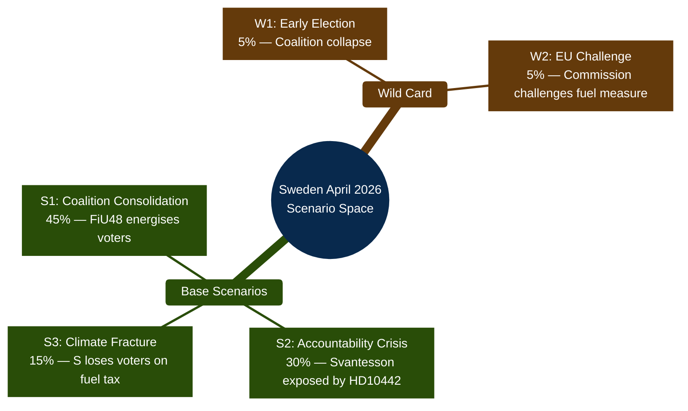
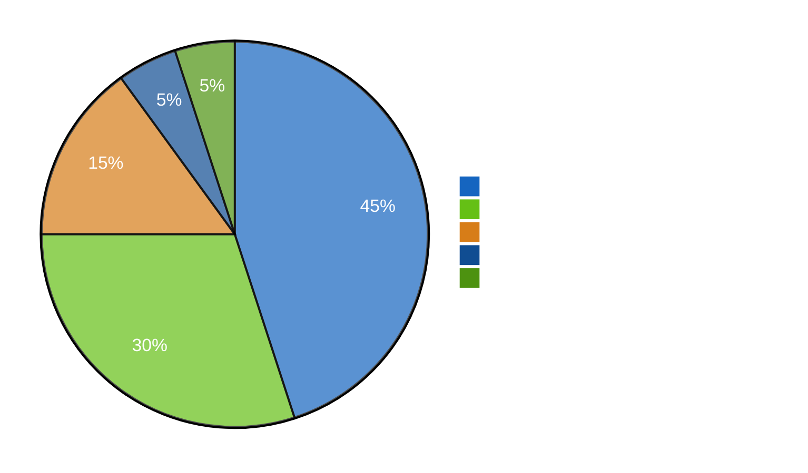

# Scenario Analysis — Evening Analysis 2026-04-22

**SCN-ID**: SCN-2026-04-22-EVE001
**Analyst**: James Pether Sörling
**Framework**: scenario-analysis.md template
**Date**: 2026-04-22 | **Riksmöte**: 2025/26

---

## Scenario Taxonomy

---

## Base Scenario Analysis

### Scenario 1: Coalition Consolidation (Probability: 45%)

**Definition**: HD01FiU48 delivers electoral dividend for the governing coalition; Vårproposition 2026 (HD03100) becomes the positive narrative anchor; S accountability offensive fails to gain traction.

**Triggers confirming S1**:
- Svantesson provides credible response to HD10442 in parliamentary debate
- Energy prices decline through summer, making the fuel tax cut look prescient
- HD03100 vårproposition passes FiU committee without S/V/MP blocking amendment

**Leading indicators** (watch):
- SFI (Swedish fiscal institution) positive assessment of HD03100 forecast
- Media coverage shifts from accountability to government delivery
- S polling stable or declining

**Strategic implications for government**: Double down on fiscal responsibility narrative; advance HD03240 (electricity system) as forward-looking policy; schedule HD10442 debate late to minimise exposure.

**Admiralty**: [C3] — Based on inference from electoral context, not confirmed intelligence

---

### Scenario 2: Accountability Crisis (Probability: 30%)

**Definition**: S's coordinated accountability offensive succeeds; HD10442 forces Svantesson into publicly untenable position; Finance Committee activities become a pre-election liability.

**Triggers confirming S2**:
- HD10442 IP debate scheduled before late August 2026
- Svantesson cannot reconcile her public statements with the court ruling
- Swedish media (DN, SVT, Expressen) run investigative pieces on eating disorder case
- Additional court documents emerge supporting Region Stockholm's position

**Leading indicators** (watch):
- Speaker scheduling of HD10442 IP debate — any date before July 2026
- Riksdag press coverage of HD10442 (quantity + tone)
- S follow-up press releases or committee questions on ätstörningsvård

**Strategic implications for opposition**: Maintain consistent messaging; seek media partners for investigative coverage; consider linking to broader healthcare accountability narrative.

**Admiralty**: [B2] — Probable; court documentation provides unusually strong evidentiary basis for this scenario

---

### Scenario 3: Climate Fracture (Probability: 15%)

**Definition**: S's Ja vote on HD01FiU48 while simultaneously filing counter-motions erodes their climate credibility; MP and V gain at S's expense among climate-prioritising voters.

**Triggers confirming S3**:
- MP/V campaign prominently on HD024082/092/098 counter-motions
- Swedish climate organisations publicly criticise S's Ja vote on HD01FiU48
- Polling shows MP/V gaining 1–3% at S's expense specifically on climate issues

**Leading indicators** (watch):
- Climate NGO statements on HD01FiU48 vote
- MP/V campaign advertisements featuring S contradiction
- SCB/Demoskop polling on climate issue salience

**Admiralty**: [C3] — Possible; dependent on media frame choices not yet determined

---

### Scenario 4: Wild Card — EU Challenge (Probability: 5%)

**Definition**: European Commission challenges HD03236/HD01FiU48 fuel tax reduction as incompatible with EU energy taxation directive or state aid rules.

**Triggers**: Any Commission preliminary investigation notification; formal infringement proceedings

**Admiralty**: [D4] — Remotely possible; based on general EU legal framework, no specific intelligence

---

### Scenario 5: Wild Card — Early Election (Probability: 5%)

**Definition**: Accountability pressure accumulates beyond manageable level; Kristersson government faces confidence vote; early election called.

**Triggers**: HD10442 + additional accountability cases trigger combined confidence motion from S+V+MP; L or C defects from coalition

**Admiralty**: [E5] — Remote; current parliamentary arithmetic makes this very unlikely before September 2026

---

## Scenario Probability Distribution

---

## Leading Indicators Per Scenario

| Scenario | Indicator | Source | Horizon |
|----------|-----------|--------|---------|
| S1 | Svantesson clear response to HD10442 | Parliamentary debate | 2026-05-05+ |
| S1 | S polling stable or declining | Demoskop/SIFO | 2026-04 to 2026-06 |
| S2 | HD10442 debate scheduled before August | Speaker calendar | 2026-04 to 2026-05 |
| S2 | DN/SVT investigation on ätstörningsvård | Media | 2026-05 |
| S3 | MP/V gain on climate in polls | SIFO | 2026-05 to 2026-07 |
| S3 | Climate NGO criticism of S | Public statements | 2026-04 to 2026-05 |
| W2 | Commission notification on HD03236 | EU Official Journal | 2026-06+ |

