# Significance Scoring — Evening Analysis 2026-04-22

**Methodology**: DIW weighting per significance-scoring.md template
**Analyst**: James Pether Sörling
**Date**: 2026-04-22 | **Riksmöte**: 2025/26
**Scope**: Cross-type synthesis of 20 key documents across 4 article types

---

## 📊 DIW Scoring Framework

| Dimension | Weight | Scale | Description |
|-----------|--------|-------|-------------|
| D (Depth) | 25% | 1–10 | Breadth/completeness of source document |
| I (Immediacy) | 40% | 1–10 | Recency; speed of real-world effect |
| W (Width of Impact) | 35% | 1–10 | Population affected; policy breadth |

**DIW Score = (D × 0.25) + (I × 0.40) + (W × 0.35), normalised to 10**

---

## Ranked Documents

```mermaid
flowchart LR
    D1["🏆 9.2 | HD01FiU48<br/>Extra ändringsbudget ENACTED<br/>Voted 2026-04-22 16:29"]
    D2["🥈 9.0 | HD03100<br/>Vårproposition 2026<br/>Pre-election fiscal framework"]
    D3["🥉 8.5 | HD0399<br/>Vårändringsbudget 2026<br/>Spending adjustments"]
    D4["📋 8.3 | HD10442<br/>Ätstörningsvård IP<br/>Svantesson accountability"]
    D5["📋 8.1 | HD01KU33<br/>Husrannsakan insyn<br/>Grundlag first reading"]
    D6["📋 8.0 | HD03240<br/>Nya elsystemlagar<br/>Energy security"]
    D7["📋 8.0 | HD03232<br/>Ukraina skadeståndskomm.<br/>Int'l accountability"]
    D8["📄 7.9 | HD01KU32<br/>Medietillgänglighet<br/>EU compliance"]
    D9["📄 7.7 | HD10445<br/>Kommunal förköpsrätt IP<br/>Housing/segregation"]
    D10["📄 7.3 | HD10443/HD10444<br/>Social dumpning / arbetsgivaravgift<br/>S accountability offensive"]
    D11["📄 7.2 | HD01CU27<br/>Identitetskrav lagfart<br/>Property crime prevention"]
    D12["📝 7.0 | HD01CU28<br/>Bostadsrättsregister<br/>Housing market reform"]
    D13["📝 6.5 | HD024082/092/098<br/>Opposition fuel counter-motions<br/>Strategic signal only"]

    D1 --> D2 --> D3 --> D4 --> D5 --> D6 --> D7 --> D8 --> D9 --> D10 --> D11 --> D12 --> D13

    style D1 fill:#B71C1C,color:#FFFFFF
    style D2 fill:#C62828,color:#FFFFFF
    style D3 fill:#E65100,color:#FFFFFF
    style D4 fill:#E65100,color:#FFFFFF
    style D5 fill:#F57F17,color:#FFFFFF
    style D6 fill:#F57F17,color:#FFFFFF
    style D7 fill:#F57F17,color:#FFFFFF
    style D8 fill:#1565C0,color:#FFFFFF
    style D9 fill:#1565C0,color:#FFFFFF
    style D10 fill:#1565C0,color:#FFFFFF
    style D11 fill:#37474F,color:#FFFFFF
    style D12 fill:#37474F,color:#FFFFFF
    style D13 fill:#546E7A,color:#FFFFFF
```

---

## Detailed DIW Scoring Table

| Rank | dok_id | Title (abridged) | D | I | W | DIW | Admiralty | Source |
|------|--------|-----------------|---|---|---|-----|-----------|--------|
| 1 | HD01FiU48 | Extra ändringsbudget ENACTED | 9 | 10 | 9 | **9.2** | [A1] | riksdagen.se |
| 2 | HD03100 | Vårproposition 2026 | 10 | 9 | 9 | **9.0** | [A1] | riksdagen.se |
| 3 | HD0399 | Vårändringsbudget 2026 | 9 | 9 | 8 | **8.5** | [A1] | riksdagen.se |
| 4 | HD10442 | Ätstörningsvård IP | 8 | 9 | 8 | **8.3** | [A1] | riksdagen.se |
| 5 | HD01KU33 | Husrannsakan insyn (grundlag) | 9 | 7 | 8 | **8.1** | [A1] | riksdagen.se |
| 6 | HD03240 | Nya elsystemlagar | 9 | 8 | 8 | **8.0** | [A1] | riksdagen.se |
| 7 | HD03232 | Ukraina skadeståndskomm. | 8 | 8 | 8 | **8.0** | [A1] | riksdagen.se |
| 8 | HD01KU32 | Medietillgänglighet (grundlag) | 8 | 7 | 8 | **7.9** | [A1] | riksdagen.se |
| 9 | HD10445 | Kommunal förköpsrätt IP | 7 | 8 | 8 | **7.7** | [A1] | riksdagen.se |
| 10 | HD024082 | S counter-motion fuel tax | 8 | 9 | 8 | **8.5** | [B2] | riksdagen.se |

---

## Sensitivity Analysis

**If S had voted Nej on HD01FiU48**: The electoral and strategic significance score would drop from 9.2 to 7.0 — the measure would be a standard coalition achievement, not a cross-party anomaly.

**If HD10442 debate is scheduled before the election**: Significance rises from 8.3 to 9.0+ if Svantesson cannot credibly respond to the court documentation.

**If HD03100 Vårproposition fails FiU committee vote**: This would be a constitutional crisis; significance would reach 10.0. Probability: Remote [E5] (<3%).

