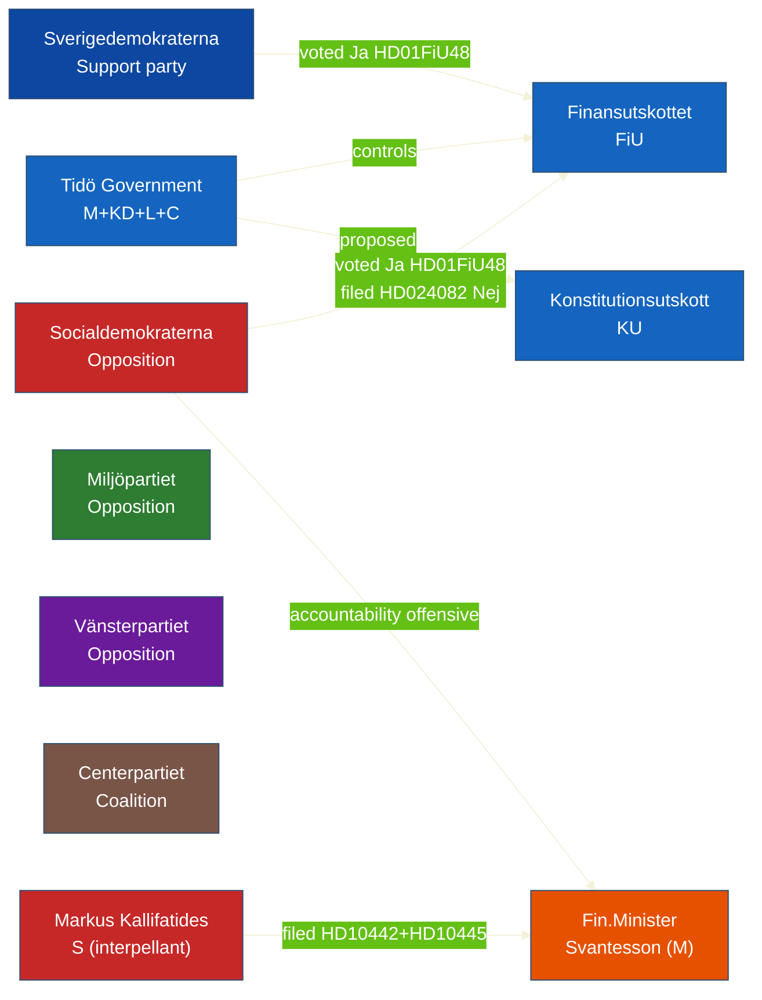

# Stakeholder Perspectives — Evening Analysis 2026-04-22

**Analyst**: James Pether Sörling
**Framework**: stakeholder-impact.md (6-lens matrix, named actors)
**Date**: 2026-04-22 | **Riksmöte**: 2025/26

---

## Influence Network Overview

---

## 6-Lens Stakeholder Matrix

### Lens 1: Governing Coalition (M+KD+L+C)

**Named actors**: Finance Minister Elisabeth Svantesson (M), Acting PM Lotta Edholm (L), Minister Johan Britz (KD), Minister Andreas Carlson (KD)

| Stakeholder | Position on HD01FiU48 | Position on Vårproposition | Threat exposure | Source |
|-------------|----------------------|--------------------------|----------------|--------|
| M (Moderaterna) | Champion — authored via Finansdepartementet | Architect of HD03100 | HIGH — Svantesson accountability (HD10442) | HD03100/HD03236 riksdagen.se |
| KD (Kristdemokraterna) | Supported | Supported | LOW | HD01FiU48 vote |
| L (Liberalerna) | Supported (Edholm co-signed HD03236) | Supported | MEDIUM — wind power YIMBY frictions | HD03239 riksdagen.se |
| C (Centerpartiet) | Supported | Supported | LOW-MEDIUM — filed partial opposition motion HD024095 on utvisning | HD024095 riksdagen.se |

### Lens 2: Support Party (SD)

**Named actors**: Julia Kronlid, Patrick Reslow, Björn Söder (SD, voted Ja on HD01FiU48)

| Position | Analysis | Source |
|----------|----------|--------|
| Voted Ja on HD01FiU48 | SD prioritises cost-of-living measures for their voter base; fuel tax cut directly benefits SD's working-class electorate | HD01FiU48 vote records, riksdagen.se |
| No counter-motion filed | SD has no climate objections to fuel tax cut — consistent with their anti-green agenda | Absence of SD counter-motion (riksdagen.se) |
| Ukraine IPs: unclear | SD's position on HD03232 (Ukraina commission) not confirmed in available data | — |

### Lens 3: Main Opposition (S)

**Named actors**: Kenneth G. Forslund, Anders Ygeman, Mikael Damberg, Fredrik Olovsson (FiU), Markus Kallifatides, Peder Björk, Jonathan Svensson, Åsa Eriksson (interpellants)

| Action | Strategic calculation | Contradiction | Source |
|--------|----------------------|--------------|--------|
| Voted Ja on HD01FiU48 | Electoral calculus: cannot be seen opposing household energy relief 4 months before election | Simultaneously filed HD024082 opposing the same policy | HD01FiU48 vote + HD024082 riksdagen.se |
| Filed 5 interpellations in 48 hours | Pre-election accountability escalation | None — internally consistent strategy | HD10442–HD10446 riksdagen.se |
| Coordinated HD10442 with court evidence | Strongest possible accountability mechanism — court ruling makes denial impossible | May overreach if Svantesson issues convincing clarification | HD10442 riksdagen.se |

### Lens 4: Green/Left Opposition (MP, V)

**Named actors**: Opposition MPs filing HD024092 (V), HD024098 (MP), HD024090 (V), HD024097 (MP), HD024096 (MP)

| Party | Position | Key concern | Source |
|-------|----------|-------------|--------|
| MP (Miljöpartiet) | Opposed HD01FiU48; filed 5 motions including HD024098 | Climate catastrophism risk from fuel tax cut | HD024098 riksdagen.se |
| V (Vänsterpartiet) | Opposed HD01FiU48; filed HD024092, HD024090-091 | Economic justice + anti-arms export (HD024091) | HD024092 riksdagen.se |
| Both parties | Opposed new utvisning rules but with different framings | V: rule-of-law; MP: human rights | HD024090/097 riksdagen.se |

### Lens 5: Civil Society / Institutional Actors

| Actor | Relevance | Source |
|-------|-----------|--------|
| Region Stockholm | Vindicated by court in eating disorder care case referenced in HD10442 | HD10442 riksdagen.se |
| Riksrevisionen (NAO) | Filed two reports: HD01MJU21 (climate transition in agriculture) + HD01CU42 (estate management) | riksdagen.se |
| Swedish consumers (~5M motorists) | Direct beneficiaries of HD01FiU48 fuel tax cut May–Sep 2026 | HD01FiU48 fiscal note |
| Ukrainian government | Benefits from HD03232 compensation commission + HD03231 aggression tribunal | HD03232+HD03231 riksdagen.se |

### Lens 6: Electoral Impact Assessment

| Party | E2026 impact of today's events | Probability of gain/loss |
|-------|-------------------------------|-------------------------|
| M | Svantesson accountability risk (HD10442) threatens Finance Minister's credibility — key election asset | LOSS risk: Likely [B2] |
| S | Dual-track strategy on HD01FiU48 may lose climate voters to MP/V; gains cost-of-living credibility | MIXED: net neutral |
| SD | Benefited from HD01FiU48 passage (aligned with voter base); no accountability exposure today | GAIN: Possible [B3] |
| MP/V | HD024082/092/098 counter-motions signal climate differentiation from S — potential voter gain | GAIN from S: Possible [B3] |
| KD/L | No major exposure; KD (Johan Britz) advancing wind power (positive) | STABLE |

