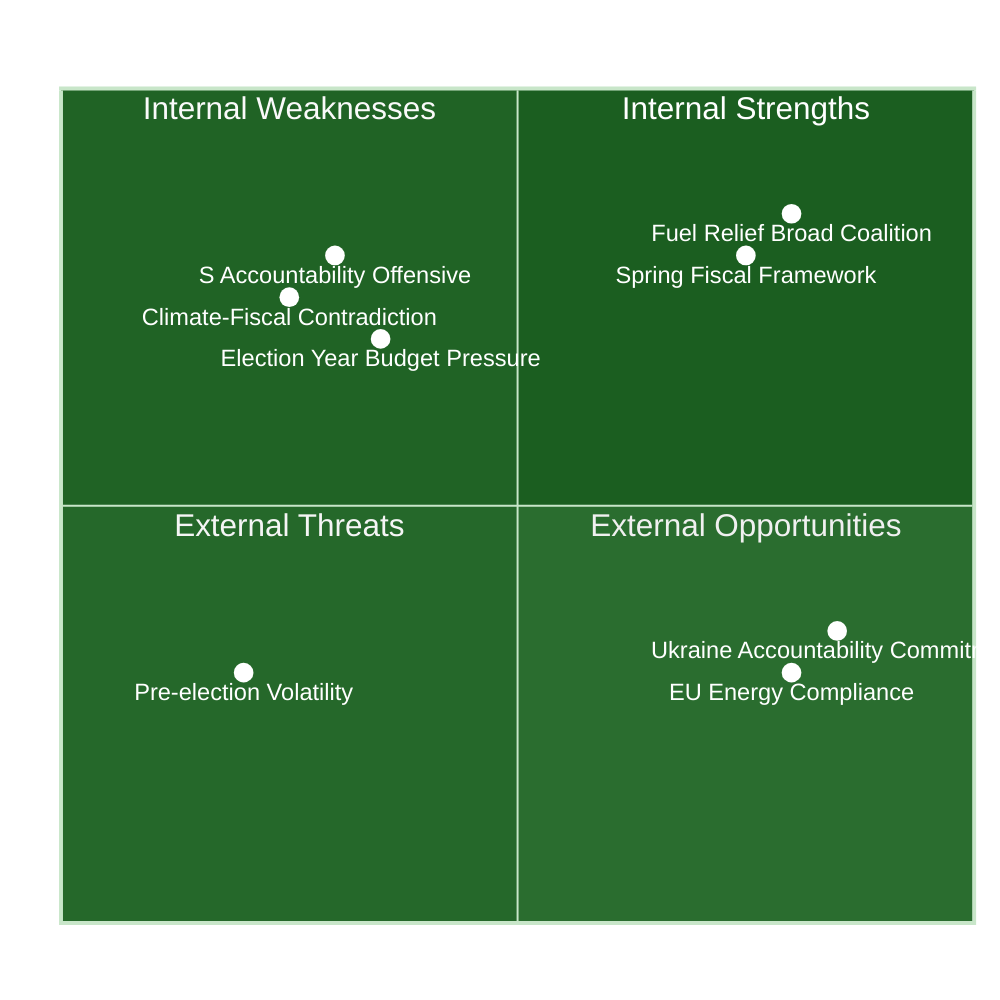

# SWOT Analysis — Evening Analysis 2026-04-22

**Analyst**: James Pether Sörling
**Framework**: political-swot-framework.md
**Scope**: Cross-type synthesis — propositions, committee reports, interpellations, motions
**Date**: 2026-04-22 | **Riksmöte**: 2025/26

---

## 🎯 SWOT Overview

---

## ✅ Strengths

| Strength | Evidence | Admiralty | Confidence |
|----------|----------|-----------|------------|
| Broad cross-party coalition enacted HD01FiU48 — demonstrates fiscal responsiveness to household cost pressures | HD01FiU48 vote record CE14CCEF: M+SD+S+KD voted Ja at riksdagen.se on 2026-04-22 | [A1] | Confirmed |
| Coherent spring fiscal framework maintains surplus rule — HD03100 preserves fiscal discipline while providing household relief | HD03100 (riksdagen.se, Finansdepartementet, 2026-04-13) — surplus rule >0.33% GDP maintained | [A1] | Confirmed |
| Sweden deepens Ukraine accountability commitment via two international frameworks — demonstrates rule-of-law solidarity | HD03232 + HD03231 (riksdagen.se, UU committee, 2026-04-16) — joined both compensation register and aggression tribunal | [A1] | Confirmed |
| Energy system modernisation advances with new electricity laws and wind revenue sharing | HD03240 + HD03239 (riksdagen.se, Klimat- och näringsdepartementet, 2026-04-14) — major policy advances | [A1] | Confirmed |
| Constitutional reform pipeline active: two grundlag first readings simultaneous | HD01KU33 + HD01KU32 (riksdagen.se, KU committee) — rarely seen dual constitutional readings | [A1] | Confirmed |

---

## ⚠️ Weaknesses

| Weakness | Evidence | Admiralty | Confidence |
|----------|----------|-----------|------------|
| Climate-fiscal contradiction: fuel tax cut (HD01FiU48) contradicts Sweden's stated carbon tax trajectory | HD01FiU48 enacted vs Sweden's longstanding fossil fuel tax policy trajectory; MP+V+S filed counter-motions HD024082/092/098 citing climate harm (riksdagen.se) | [A1] | Confirmed |
| S dual-track electoral strategy undermines policy coherence: voted for relief while opposing in motion | HD01FiU48 vote (Ja, S) + HD024082 opposition motion same week (riksdagen.se) — direct contradiction | [A1] | Confirmed |
| Svantesson ministerial accountability exposure: HD10442 cites court ruling contradicting her public statements | HD10442 (riksdagen.se, 2026-04-21, M. Kallifatides/S) — court upheld Region Stockholm, Svantesson's statements deemed incorrect | [A1] | Probable |
| Budget deterioration of 4.1 GSEK in pre-election spending context risks medium-term fiscal credibility | HD01FiU48 fiscal impact note + Sweden GDP growth 2024 only 0.82% (World Bank) | [A1/B2] | Very likely |
| Social dumpning documented (HD10443) — municipalities illegally displacing vulnerable persons between jurisdictions reveals governance gap | HD10443 (riksdagen.se, 2026-04-22, P. Björk/S) + related HD10423 already scheduled for answer 2026-05-05 | [A1] | Probable |

---

## 🚀 Opportunities

| Opportunity | Evidence | Admiralty | Confidence |
|-------------|----------|-----------|------------|
| Pre-election fiscal package galvanises consumer confidence at critical 144-day-to-election moment | HD01FiU48 enacted; Sweden inflation dropping from 8.55% (2023) to 2.84% (2024) (World Bank) creates fiscal headroom | [A1/B2] | Likely |
| EU circular economy compliance via HD01MJU19 waste legislation positions Sweden as a leader in materials recovery | HD01MJU19 (riksdagen.se, MJU committee) — implements EU circular economy targets | [A1] | Probable |
| Pre-emption rights debate (HD10445) opens housing segregation as electoral issue — S can position on urban justice | HD10445 (riksdagen.se, 2026-04-22, M. Kallifatides/S) — cites SOU 2024:38; government shelved this policy | [A1] | Likely |
| Wind power revenue sharing (HD03239) resolves key barrier to onshore wind expansion — long-term energy security | HD03239 (riksdagen.se, Klimat- och näringsdepartementet, 2026-04-14) — municipal resident compensation rights | [A1] | Probable |

---

## ⚡ Threats

| Threat | Evidence | Admiralty | Confidence |
|--------|----------|-----------|------------|
| Coordinated S accountability offensive could force political crisis before election | HD10442+10443+10444+10445+10446 (riksdagen.se): 5 interpellations in 48 hours targeting Finance Minister and Civil Minister | [A1] | Probable |
| Climate-fiscal gap could become primary S election attack vector if global energy prices normalise | HD024082/092/098 opposition motions (riksdagen.se) + Sweden commitment to Paris Agreement | [B2] | Likely |
| Municipal social dumping (HD10443) if unaddressed could generate media escalation pre-election | HD10443 + HD10423 (riksdagen.se) — pattern: multiple S interpellations on same theme signals investigative journalism likely | [B2] | Possible |
| 4.1 GSEK budget deterioration in context of weak GDP growth risks credit agency scrutiny | HD01FiU48 fiscal note + World Bank Sweden GDP 2024: 0.82%, 2023: −0.20% — two consecutive near-zero years | [A1/B2] | Unlikely |

---

## TOWS Matrix

| | External Opportunities | External Threats |
|---|----------------------|-----------------|
| **Internal Strengths** | SO: Use cross-party fiscal coalition (HD01FiU48) to frame E2026 as government delivering household relief while investing in energy transition (HD03240+HD03239) | ST: Leverage Ukraine commitment (HD03232+HD03231) to shift media narrative from S accountability attacks to foreign policy strength |
| **Internal Weaknesses** | WO: Address S dual-track contradiction by forcing S to explain their simultaneous Ja vote and opposition motion | WT: Pre-empt Svantesson accountability crisis (HD10442) with proactive ministerial statement before IP debate is scheduled |

