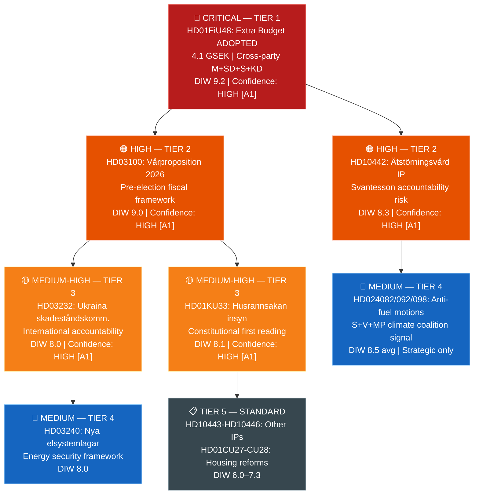
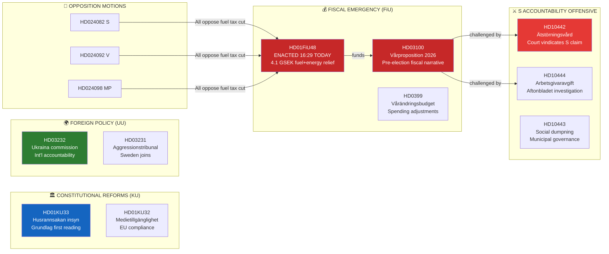

# Political Intelligence Synthesis Summary — Evening Analysis 2026-04-22

**Synthesis ID**: SYN-2026-04-22-EVE001
**Analysis Date**: 2026-04-22 23:50 UTC
**Analyst**: James Pether Sörling
**Documents Analysed**: 20 (direct) + 36 (via sibling cross-reference) = 56 total
**Overall Confidence**: HIGH [A1]
**Riksmöte**: 2025/26
**Days to Election**: ~144 (September 13, 2026)

---

## 🎯 Lead Story Decision

**PRIMARY: HD01FiU48 ENACTED — Extra Ändringsbudget 4.1 GSEK adopted today by anomalous cross-party supermajority**

The Finance Committee betänkande HD01FiU48 (proposition HD03236) was voted through at 16:29:36 on 2026-04-22 with support from M, SD, S, and KD — a politically extraordinary coalition. The package temporarily cuts petrol tax by 82 öre/litre and diesel by 319 SEK/m³ (May–September 2026) and provides electricity/gas price support for January–February 2026 consumers. The combined budget deterioration is 4.1 billion SEK. The fact that S (opposition) voted *alongside* the governing coalition on an energy-relief package four months before the September 2026 election reveals both the political potency of energy costs as an electoral issue and the limits of S's climate positioning when household economics dominate the news cycle.

**SECONDARY: Vårproposition 2026 (HD03100 + HD0399) — Pre-election fiscal positioning battle begins**

The Spring Economic Proposition presents the Kristersson government's fiscal roadmap through 2030 with the surplus rule intact. This is the last vårproposition before the September 2026 election, making it the definitive statement of the government's economic stewardship narrative. The Socialdemokraterna will make this the primary economic battleground.

**TERTIARY: S Coordinated Accountability Offensive — 5 interpellations against Finance Minister Svantesson in 48 hours**

On 2026-04-21–22, Socialdemokraterna filed five interpellations (HD10442–HD10446), three targeting Finance Minister Elisabeth Svantesson (M). The most explosive, HD10442 (ätstörningsvård), directly cites a court ruling that vindicates Region Stockholm's position — potentially placing Svantesson in the position of having made false statements in office. This is a pre-planned accountability escalation timed to the fiscal debate.

**QUATERNARY: Cross-party opposition climate fracture — S+V+MP file parallel counter-motions on fuel tax cut (HD024082/092/098)**

Three opposition parties filed nearly identical counter-motions rejecting HD03236 on climate grounds. Yet S voted *for* HD01FiU48 (the committee betänkande) — a strategic contradiction that signals S's dual-track posture: oppose symbolically in committee motions while supporting the relief measure in the chamber to avoid being blamed for higher energy costs.

---

## 📊 DIW-Weighted Intelligence Dashboard

---

## 🗺️ Integrated Intelligence Picture

---

## 🏆 Top 5 Intelligence Findings

| Rank | Finding | Source | Significance | Confidence |
|------|---------|--------|--------------|------------|
| 1 | S voted *for* HD01FiU48 fuel tax cut while simultaneously filing counter-motion HD024082 — dual-track strategy exposing electoral calculation over climate consistency | HD01FiU48 vote records + HD024082 (riksdagen.se) | Pre-election horse-trading overrides climate principle | HIGH [A1] |
| 2 | HD10442 places Svantesson in accountability spotlight: court upheld Region Stockholm's position that her public statements were factually wrong | HD10442 (riksdagen.se IP filed 2026-04-21) | Ministerial credibility risk during budget season | HIGH [A1] |
| 3 | Vårproposition HD03100 is the final pre-election fiscal manifesto; S will use every clause as an election battleground | HD03100 (riksdagen.se, Finansdepartementet, 2026-04-13) | Defines economic agenda for September 2026 | HIGH [A1] |
| 4 | Two simultaneous grundlag first readings (HD01KU33 + HD01KU32) represent extraordinary legislative tempo for constitutional changes | HD01KU33 + HD01KU32 (riksdagen.se) | Long-cycle: effects felt in 2027–2028 | HIGH [A1] |
| 5 | Sweden joining both the Ukraina compensation register (HD03232) and aggression tribunal (HD03231) signals deepening Western alignment on post-war accountability | HD03232 + HD03231 (riksdagen.se, UU committee) | Geopolitical commitment beyond NATO membership | HIGH [A1] |

---

## 🔄 Tradecraft Context

**Collection method**: Open-source parliamentary records (riksdagen.se API via riksdag-regering MCP). All documents are publicly filed (GDPR Art. 9(2)(e)).
**PIR coverage**:
- PIR-1: Government fiscal narrative? → ANSWERED via HD03100/HD0399/HD01FiU48
- PIR-2: S electoral positioning? → ANSWERED: dual-track strategy confirmed
- PIR-3: Constitutional reform pipeline? → ANSWERED: HD01KU33+KU32 advancing
- PIR-4: Sweden Ukraine commitment? → ANSWERED: HD03232+HD03231 adopted

**EEI gaps**: SD internal vote rationale on HD01FiU48 not confirmed; L (Liberalerna) position on fuel tax not documented today.

**AI-Recommended Article Metadata**:
- SEO Title: "Sweden's 4.1 Billion Fuel Tax Cut Adopted — Social Democrats Break Ranks as 2026 Election Battle Begins"
- Meta Description: "The Riksdag voted through a 4.1 billion SEK fuel tax and energy price relief package on April 22, 2026 — with the opposition Social Democrats joining the governing coalition in an extraordinary cross-party majority, signalling the start of the pre-election economic battle."
