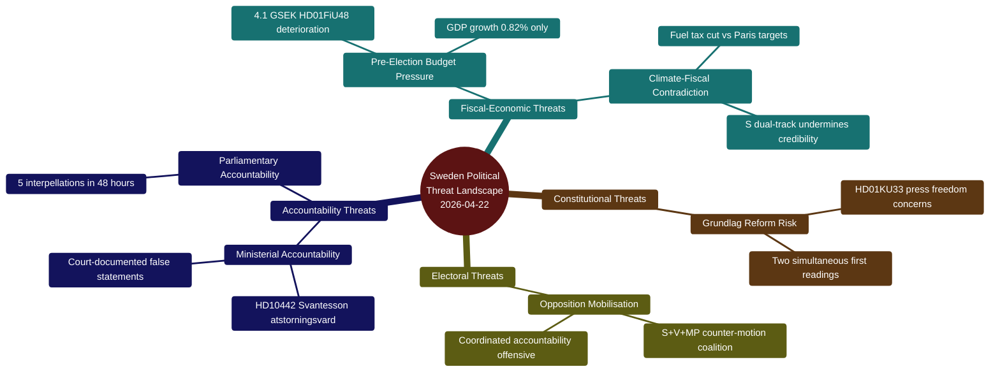
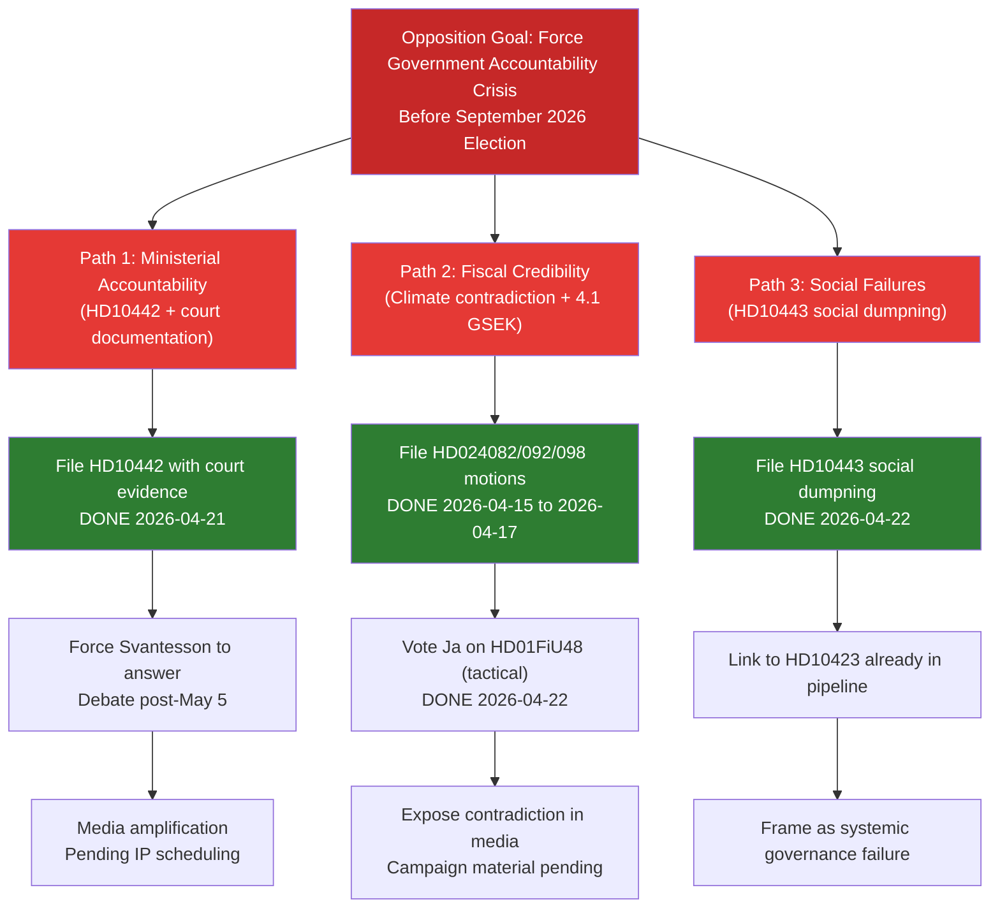

# Threat Analysis — Evening Analysis 2026-04-22

**Analyst**: James Pether Sörling
**Framework**: political-threat-framework.md (Political Threat Taxonomy, attack tree)
**Date**: 2026-04-22 | **Riksmöte**: 2025/26
**Overall Threat Level**: Elevated | **Confidence**: [B2]

---

## Political Threat Taxonomy Overview

---

## Attack Tree Analysis

---

## Parliamentary Accountability Chain

| Phase | Action | Actor | Status | Source |
|-------|--------|-------|--------|--------|
| Evidence gathering | Identify Svantesson statements on atstorningsvard | S research | Complete | HD10442 references |
| Weaponisation | Obtain court ruling vindicating Region Stockholm | Legal research | Complete | HD10442 cites court case |
| Delivery | File interpellation HD10442 with court documentation | Markus Kallifatides (S) | **Complete** 2026-04-21 | riksdagen.se |
| Response forcing | Force parliamentary debate | Speaker scheduling | Pending (post-May 5) | riksdagen.se |
| Media escalation | Coverage of false statements | Swedish press | Pending | — |
| Electoral use | S uses answer in campaign materials | S party | Pending (election day) | — |

---

## MITRE-Style TTP Mapping (Political Tactics)

| TTP | Tactic | Technique | Procedure | Source |
|-----|--------|-----------|-----------|--------|
| S-001 | Accountability | Court-documented accountability | File IP with court ruling as evidence — higher evidentiary standard than typical IP | HD10442 (riksdagen.se) |
| S-002 | Dual-track positioning | Simultaneous support and opposition | Vote for measure in chamber while filing counter-motion | HD01FiU48 vote + HD024082 |
| S-003 | Coordinated offensive | Multi-minister targeting | File 5 IPs in 48 hours targeting 2 ministers | HD10442-HD10446 |
| SD-001 | Coalition support | Key vote solidarity | Voted Ja on HD01FiU48 alongside government | HD01FiU48 vote records |

---

## Threat Probability Assessment

| Threat | Current State | Probability | Timeline | Admiralty |
|--------|--------------|-------------|----------|-----------|
| S successfully damages Svantesson in HD10442 IP debate | IP scheduled, court docs strong | Likely [B2] 65% | Post 2026-05-05 | [B2] |
| S climate voters defect to MP/V due to HD01FiU48 Ja vote | Counter-motions + Ja vote contradiction | Possible [B3] 40% | By election 2026-09-13 | [B3] |
| Social dumpning (HD10443) generates media investigation | Two S IPs on same theme | Possible [B3] 35% | 2026-04 to 2026-05 | [B3] |
| Government fiscal credibility challenged before June budget | 4.1 GSEK + weak GDP | Unlikely [D4] 20% | 2026-05 to 2026-06 | [D4] |
