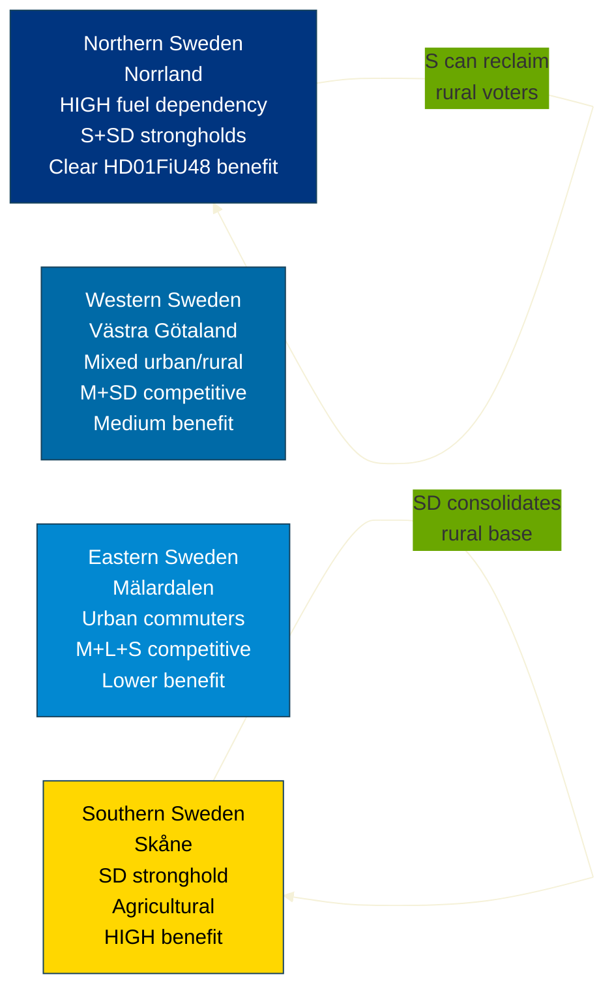

# Voter Segmentation Analysis — Evening Analysis 2026-04-22

**Analyst**: James Pether Sörling
**Framework**: electoral-domain-methodology.md § Voter Segmentation
**Date**: 2026-04-22 | **Riksmöte**: 2025/26

---

## Segment Impact Matrix — HD01FiU48 (Fuel Tax Cut)

| Segment | Size est. | Impact of HD01FiU48 | Likely primary beneficiary party |
|---------|-----------|---------------------|----------------------------------|
| Rural households (>50km from city) | ~15% of electorate | HIGH — direct fuel cost savings | SD, M, S (rural) |
| Commuters >30km (car-dependent) | ~20% | HIGH — daily saving | SD, M |
| Urban non-car households | ~25% | LOW — marginal benefit | V, MP, L (urban) |
| Small businesses (transport) | ~5% | HIGH — operational cost relief | M, KD |
| Climate-concerned voters | ~15% | NEGATIVE — fossil fuel subsidy | MP, V, C (green wing) |
| Low-income households (fuel-dependent) | ~10% | HIGH — regressive relief actually progressive for this group | S, SD |
| Agricultural sector | ~2% | HIGH — diesel relief applies | SD, C, M |
| Pensioners (rural, fixed income) | ~8% | MEDIUM | SD, KD, S |

---

## Geographic Segmentation

---

## Interpellation Offensive — Voter Segment Impact

| IP (dok_id) | Issue | Target segment | S positioning |
|-------------|-------|---------------|---------------|
| HD10442 (eating disorders + Svantesson) | Health system / fiscal priority | Middle-class families, women voters | "We hold government accountable on welfare" |
| HD10443 (social dumping) | Labour market | Union households, LO-affiliated voters | "We protect Swedish workers" |
| HD10444 (housing waiting times) | Young households | Urban young voters | "Government has failed on housing" |
| HD10445 (energy costs) | Energy transition | Rural, pensioners | "We will ensure affordable energy" |
| HD10446 (follow-up unknown) | — | Broad | Accountability continuity |

---

## Key Segmentation Finding

The critical voter segment is **rural S-leaning voters** (traditional social democrat base that has drifted to SD). Today's events create a complex picture for this group:
- HD01FiU48 Ja vote from S = direct benefit signal
- HD024082 counter-motion = confusing contradiction
- HD10442-HD10446 = accountability narrative against government

**Net assessment**: The fuel cut Ja vote is likely more electorally legible to this segment than the technical counter-motion. S has calculated correctly that the visible action (Ja vote) outweighs the insider opposition (committee motion). **Likelihood this segment returns to S**: Unlikely to Very Unlikely without additional signal; HD01FiU48 Ja vote is necessary but not sufficient. Admiralty: [B3].

