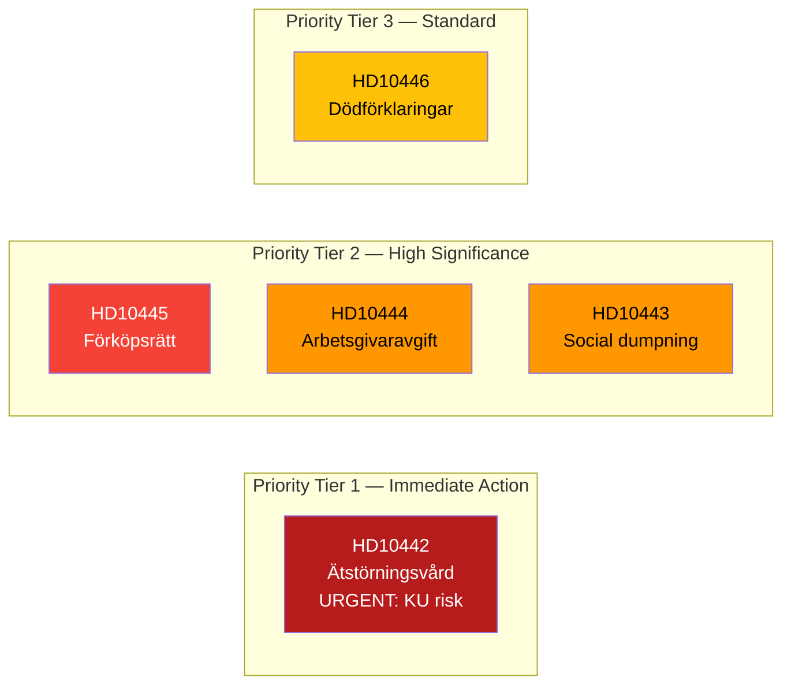

# Classification Results — Interpellations 2026-04-22

**Methodology**: political-classification-guide.md — 7-dimension classification  
**Analysis Date**: 2026-04-22  

---

## 📋 Classification Overview

---

## 📊 7-Dimension Classification Table

| Dimension | HD10442 | HD10445 | HD10444 | HD10443 | HD10446 |
|-----------|---------|---------|---------|---------|---------|
| **1. Political Temperature** | 🔴 Very Hot | 🟠 Hot | 🟠 Hot | 🟠 Hot | 🟡 Moderate |
| **2. Policy Domain** | Healthcare / Ministerial accountability | Housing / Urban planning / Anti-segregation | Fiscal / Labour market | Social welfare / Municipal governance | Administrative law / Civil registry |
| **3. Actor Spectrum** | M vs S; KD; Region Stockholm | S vs KD; C/L coalition fault line | S vs M; Employers; Young workers | S vs KD; Vulnerable persons | S vs M; Skatteverket |
| **4. Institutional Reach** | KU risk; Stockholms tingsrätt | Riksdag; Civilutskott; Municipalities | Riksdag; FiU; Employers | Riksdag; Municipalities; Socialtjänst | Riksdag; Skatteverket |
| **5. Evidence Quality** | A1 (court ruling, parliamentary record) | A1 (official directives, SOU) | B2 (Aftonbladet + internal memos) | A1 + B3 (directives + media) | A1 (minister's own admission) |
| **6. GDPR Art. 9** | Public interest (9(2)(g)); Region Stockholm data | Publicly available (9(2)(e)) | Labour market data (9(2)(b)) | Social case data anonymised | Registry data anonymised |
| **7. Retention** | Permanent — KU-risk document | Permanent — housing policy record | Permanent — fiscal policy record | Permanent — social policy record | Permanent — administrative record |

---

## 🔐 Access Classification

| dok_id | Classification | Rationale |
|--------|---------------|-----------|
| HD10442 | **PUBLIC — High Significance** | All data from official public sources: riksdagen.se, court records |
| HD10445 | **PUBLIC — High Significance** | Official directives, SOU — all public record |
| HD10444 | **PUBLIC — High Significance** | Interpellation text public; Aftonbladet investigation public |
| HD10443 | **PUBLIC — Standard** | Interpellation text public; social case details anonymised |
| HD10446 | **PUBLIC — Standard** | Aggregate data only (30 cases/year); no individual identification |

---

## 🏷️ Tag Matrix

| dok_id | Primary Tags | Secondary Tags |
|--------|-------------|---------------|
| HD10442 | `ministerial-accountability` `healthcare` `court-ruling` `Region-Stockholm` | `eating-disorders` `KU-risk` `Svantesson` |
| HD10445 | `housing-policy` `segregation` `pre-emption-rights` `SOU-2024-38` | `suburban-security` `urban-planning` `Carlson` |
| HD10444 | `fiscal-policy` `labour-market` `youth-employment` `employer-contributions` | `Aftonbladet-investigation` `profit-capture` `Svantesson` |
| HD10443 | `social-welfare` `municipal-governance` `social-dumping` `vulnerable-persons` | `coercive-relocation` `Slottner` `HD10423` |
| HD10446 | `administrative-justice` `civil-registry` `Skatteverket` `death-declaration` | `Svantesson` `administrative-reform` |

---

## 🔄 Tradecraft Context

**Methodology**: political-classification-guide.md — 7-dimension classification  

**GDPR Assessment**:
All five interpellations concern matters of substantial public interest under GDPR Art. 9(2)(g). The interpellation texts themselves contain no special category personal data beyond what is publicly stated by name in official parliamentary documents. Individual case references (Västmanland false death case in HD10446; unnamed social dumping victims in HD10443) are generalised to aggregate form in this analysis. No individual identification required or appropriate.

**Retention Justification**:
All documents classified Permanent because:
1. They constitute official parliamentary record accessible via riksdagen.se
2. They document substantive policy failures with Election 2026 relevance
3. The court ruling (HD10442) and government directives (HD10445) are legally significant public records

**Priority Tier Rationale**:
HD10442 is classified Tier 1 (Immediate Action) rather than Tier 2 because the combination of documented ministerial false statement + court ruling creates a live constitutional risk that requires real-time monitoring through the May 2026 parliamentary debates.
