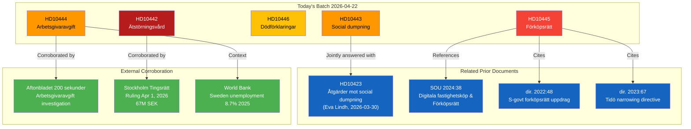

# Cross-Reference Map — Interpellations 2026-04-22

**Methodology**: structural-metadata-methodology.md  
**Analysis Date**: 2026-04-22  

---

## 🔗 Document Linkage Map

---

## 📋 Cross-Reference Registry

### Internal Cross-References (Riksdag Documents)

| Source | Referenced | Relationship | Significance |
|--------|-----------|-------------|-------------|
| HD10443 | HD10423 (riksdagen.se) | Jointly answered — same minister, same social dumping topic | Amplifies signal; doubling pressure on Slottner (KD) |
| HD10445 | SOU 2024:38 | References as shelved investigation output | Establishes government inaction against completed SOU |
| HD10445 | dir. 2022:48 (riksdagen.se) | Original investigation mandate from S government | Demonstrates S competence, government regression |
| HD10445 | dir. 2023:67 (riksdagen.se) | Tidö narrowing of pre-emption mandate | Documents ideological narrowing |
| HD10446 | Prior skriftlig fråga to Svantesson | Minister's own answer on 30 deaths/year | Minister already admitted problem; consistency trap |

### External Corroboration

| Source | Document | Relation | Admiralty |
|--------|---------|---------|-----------|
| Aftonbladet "200 sekunder" series | HD10444 | Media investigation corroborating employer profit capture | [B2] Corroborated |
| Stockholm District Court ruling Apr 1, 2026 | HD10442 | Legal ruling vindicating Region Stockholm (67M SEK) | [A1] Official |
| World Bank Sweden unemployment data 2025 (8.7%) | HD10444 | Economic context for youth employment policy | [A1] Official |
| Sweden GDP growth data (0.82% 2024, -0.2% 2023) | HD10443, HD10444 | Weak economic growth context for fiscal and social policy | [A1] Official |

---

## 🔄 Continuity with Prior Analysis Runs

| Theme | Prior Analysis | Forward Development |
|-------|---------------|---------------------|
| Social dumping | HD10423 (Eva Lindh, Mar 2026) | HD10443 (Björk, Apr 2026) — double interpellation; joint answer expected May 2026 |
| Housing pre-emption rights | dir. 2023:67, SOU 2024:38 | HD10445 — confirms no legislation planned 2025/26 |
| Youth unemployment | Recurring theme in S motions 2024/25-2025/26 | HD10444 — direct policy exploitation evidence |
| Ministerial accountability (Svantesson) | Multiple prior questions on healthcare | HD10442 — escalation to court-validated false statement |

---

## ⏩ Forward Indicators / Continuity Contracts

| Indicator | Expected Date | Trigger |
|-----------|--------------|---------|
| Slottner joint answer on HD10443 + HD10423 | By 2026-05-05 | Reply deadline |
| Svantesson answer on HD10444 | By 2026-05-06 | Reply deadline |
| Svantesson answer on HD10446 | By 2026-05-06 | Reply deadline |
| Carlson answer on HD10445 | By 2026-05-06 | Reply deadline |
| Svantesson answer on HD10442 | By 2026-05-05 | Reply deadline |
| Potential KU anmälan (HD10442) | 2026-05 onward | S party decision post-debate |
| Aftonbladet follow-up on employer contribution | Ongoing | Investigation series continues |
| FiU committee discussion on employer contribution | 2026-05/06 | Opposition motion possible |

---

## 🔄 Tradecraft Context

**Methodology**: structural-metadata-methodology.md  

**Document Linkage Confidence**:
- HD10443 ↔ HD10423 joint answer link: [A1] — confirmed in Riksdag document system (GemensamtBesvarad field in HD10443 metadata)
- HD10445 ↔ SOU 2024:38 reference: [A1] — named explicitly in interpellation text
- HD10445 ↔ dir. 2022:48, dir. 2023:67: [A1] — named explicitly in interpellation text
- HD10444 ↔ Aftonbladet: [B2] — described in interpellation text as "200 sekunder" investigation

**Continuity Assessment**:
The social dumping theme (HD10423 + HD10443) represents the most persistent cross-run thread in this batch — spanning from March 30, 2026 (HD10423) to April 22, 2026 (HD10443). The government's continued inaction between these two filings suggests Slottner has made a deliberate choice not to pre-empt the interpellations with proactive policy action — a strategic error given the joint accountability moment this creates.

**Forward Continuity Contracts**:
Next analysis run monitoring these documents should track:
1. Whether Svantesson files a correction or KU anmälan follows (HD10442)
2. Whether Slottner's joint answer (HD10443/HD10423) scheduled 2026-05-05 acknowledges the social dumping problem
3. Whether employer contribution monitoring is announced (HD10444) before or during the debate
4. Whether Carlson signals any SOU 2024:38 progress (HD10445)
