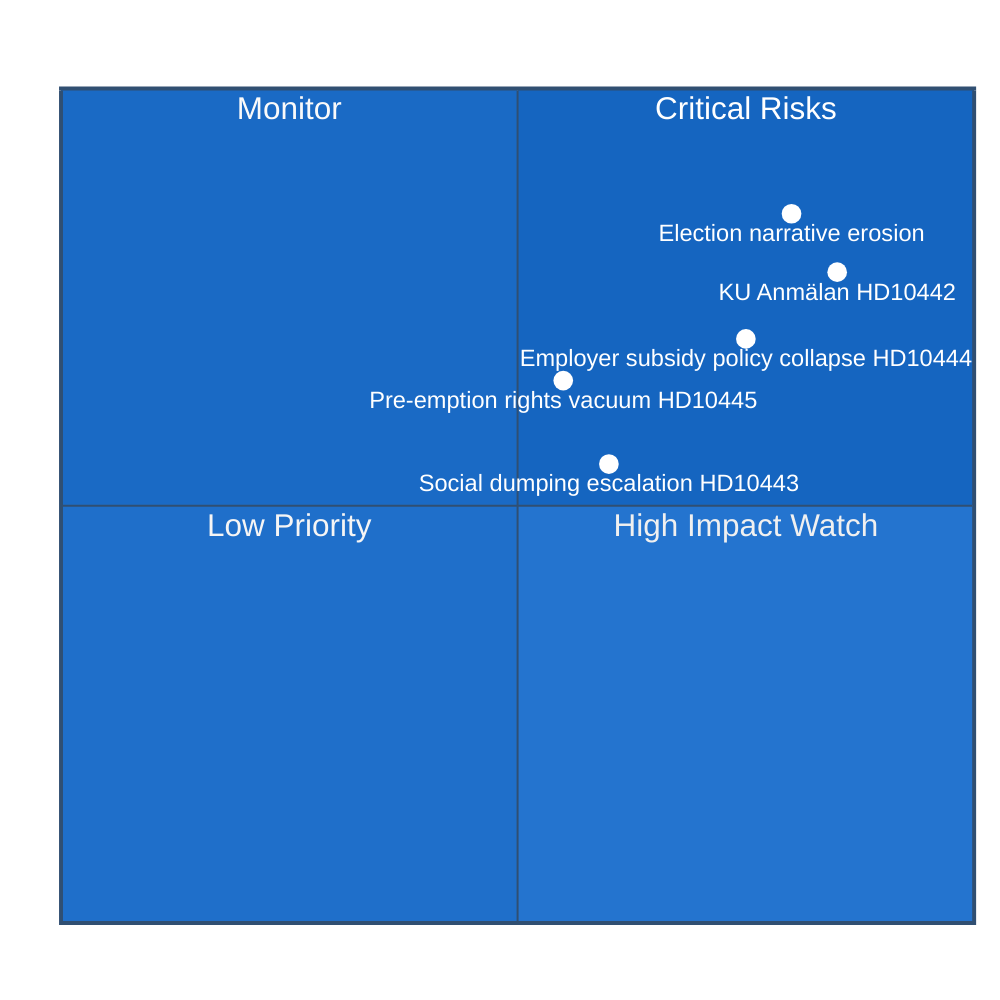

# Risk Assessment — Interpellations 2026-04-22

**Methodology**: political-risk-methodology.md — 5×5 L×I matrix  
**Analysis Date**: 2026-04-22  

---

## 🎯 Top 5 Risks

---

## 📋 Risk Register

### Risk 1: Constitutional Committee (KU) Investigation of Finance Minister Svantesson

| Dimension | Assessment |
|-----------|-----------|
| **Description** | KU anmälan filed by S or another party based on Svantesson's documented false September 22, 2025 parliament statement about Region Stockholm eating disorder care, now court-contradicted (HD10442; Stockholm District Court April 1, 2026 — HD10442, riksdagen.se) |
| **Likelihood** | 4/5 — Very Likely: documented false statement + court ruling creates strong evidentiary basis |
| **Impact** | 5/5 — Critical: KU investigation triggers public scrutiny, possible parliamentary censure, coalition stability risk |
| **Score** | **20/25 — Critical** |
| **Cascading effects** | M-party internal pressure; SD may use as leverage; coalition renegotiation risk |
| **Mitigant** | Svantesson proactively acknowledges error before interpellation debate |

### Risk 2: Election 2026 Narrative — Incumbent Credibility Erosion

| Dimension | Assessment |
|-----------|-----------|
| **Description** | Cumulative effect of five S interpellations documenting policy failures across healthcare, labour market, housing, social welfare, and administrative justice — all within 2 days — creates sustained anti-government narrative [HD10442, HD10444, HD10443, HD10445, HD10446 — riksdagen.se] |
| **Likelihood** | 5/5 — Almost Certain: opposition strategy is working; media will amplify |
| **Impact** | 4/5 — High: sustained narrative damage 5 months before election (Sep 14, 2026) |
| **Score** | **20/25 — Critical** |
| **Cascading effects** | Voter swing in suburban Stockholm; youth voter motivation reduced; progressive voter bloc consolidation around S |
| **Mitigant** | Government counter-narrative with positive policy achievements; minister communications training |

### Risk 3: Employer Contribution Policy Collapse (HD10444)

| Dimension | Assessment |
|-----------|-----------|
| **Description** | Aftonbladet investigation documenting retail chain internal memos explicitly redirecting April 2026 employer contribution savings from hiring to profit — directly contradicting stated government policy purpose (HD10444, riksdagen.se; Aftonbladet "200 sekunder" series) |
| **Likelihood** | 4/5 — Very Likely: investigation already published; more companies likely exposed |
| **Impact** | 4/5 — High: flagship youth employment policy undermined; youth unemployment at 8.7% (2025, World Bank) |
| **Score** | **16/25 — High** |
| **Cascading effects** | V and S will push for clawback mechanisms; FiU parliamentary review; further media scrutiny |
| **Mitigant** | Svantesson announces monitoring/evaluation framework; employer trade association engagement |

### Risk 4: Social Dumping Escalation (HD10443)

| Dimension | Assessment |
|-----------|-----------|
| **Description** | Without legislative action against municipal social dumping, vulnerable persons continue to be coerced into relocating between municipalities, with documented housing quality failures. HD10443 + HD10423 (jointly answered) create dual interpellation pressure — riksdagen.se |
| **Likelihood** | 3/5 — Likely: practice documented in media, no government legislation planned |
| **Impact** | 3/5 — Moderate: affects limited number of individuals but symbolically important for Tidö/KD positioning on human dignity |
| **Score** | **9/25 — Moderate** |
| **Cascading effects** | KD internal discomfort (Christian democracy vs. municipal autonomy); ombudsman engagement |
| **Mitigant** | Slottner acknowledges problem, commits to guidance/framework for municipalities |

### Risk 5: Pre-emption Rights Policy Vacuum — Suburban Unrest (HD10445)

| Dimension | Assessment |
|-----------|-----------|
| **Description** | Without municipal pre-emption rights for key properties, suburban Stockholm areas (Sätra, Vårberg, Rågsved) remain vulnerable to speculative property acquisitions. SOU 2024:38 shelved — no bill in 2025/26 agenda — HD10445, riksdagen.se; dir. 2023:67 |
| **Likelihood** | 3/5 — Likely: SOU already delivered, no government action signalled |
| **Impact** | 4/5 — High: linked to segregation and crime narratives critical for Election 2026 |
| **Score** | **12/25 — High** |
| **Cascading effects** | Stockholm municipality political pressure; C and L coalition partners may break ranks |
| **Mitigant** | Government commits to SOU implementation timeline; partial pre-emption for security purposes expedited |

---

## 📊 Posterior Probability Estimates

| Event | Prior P | Evidence Update | Posterior P |
|-------|---------|-----------------|-------------|
| KU anmälan filed against Svantesson (HD10442) | 0.40 | +0.35 (court ruling [A1]) | **0.75** |
| Svantesson announces employer monitoring (HD10444) | 0.30 | +0.15 (political pressure) | **0.45** |
| Social dumping legislation before election | 0.15 | -0.05 (no agenda item) | **0.10** |
| Pre-emption rights bill before Sep 2026 election | 0.10 | -0.05 (no agenda item) | **0.05** |

---

## 🔄 Tradecraft Context

**Methodology**: political-risk-methodology.md — 5×5 Likelihood × Impact matrix; cascading risk chains  
**Assessment period**: 2026-04-22 through 2026-09-14 (Election Day)  

**Key epistemic note**: The risk assessments above are grounded in [A1] official sources (court ruling, parliamentary record, government directives) for the two critical risks. The posterior probability of KU anmälan (0.75) reflects the documented strength of evidence available to S: a dated parliamentary quote + an unambiguous court ruling — a near-perfect evidentiary combination for a constitutional complaint.

**Cascading risk chain — worst case for Tidö**:
Court ruling validates S on HD10442 → KU anmälan filed → Investigation opens → Svantesson forced to appear before KU → Media escalation → Coalition partners (KD, L) distance themselves → Government credibility on healthcare further weakens → Election 2026 suburban M vote softens → S regains governing mandate.

**Cascading risk chain — best case for Tidö**:
Svantesson acknowledges error on HD10442 before debate → Announces employer monitoring on HD10444 → Slottner commits to social dumping guidance → Carlson signals partial SOU 2024:38 progress → S interpellations become routine scrutiny → Election 2026 contested on normal grounds.

**Assessment**: The government has a narrow but real window (before May 5-6 debate dates) to make tactical concessions that blunt the accountability offensive. The political calculus favors proactive correction over defensive entrenchment, given the documentary strength of S's evidentiary position.
