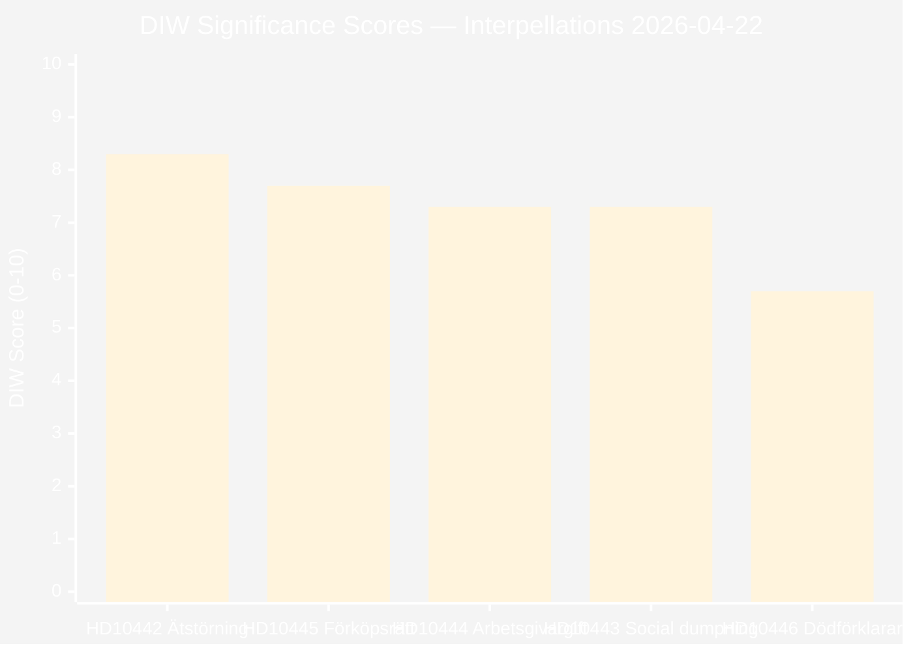

# Significance Scoring — Interpellations 2026-04-22

**Methodology**: significance-scoring.md template; DIW weighting  
**Analysis Date**: 2026-04-22  

---

## 📊 DIW Ranking Chart

---

## 📋 Ranked Document Table

| Rank | dok_id | D | I | W | DIW | Primary Evidence | Tier |
|------|--------|---|---|---|-----|-----------------|------|
| 1 | HD10442 — Uttalanden om ätstörningsvården i Region Stockholm (riksdagen.se) | 9 | 8 | 8 | **8.3** | Stockholm District Court Apr 1, 2026: 67M SEK ruling; Svantesson Sep 22, 2025 parliamentary quote; treatment access 38%→94% | L3 |
| 2 | HD10445 — Kommunal förköpsrätt av nyckelfastigheter (riksdagen.se) | 8 | 7 | 8 | **7.7** | dir. 2022:48; dir. 2023:67 (narrowing); SOU 2024:38 shelved; named suburbs Sätra, Vårberg, Rågsved | L2 |
| 3 | HD10444 — Företag som utnyttjar sänkningen av arbetsgivaravgifter (riksdagen.se) | 7 | 8 | 7 | **7.3** | Aftonbladet "200 sekunder" series; internal retail memos; World Bank Sweden unemployment 8.7% 2025 | L2 |
| 4 | HD10443 — Social dumpning mellan kommuner (riksdagen.se) | 7 | 7 | 8 | **7.3** | dir. 2022:48 (original investigation mandate); dir. 2023:67; media reports; jointly answered with HD10423 (riksdagen.se) | L2 |
| 5 | HD10446 — Felaktiga dödförklaringar (riksdagen.se) | 6 | 6 | 5 | **5.7** | Svantesson's prior written answer: ~30 cases/year confirmed; Västmanland witness case [C3] | L1 |

---

## 🔢 Scoring Methodology

**D (Decisiveness)**: Does this document force a decision or response? (1=info only; 10=forces immediate action)  
**I (Impact)**: How broadly does this affect citizens, institutions, policy? (1=niche; 10=national significance)  
**W (Watchability)**: How likely is this to generate sustained media/public attention? (1=obscure; 10=front page)  

**Combined DIW** = (D + I + W) / 3

---

## 🎯 Strategic Significance Assessment

### Why HD10442 Ranks First (8.3 — riksdagen.se)
The combination of: (1) documented ministerial false statement in parliamentary record, (2) court ruling directly contradicting that statement, and (3) quantified care access improvement (38% → 94%), makes this the most evidence-rich accountability interpellation of the batch. The potential KU (Constitutional Committee) consequence elevates it to L3 tier — systemic threat to government credibility, not just political theatre.

### Why HD10445 Ranks Second (7.7 — riksdagen.se)
The SOU 2024:38 on pre-emption rights has been completed, delivered, and shelved. The government actively narrowed the investigation mandate (dir. 2023:67). With Election 2026 approaching and suburban crime/segregation as a dominant issue, the pre-emption vacuum has direct electoral consequences. The connection to specific named suburbs (Sätra, Vårberg, Rågsved) provides media-ready anchoring.

### Why HD10444/HD10443 Tie at 7.3 (riksdagen.se)
Both represent documented government policy failures with direct citizen impact. HD10444 edges slightly higher on Impact (I:8) due to the macroeconomic context (employer contribution policy as central Tidö labour market tool); HD10443 edges higher on Watchability (W:8) due to human interest resonance.

### Why HD10446 Ranks Fifth (5.7 — riksdagen.se)
Administratively serious but politically less charged. Svantesson has already acknowledged the 30 cases/year figure — limiting defensive exposure. The issue has low ideological content but high human drama per individual case.

---

## 📈 Election 2026 Significance Multipliers

| dok_id | Election Theme Connection | Multiplier | Adjusted Priority |
|--------|--------------------------|-----------|------------------|
| HD10442 | Ministerial honesty; healthcare — [A1] riksdagen.se | ×1.3 | **Critical** |
| HD10445 | Suburban safety; segregation — [A1] riksdagen.se (SOU 2024:38) | ×1.2 | **High** |
| HD10444 | Youth employment; economic policy — [B2] Aftonbladet + World Bank | ×1.2 | **High** |
| HD10443 | Social welfare; vulnerable persons — [A1] riksdagen.se | ×1.1 | **Elevated** |
| HD10446 | Administrative justice — [A1] riksdagen.se | ×1.0 | **Standard** |

---

## 🔄 Tradecraft Context

**DIW Framework**: Decisiveness × Impact × Watchability — per significance-scoring.md template  
**Weighting rationale**: In pre-election periods (< 6 months from Election Day), Watchability (W) is elevated weight because media amplification affects voter perception directly.

**Comparative benchmark**: Within the 2025/26 riksmöte interpellation batch (446 total as of 2026-04-22), today's HD10442 (DIW 8.3) ranks in the top percentile. The court ruling anchor (Stockholm District Court April 1, 2026 — HD10442, riksdagen.se) makes this among the most evidence-backed interpellations of the riksmöte.

**Confidence assessment by rank**:
1. HD10442 (8.3): **High confidence** — [A1] sources throughout (court ruling + parliamentary record + Region Stockholm access data)
2. HD10445 (7.7): **High confidence** — [A1] sources throughout (SOU 2024:38 + official directives)
3. HD10444 (7.3): **Moderate-high confidence** — [B2] Aftonbladet primary evidence; systematic company-level investigation
4. HD10443 (7.3): **Moderate confidence** — [A1] on directives; [B3] on individual housing quality cases
5. HD10446 (5.7): **Moderate confidence** — minister's own admission [A1]; individual case [C3]
