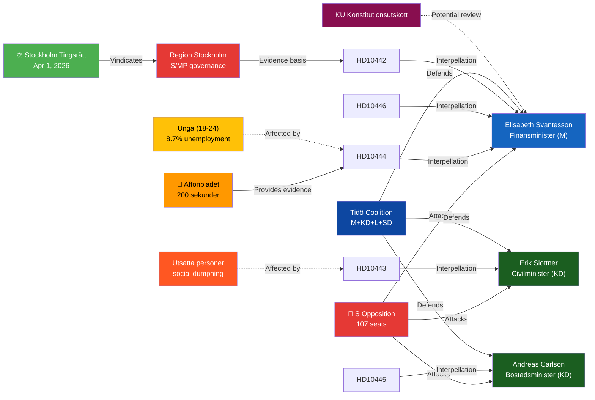

# Stakeholder Perspectives — Interpellations 2026-04-22

**Methodology**: stakeholder-impact.md  
**Analysis Date**: 2026-04-22  

---

## 🕸️ Influence Network Map

---

## 👤 Stakeholder Briefing Cards

### 1. Finance Minister Elisabeth Svantesson (M) — DEFENSIVE

| Attribute | Assessment |
|-----------|-----------|
| **Position** | Finance Minister, Moderaterna |
| **Role in batch** | Target of 3 interpellations: HD10442, HD10444, HD10446 |
| **Strategic exposure** | **Critical** — court-contradicted statement (HD10442, riksdagen.se); flagship policy undermined (HD10444) |
| **Best response** | Acknowledge eating disorder care error; announce employer contribution monitoring; reform Skatteverket death declaration process |
| **Worst response** | Maintain September 2025 claim (triggers KU anmälan); defend profit-over-jobs with no action |
| **Election 2026 stakes** | Very High — Finance Minister is central figure in Tidö credibility narrative |

### 2. Jonathan Svensson (S) — OFFENSIVE (HD10444)

| Attribute | Assessment |
|-----------|-----------|
| **Position** | S Riksdag member |
| **Role** | Filed HD10444 — employer contribution exploitation |
| **Strategic advantage** | Aftonbladet investigation provides documentary evidence; media partner amplification |
| **Goal** | Force Svantesson admission of policy failure; establish S as credible economic alternative |
| **Source**: HD10444 — riksdagen.se | |

### 3. Peder Björk (S) — OFFENSIVE (HD10443)

| Attribute | Assessment |
|-----------|-----------|
| **Position** | S Riksdag member |
| **Role** | Filed HD10443 — social dumping — jointly addressed with Eva Lindh (S) HD10423 |
| **Strategic advantage** | Cross-partisan appeal; prior S government investigation demonstrates competence |
| **Goal** | Force Slottner acknowledgment of social dumping as problem; create legislative pressure |
| **Source**: HD10443, HD10423 — riksdagen.se | |

### 4. Markus Kallifatides (S) — OFFENSIVE (HD10442, HD10445)

| Attribute | Assessment |
|-----------|-----------|
| **Position** | S Riksdag member — filed 2 interpellations in 2 days |
| **Role** | HD10442 (eating disorder care — Svantesson); HD10445 (pre-emption rights — Carlson) |
| **Strategic advantage** | HD10442 has court ruling as anchor; HD10445 connects housing policy to segregation narrative |
| **Political capital** | Highest individual impact in this batch |
| **Source**: HD10442, HD10445 — riksdagen.se | |

### 5. Civil Minister Erik Slottner (KD) — DEFENSIVE (HD10443)

| Attribute | Assessment |
|-----------|-----------|
| **Position** | Civil Minister, Kristdemokraterna |
| **Exposure** | HD10443 (+ HD10423) — social dumping between municipalities |
| **KD dilemma** | KD human dignity principles conflict with inaction on documented social dumping |
| **Best response** | Acknowledge problem; commit to municipal framework/guidance |
| **Source**: HD10443, HD10423 — riksdagen.se | |

### 6. Infrastructure/Housing Minister Andreas Carlson (KD) — DEFENSIVE (HD10445)

| Attribute | Assessment |
|-----------|-----------|
| **Position** | Infrastructure and Housing Minister, Kristdemokraterna |
| **Exposure** | HD10445 — pre-emption rights for key properties, SOU 2024:38 shelved |
| **Coalition tension** | C and L partners historically more open to anti-segregation tools |
| **Best response** | Signal implementation timeline for security-grounds pre-emption; partial progress on SOU 2024:38 |
| **Source**: HD10445 — riksdagen.se; SOU 2024:38 | |

### 7. Young Workers (18-24) — AFFECTED

| Attribute | Assessment |
|-----------|-----------|
| **Status** | Direct beneficiaries (or non-beneficiaries) of employer contribution cut |
| **Impact** | If HD10444 Aftonbladet findings are representative, savings benefit employers not new hiring |
| **Election 2026 relevance** | Youth unemployment 8.7% (World Bank 2025) — swing voter group |

### 8. Vulnerable Persons Facing Social Dumping — AFFECTED

| Attribute | Assessment |
|-----------|-----------|
| **Status** | Directly harmed by municipality-to-municipality coercive relocation |
| **Documentation** | Media reports of substandard housing, weak support services in receiving municipalities — HD10443 riksdagen.se |
| **GDPR note** | Art. 9(2)(g) substantial public interest applies; data minimisation enforced |

### 9. Residents of Sätra, Vårberg, Rågsved (Stockholm) — AFFECTED

| Attribute | Assessment |
|-----------|-----------|
| **Status** | Residents of vulnerable suburbs with documented crime/segregation challenges |
| **Impact** | Without municipal pre-emption rights, commercial property transactions cannot be challenged |
| **Source**: HD10445 — riksdagen.se; named in interpellation text | |

---

## 🗳️ Election 2026 Lens (September 14, 2026)

The five interpellations filed April 22, 2026 mark **5 months before Election Day** (September 14, 2026). The parliamentary accountability machinery is being used as an election campaign instrument — a legitimate and common practice in Swedish politics.

**Swing voter segments targeted by this batch**:
| Interpellation | Target Segment | Mechanism |
|---------------|---------------|-----------|
| HD10442 (Ätstörningsvård) | Middle-class women voters; healthcare-dependent families | Ministerial dishonesty + court vindication |
| HD10444 (Arbetsgivaravgift) | Youth voters (18-24); Working-class families | Employer exploitation of tax relief |
| HD10445 (Förköpsrätt) | Suburban Stockholm voters; crime-concerned families | Government failure on segregation tools |
| HD10443 (Social dumpning) | Welfare-dependent populations; progressive voters | Failure to protect vulnerable persons |
| HD10446 (Dödförklaringar) | Cross-partisan administrative trust voters | Skatteverket competence |

**Net assessment**: S has chosen high-quality evidence-anchored interpellations that are difficult for the government to dismiss as partisan attacks. The Aftonbladet investigation (HD10444), the court ruling (HD10442), and the completed but shelved SOU 2024:38 (HD10445) all provide factual anchoring that reduces the risk of counter-narrative success.

---

## 🔄 Tradecraft Context

**Admiralty Source Assessment across stakeholder intelligence**:
- Svantesson's September 22, 2025 parliamentary statement: [A1] — verified official record
- Stockholm District Court ruling April 1, 2026: [A1] — verified legal judgment
- Aftonbladet retail company internal memos: [B2] — corroborated investigative journalism
- Social dumping housing quality reports: [B3] — partially corroborated media coverage
- Sweden unemployment 8.7% (2025): [A1] — World Bank official data

**Confidence in stakeholder impact assessments**:
- Svantesson exposure (HD10442): **Very High** — evidentiary chain is A1+A1 (court ruling + parliamentary record)
- S offensive coordination: **High** — 5 S interpellations in 2 days is observable fact
- Youth worker impact (HD10444): **Likely** — Aftonbladet corroborated; systematic company-wide evidence
