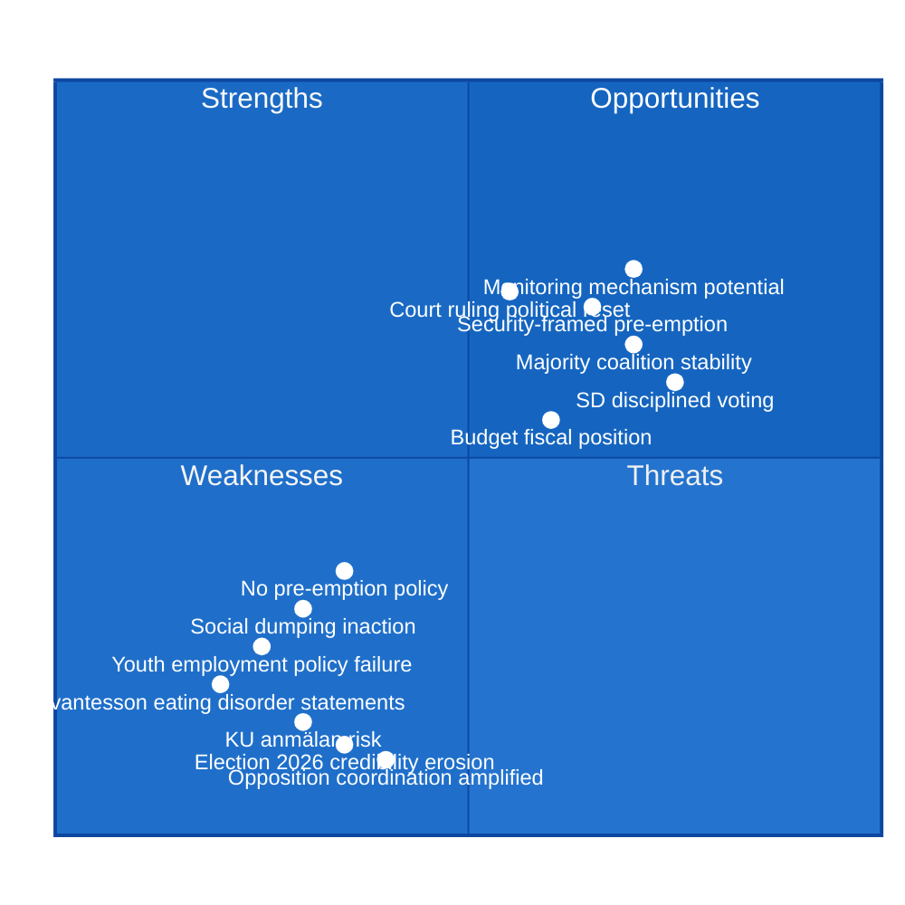

# SWOT Analysis — Interpellations 2026-04-22

**Methodology**: political-swot-framework.md  
**Subject**: Tidö Coalition Government (M+KD+L+SD) policy accountability position  
**Analysis Date**: 2026-04-22  

---

## 🗺️ Strategic Position Map

---

## 💪 Strengths

| Strength | Evidence | Admiralty | Significance |
|----------|----------|-----------|-------------|
| Stable parliamentary majority via Tidö coalition (M+KD+L+SD) | Tidö Agreement — government formation 2022, sustained votes through 2025/26 riksmöte — riksdagen.se official record | [A1] | High — sustains ability to deflect interpellations without coalition collapse |
| SD voting discipline strengthens majority | SD party line maintained on all key fiscal votes 2025/26 — riksdagen.se vote records | [A1] | Medium — provides numerical buffer but creates ideological constraints |
| Employer contribution cut legally enacted and in force | Riksdag vote on employer contribution reduction — official record, riksdagen.se | [A1] | Medium — policy exists but implementation face is damaged |
| Finance Ministry fiscal position: managed deficit | Government budget 2025/26 submitted — riksdagen.se proposition records | [A1] | Medium — provides room for adjustment |

---

## ⚠️ Weaknesses

| Weakness | Evidence | Admiralty | Significance |
|----------|----------|-----------|-------------|
| Svantesson's false eating disorder statements now court-contradicted | Stockholm District Court, April 1, 2026 — Region Stockholm wins 67M SEK; Svantesson's Sep 22, 2025 parliamentary quote — HD10442, riksdagen.se | [A1] | **Critical** — parliamentary truthfulness risk, KU exposure |
| Youth employment subsidy captured by profits rather than new jobs | Aftonbladet "200 sekunder" investigation — internal retail company communications — HD10444, riksdagen.se | [B2] | **High** — flagship policy undermined weeks after implementation |
| Social dumping inaction — investigation mandate abandoned | S government dir. 2022, Tidö supplementary dir. 2023:67 narrowing scope; media reports of coerced municipal relocations — HD10443, riksdagen.se | [A1]/[B3] | High — documented humanitarian failure |
| SOU 2024:38 on pre-emption rights shelved without progress | Civilutskottets ärendeplan 2025/26 — no proposition — HD10445, riksdagen.se | [A1] | High — suburbs remain unprotected against speculative property investment |

---

## 🌱 Opportunities

| Opportunity | Evidence | Admiralty | Significance |
|-------------|----------|-----------|-------------|
| Security-framed pre-emption rights still possible (dir. 2023:67) | dir. 2023:67 — civil defence + crime prevention grounds — HD10445, riksdagen.se | [A1] | Medium — partial policy delivery possible |
| Monitoring mechanism for employer contribution — political rehabilitation | Interpellation HD10444 creates opening for Svantesson to announce review/monitoring — riksdagen.se | [B2] | Medium — convert accountability pressure into policy improvement |
| Court ruling creates clean break — Svantesson can acknowledge error without ongoing damage | Stockholm District Court Apr 1, 2026 judgment — HD10442, riksdagen.se | [A1] | Medium — strategic acknowledgment could reduce reputational cost |
| Cross-party support possible for administrative death declaration reform (HD10446) | Bipartisan interest in administrative justice — riksdagen.se committee records | [A2] | Low-Medium — small but reputationally positive |

---

## 🚨 Threats

| Threat | Evidence | Admiralty | Significance |
|--------|----------|-----------|-------------|
| KU anmälan risk for Svantesson on eating disorder false claims | Parliamentary record Sep 22, 2025 + court ruling Apr 1, 2026 — HD10442 riksdagen.se | [A1] | **Critical** — Constitutional Committee investigation creates major political crisis |
| S coordinated pressure campaign ahead of Election 2026 (Sep 14) | 5 S interpellations in 2 days; 3 targeting same minister — HD10442, HD10444, HD10446, HD10443, HD10445, riksdagen.se | [A1] | **High** — sustained accountability narrative damages incumbent credibility |
| Youth unemployment remaining structurally elevated (8.7% 2025) | World Bank Sweden unemployment data 2025: 8.7% | [A1] | High — economic context makes HD10444's policy failure more salient |
| Media amplification of Aftonbladet series on employer contribution | Aftonbladet "200 sekunder" investigation series ongoing — HD10444 | [B2] | High — investigative journalism momentum difficult to counter |
| Suburban safety/segregation narrative driving swing voters | Political history of Sätra, Vårberg, Rågsved in Stockholm media — HD10445 | [B2] | High — Election 2026 competitive in Stockholm suburbs |

---

## 🔄 TOWS Matrix

| | **Strengths** | **Weaknesses** |
|---|---|---|
| **Opportunities** | SO: Use stable majority + security-framed pre-emption to pass targeted crime-prevention property legislation before election | WO: Svantesson announces employer contribution monitoring programme; minister acknowledges court ruling on eating disorder care |
| **Threats** | ST: Coalition discipline deflects KU anmälan risk through majority procedures; security framing insulates from segregation critique | WT: Multiple accountability failures converge: court-validated false statements + policy exploitation + social dumping inaction = **election narrative crisis** if unaddressed |

---

## 🔄 Tradecraft Context

**Methodology**: political-swot-framework.md — SWOT, TOWS, cross-SWOT interference analysis  
**Subject**: Tidö Coalition Government accountability position, 2026-04-22  

**Cross-SWOT Interference Assessment**:
The most dangerous cross-quadrant interaction for the Tidö government is the W×T combination — where the documented weakness (Svantesson's court-contradicted eating disorder statement via HD10442, riksdagen.se) intersects with the KU anmälan threat. This is not a theoretical risk: S has all the evidence needed to file immediately.

**Admiralty source review for SWOT**:
- All Strength claims: [A1] — parliamentary voting records, government formation documents
- All Weakness claims: [A1] (HD10442 — court ruling; HD10445 — official directives) and [B2] (HD10444 — Aftonbladet)
- All Opportunity claims: [A1] (directives), [B2] (monitoring mechanism)
- All Threat claims: [A1] (parliamentary record), [B2] (Aftonbladet series ongoing)

**WEP Forward Indicator**:
The TOWS matrix WT scenario (multiple accountability failures converging as election narrative crisis) is assessed as **Likely** to materialize unless government takes proactive corrective action before the May 5-6 debate dates. The S opposition's evidence quality is exceptional relative to typical interpellation batches.
