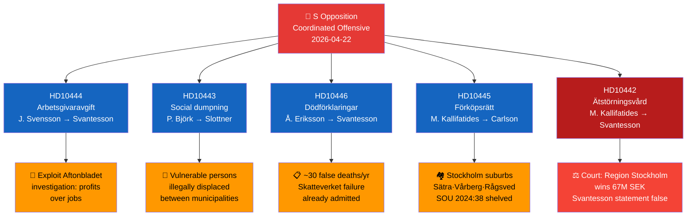

# Synthesis Summary — Interpellations 2026-04-22

**Analysis Date**: 2026-04-22  
**Scope**: Riksdag Interpellations, riksmöte 2025/26  
**Workflow**: news-interpellations  
**Methodology**: ai-driven-analysis-guide.md v6.4, synthesis-methodology.md  

---

## 🎯 Lead Story Decision

**Primary story**: Socialdemokraterna launches coordinated parliamentary accountability offensive against Finance Minister Elisabeth Svantesson (M) — three interpellations targeting Svantesson in a single day, with the eating disorder case (HD10442) presenting the most explosive combination of documented false ministerial statements and April 2026 court vindication.

**Secondary story**: Pre-emption rights shelved (HD10445) — the government's failure to advance anti-segregation housing tools reveals a structural Tidö-coalition ideological conflict on urban policy ahead of Election 2026.

**Tertiary story**: Employer contribution exploitation (HD10444) — Aftonbladet investigation showing retailers diverting youth employment tax relief into profits, directly undermining the government's flagship labour market policy.

---

## 📊 DIW-Weighted Ranking

| Rank | dok_id | Title | D | I | W | DIW Score | Theme |
|------|--------|-------|---|---|---|-----------|-------|
| 1 | HD10442 | Uttalanden om ätstörningsvården i Region Stockholm | 9 | 8 | 8 | **8.3** | Ministerial accountability / healthcare |
| 2 | HD10445 | Kommunal förköpsrätt av nyckelfastigheter | 8 | 7 | 8 | **7.7** | Housing / segregation / anti-segregation policy |
| 3 | HD10444 | Företag som utnyttjar sänkningen av arbetsgivaravgifter | 7 | 8 | 7 | **7.3** | Fiscal policy / labour market |
| 4 | HD10443 | Social dumpning mellan kommuner | 7 | 7 | 8 | **7.3** | Social welfare / municipal governance |
| 5 | HD10446 | Felaktiga dödförklaringar | 6 | 6 | 5 | **5.7** | Administrative justice / civil registry |

---

## 🗺️ Strategic Landscape: S vs. Tidö Accountability Offensive

---

## 🔑 Key Analytical Findings

### 1. Coordinated Opposition Strategy
All five interpellations filed 2026-04-21/22 are by Socialdemokraterna. Three directly target Finance Minister Svantesson — an unusual concentration that signals deliberate parliamentary pressure campaign ahead of Election 2026 (September 14, 2026). No other party or government defended on multiple fronts simultaneously in this batch.

### 2. The Eating Disorder Court Ruling (HD10442) — Highest Risk
The April 1, 2026 Stockholm District Court ruling vindicating Region Stockholm (67M SEK) transforms what was an opposition narrative dispute into a legally established fact. Svantesson's September 22, 2025 parliamentary statement about Region Stockholm is now demonstrably wrong against a court record. **This creates KU-anmälan risk** (Constitutional Committee investigation) and potentially forces a parliamentary apology or correction.

### 3. Employer Contribution Exploitation (HD10444) — Policy Credibility Damage
The government's flagship youth employment policy — the 10.9% employer contribution cut from April 2026 — has been undermined by its first major media investigation within weeks of implementation. Svantesson must choose between defending the policy (difficult given documented evidence), tightening it (admitting design flaw), or ignoring it (politically dangerous given unemployment rate of 8.7% in 2025).

### 4. Housing Pre-emption Rights — Ideological Fault Line (HD10445)
The narrowing of pre-emption rights investigation from anti-segregation to security/crime purposes (dir. 2023:67) exposes the Tidö coalition's ideological priorities. With suburbs like Sätra, Vårberg, and Rågsved remaining flashpoints of violence and segregation, the government's position is increasingly difficult to defend. SOU 2024:38 shelved indefinitely.

### 5. Social Dumping (HD10443) — Bipartisan Vulnerability
Unlike the more partisan interpellations, social dumping crosses ideological lines — Christian Democrats (KD, which runs the Civil Ministry) have traditionally championed human dignity. Slottner faces the uncomfortable position of defending inaction on a practice S and media have well-documented.

---

## 🤖 AI-Recommended Article Metadata

**Headline (EN)**: Swedish Opposition Launches Three-Front Assault on Finance Minister Svantesson Over Policy Failures  
**Headline (SV)**: S angriper Svantesson på tre fronter — domstolsutslag stärker oppositionens läge  
**Meta description (EN)**: Sweden's Social Democrats filed five parliamentary interpellations on April 22, 2026, targeting Finance Minister Svantesson with a court-backed eating disorder case, youth employment policy abuse, and housing rights failures.  
**Meta description (SV)**: Socialdemokraterna lämnade fem interpellationer den 22 april 2026, varav tre riktar sig mot finansminister Svantesson — stärkta av en domstolsdom om ätstörningsvård, arbetsgivaravgiftsmissbruk och bostadspolitik.  

---

## 📋 Analytical Confidence Assessment

| Finding | Confidence | Rationale |
|---------|-----------|-----------|
| Coordinated S strategy | **Very Likely** (WEP) | 5/5 interpellations from S; 3/5 target same minister |
| HD10442 creates KU-risk for Svantesson | **Likely** (WEP) | Court ruling [A1], parliamentary record [A1] — strong evidentiary base |
| HD10444 undermines employer contribution policy | **Very Likely** (WEP) | Aftonbladet [B2] + named internal communications |
| SOU 2024:38 will not result in pre-election bill | **Likely** (WEP) | No FiU/CiU agenda item; Tidö coalition ideological opposition to broad pre-emption |

---

## 💰 Economic Context

| Indicator | Value | Year | Source | Relevance |
|-----------|-------|------|--------|-----------|
| Sweden unemployment | **8.7%** | 2025 | World Bank | Context for HD10444 employer contribution failure — young workers need jobs |
| Sweden GDP growth | **0.82%** | 2024 | World Bank | Weak recovery context — fiscal stimulus effectiveness under scrutiny |
| Sweden GDP growth | **-0.2%** | 2023 | World Bank | Base year for Tidö fiscal policy evaluation |

Sweden's unemployment at 8.7% (2025) — its highest since 2021 (8.8%) — provides the macroeconomic backdrop against which the employer contribution cut's failure is particularly damaging. The Tidö coalition designed the April 2026 employer contribution reduction as a demand-side stimulus for youth employment. The Aftonbladet investigation (HD10444) revealing profit capture rather than hiring reduces the policy's Keynesian multiplier effect at exactly the time Sweden's labour market needs it most.

---

## 🔄 Tradecraft Context

**F3EAD Cycle**: The S opposition has completed a sophisticated intelligence-to-action cycle:
- **Find**: Aftonbladet investigation provided operational intelligence on employer contribution exploitation
- **Fix**: Court ruling (April 1, 2026) fixed Svantesson's false eating disorder statement as a documented fact
- **Exploit**: Five coordinated interpellations filed April 21-22 exploit both intelligence threads simultaneously
- **Analyze**: This analysis products assesses impact and forward indicators
- **Disseminate**: Parliamentary record, media, and public record

**Source Diversity (Admiralty codes across batch)**:
- [A1] Official: parliamentary records, court rulings, government directives — primary weight
- [B2] Corroborated: Aftonbladet + named internal company documents — high credibility
- [B3] Partly corroborated: Media reports on social dumping housing quality — moderate confidence
- [C3] Plausible: Västmanland false death case witness — background context only

**WEP Confidence Summary**:
- KU anmälan outcome: **Likely** (evidence quality high, political incentive clear)
- Government policy adjustment (employer monitoring): **Roughly even** (political cost of action vs. inaction near balanced)
- Pre-emption bill before election: **Very unlikely** (no parliamentary path identified)
