# Threat Analysis — Interpellations 2026-04-22

**Methodology**: political-threat-framework.md — attack trees, MITRE-style TTP mapping  
**Analysis Date**: 2026-04-22  

---

## 🌳 Threat Trees

```mermaid
flowchart TD
    ROOT["🎯 Goal: Undermine Tidö Government before Election 2026 (Sep 14)"] 
    ROOT --> T1["T1: Ministerial Accountability HD10442 — Svantesson"]
    ROOT --> T2["T2: Policy Failure Exposure HD10444 — Arbetsgivaravgift"]
    ROOT --> T3["T3: Social Contract Failure HD10443 — Social dumpning"]
    ROOT --> T4["T4: Urban Policy Vacuum HD10445 — Förköpsrätt"]

    T1 --> A1["Cite court ruling Stockholm District Court Apr 1, 2026 — HD10442 riksdagen.se"]
    T1 --> A2["Cite parliamentary record Sep 22, 2025 statement — HD10442 riksdagen.se"]
    T1 --> A3["Force KU anmälan Constitutional Committee"]

    T2 --> B1["Cite Aftonbladet investigative series — HD10444 riksdagen.se"]
    T2 --> B2["Document profit-over-jobs internal communications"]
    T2 --> B3["Link to 8.7% unemployment World Bank Sweden 2025"]

    T3 --> C1["Cite prior S-government investigation dir. 2022"]
    T3 --> C2["Document Tidö narrowing dir. 2023:67 — HD10445 riksdagen.se"]
    T3 --> C3["Joint interpellation HD10443 + HD10423 riksdagen.se"]

    T4 --> D1["Cite SOU 2024:38 shelved without bill — HD10445 riksdagen.se"]
    T4 --> D2["Name specific suburbs Sätra Vårberg Rågsved"]
    T4 --> D3["Exploit KD human dignity position contradiction"]

    style ROOT fill:#E53935,color:#FFFFFF
    style T1 fill:#B71C1C,color:#FFFFFF
    style T2 fill:#F44336,color:#FFFFFF
    style T3 fill:#FF5722,color:#FFFFFF
    style T4 fill:#FF9800,color:#000000
    style A1 fill:#1565C0,color:#FFFFFF
    style A2 fill:#1565C0,color:#FFFFFF
    style A3 fill:#880E4F,color:#FFFFFF
    style B1 fill:#1565C0,color:#FFFFFF
    style B2 fill:#1565C0,color:#FFFFFF
    style B3 fill:#1565C0,color:#FFFFFF
    style C1 fill:#1565C0,color:#FFFFFF
    style C2 fill:#1565C0,color:#FFFFFF
    style C3 fill:#1565C0,color:#FFFFFF
    style D1 fill:#1565C0,color:#FFFFFF
    style D2 fill:#1565C0,color:#FFFFFF
    style D3 fill:#4A148C,color:#FFFFFF
```

---

## ⚔️ Attack Chain Analysis — S Opposition Strategy

| Phase | Action | Technique | Evidence |
|-------|--------|-----------|---------|
| Reconnaissance | Identify minister weak points | Parliamentary record review; Aftonbladet tip-offs | Multiple S MPs focused on Svantesson |
| Weaponization | Build interpellation case | Legal (court ruling), journalism (Aftonbladet), policy record (SOU 2024:38) | 5 interpellations filed same week |
| Delivery | File interpellations | Parliamentary right Art. 12 interpellation | HD10442-HD10446 — riksdagen.se |
| Exploitation | Force minister response | Interpellation debate mandatory | Debates scheduled 2026-05-05/06 |
| Installation | Establish accountability narrative | Media coverage, public record | Permanent parliamentary record |
| C2 | Coordinate multi-front pressure | Multiple S MPs, coordinated timing | 3 Svantesson + 1 Slottner + 1 Carlson same week |

---

## 🛡️ MITRE-Style TTP Mapping (Parliamentary Domain)

| Tactic | Technique ID | Technique | Example from Batch |
|--------|-------------|-----------|-------------------|
| Initial Access | PP-001 | Parliamentary Question (Skriftlig Fråga) | Prior question establishing 30 false deaths/yr (HD10446) |
| Execution | PP-002 | Interpellation Filing | HD10442, HD10443, HD10444, HD10445, HD10446 — riksdagen.se |
| Persistence | PP-003 | Multi-actor coordination | Björk + Eriksson + Svensson + Kallifatides x2 |
| Privilege Escalation | PP-004 | Constitutional Committee (KU) anmälan | HD10442 → KU risk — court ruling creates basis |
| Defense Evasion | PP-005 | Non-partisan issue selection | HD10446 (false deaths) — difficult to deny |
| Discovery | PP-006 | Investigative journalism partnership | HD10444 + Aftonbladet "200 sekunder" |
| Collection | PP-007 | Evidence aggregation | Court ruling + parliamentary record + media investigation |
| Impact | PP-008 | Ministerial reputation damage | HD10442 — documented false government narrative |

---

## 🔰 Threat Actors

| Actor | Role | Capability | Intent |
|-------|------|-----------|--------|
| S parliamentary group | Primary threat actor | 107 Riksdag seats; coordinated strategy | Maximum pre-election accountability pressure |
| Aftonbladet | Enabler | Investigative journalism "200 sekunder" series | Public interest journalism; ongoing |
| Stockholm District Court | Structural enabler | Legal ruling April 1, 2026 — HD10442 riksdagen.se | Neutral legal jurisdiction; outcome favors S narrative |
| Region Stockholm (S/MP) | Corroborating source | 67M SEK court recovery; treatment access data 38% to 94% — HD10442 riksdagen.se | Political interest in narrative vindication |
| Constitutional Committee (KU) | Potential escalator | Constitutional oversight authority | Neutral — responds to formal anmälan |

---

## 🛡️ Government Counter-Measures (Available)

1. **Pre-emptive correction**: Svantesson retracts September 2025 statement before interpellation debate — reduces KU risk (HD10442 — riksdagen.se)
2. **Policy adjustment**: Announce employer contribution monitoring mechanism — deflects HD10444 pressure
3. **Acknowledge social dumping**: Slottner commits to municipal guidance framework — reduces HD10443 reputational damage
4. **Pre-emption timeline**: Carlson signals SOU 2024:38 (HD10445 — riksdagen.se) implementation path
5. **Coalition messaging discipline**: Coordinate M+KD+L+SD response to avoid contradictions

**Assessment**: Counter-measures available but require proactive government action before May 5-6 debate dates.

---

## 🔄 Tradecraft Context

**Methodology**: political-threat-framework.md  
**Assessment date**: 2026-04-22  

**Threat Actor Capability Assessment**:
The S parliamentary group (107 seats) has demonstrated a sophisticated evidence-first approach in this batch — unlike typical interpellations that rely primarily on political argumentation, this batch uses [A1] court rulings and [A1] official directives as its primary weapons. This shifts the debate from "S claims vs. government denies" to "courts ruled vs. minister's statement" (HD10442 — riksdagen.se).

**MITRE Framework Application Note**:
The PP-004 (Privilege Escalation via KU anmälan) technique has the highest potential impact in this batch. Historical precedent shows that KU investigations of sitting ministers (Riksdag standing orders; constitutional review procedure) create sustained media cycles that damage polling numbers regardless of outcome. The KU process itself, not the finding, is the reputational harm vector.

**Confidence in threat assessments**:
- Attack chain analysis: **High confidence** — all five phases are observable from parliamentary record (riksdagen.se)
- KU anmälan risk: **Very Likely** — documented false statement + court ruling = textbook constitutional complaint
- Government counter-measure effectiveness: **Roughly even** — depends on timing and depth of acknowledgment before debates
