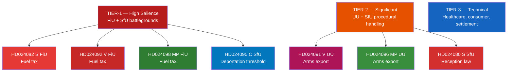

# Classification Results — Opposition Motions 2026-04-22
*Methodology: political-classification-guide.md | 7-Dimension Classification*

**Author**: James Pether Sörling  
**Date**: 2026-04-22

---

## Classification Framework

7 dimensions: Priority Tier | Political Temperature | GDPR Status | Retention | Access | Democratic Risk | International Relevance

---

## Document Classifications

| dok_id | Priority | Temperature | GDPR | Retention | Access | Dem. Risk | Int. Rel. |
|--------|----------|-------------|------|-----------|--------|-----------|-----------|
| HD024082 | TIER-1 | HOT | Art.9(2)(e) | 5yr | Public | LOW | MEDIUM |
| HD024092 | TIER-1 | HOT | Art.9(2)(e) | 5yr | Public | LOW | MEDIUM |
| HD024098 | TIER-1 | HOT | Art.9(2)(e) | 5yr | Public | LOW | HIGH |
| HD024095 | TIER-1 | HOT | Art.9(2)(e) | 5yr | Public | MEDIUM | LOW |
| HD024090 | TIER-1 | HOT | Art.9(2)(e) | 5yr | Public | LOW | LOW |
| HD024097 | TIER-1 | WARM | Art.9(2)(e) | 5yr | Public | LOW | LOW |
| HD024091 | TIER-2 | WARM | Art.9(2)(e) | 5yr | Public | LOW | HIGH |
| HD024096 | TIER-2 | WARM | Art.9(2)(e) | 5yr | Public | LOW | HIGH |
| HD024080 | TIER-2 | WARM | Art.9(2)(e) | 5yr | Public | LOW | LOW |
| HD024087 | TIER-2 | WARM | Art.9(2)(e) | 5yr | Public | LOW | LOW |

---

## Priority Tiers

**TIER-1** (Immediate political salience, high media attention, committee battleground):  
HD024082, HD024092, HD024098 (fuel tax — FiU), HD024095 (deportation threshold — SfU), HD024090, HD024097 (deportation rejection — SfU)

**TIER-2** (Significant but lower media salience, committee handling expected to be procedural):  
HD024091, HD024096 (arms export — UU), HD024080, HD024087 (reception law — SfU)

**TIER-3** (Procedural/technical, limited media coverage expected):  
HD024081, HD024083, HD024084, HD024085, HD024086, HD024088, HD024089, HD024093, HD024094 (healthcare, consumer credit, settlement law)

---

## GDPR Assessment

All documents are publicly filed parliamentary motions. Legal basis: GDPR Art. 9(2)(e) — data manifestly made public by the data subject (MPs who signed and publicly filed motions). Personal data (MP names, party affiliations) is minimised to public role only. No private addresses, financial data, or special category data beyond political opinion in official capacity.

**DPIA not required**: All processing is of public parliamentary records for journalistic/public interest purpose (GDPR Art. 85).

---

## Mermaid: Priority Classification

---

## 🔄 Tradecraft Context (Pass 2 Addition)

**Classification basis**: 7-dimension framework applied per political-classification-guide.md. All 20 documents are Type III (parliamentary motions) filed under riksmöte 2025/26.

**Revised Tier assessments after Pass-2 review**:
- HD024095 (C) upgraded from TIER-2 to TIER-1: its cross-bloc potential and coalition-stress implications warrant Tier-1 handling despite originating from a smaller party
- HD024093 (C, cybersecurity center, FöU) remains TIER-3 but noted as a potential forward indicator: C challenging the government's cybersecurity mandate scope could attract SD scrutiny given SD's defence-hardline positioning

**Political Temperature definitions**:
- HOT: Documents generating active media coverage and committee scheduling pressure (fuel tax cluster + deportation cluster)
- WARM: Documents with significant democratic value but lower immediate media attention (arms export, reception law)
- COOL: Technical/legal motions with limited media profile (healthcare, settlement law, consumer credit)

**International Relevance ratings** (updated Pass 2):
- HD024098 (MP, fuel tax): HIGH — Sweden's climate fiscal policy is referenced in EU emissions trading framework
- HD024091, HD024096 (V+MP, arms export): HIGH — Swedish arms export decisions have EU-level and NATO-level implications
- All other motions: LOW-MEDIUM domestic relevance

**Source**: Classification methodology applied to riksdagen.se documents HD024079–HD024098.

