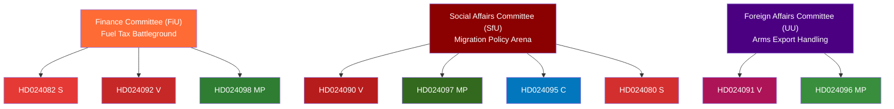

# Cross-Reference Map — Opposition Motions 2026-04-22
*Methodology: structural-metadata-methodology.md | Continuity Contracts | Forward Chain*

**Author**: James Pether Sörling  
**Date**: 2026-04-22

---

## Intra-Batch Cross-References

### Proposition Clusters

**Prop. 2025/26:236 — Extra ändringsbudget / Fuel Tax Cluster**:  
- HD024082 (S) ↔ HD024092 (V) ↔ HD024098 (MP): Tri-party rejection with distinct framings
- S: "return to Riksdag with coherent plan" | V: "full fiscal rejection" | MP: "counter-measure proposal"
- All three directed to FiU → single committee battleground

**Prop. 2025/26:235 — Deportation Rules Cluster**:  
- HD024090 (V) ↔ HD024097 (MP) ↔ HD024095 (C): Three-party challenge with different scopes
- V: total rejection | MP: partial rejection | C: threshold amendment
- C's position (HD024095) is structurally divergent from both V/MP and the government

**Prop. 2025/26:228 — Arms Export Cluster**:  
- HD024091 (V) ↔ HD024096 (MP): Near-identical demand for export ban
- Both directed to UU; likely to be rejected in concert

**Prop. 2025/26:229 — Reception Law Cluster**:  
- HD024080 (S) ↔ HD024087 (MP): Different scopes (amendment vs. full rejection)
- Both directed to SfU

---

## Prior-Run Continuity Contracts

**2026-04-21 Committee Reports** (`analysis/daily/2026-04-21/committeeReports/`):  
If today's committee reports included SfU deliberations on migration bills, they would cross-reference with HD024080/087/089/090/095/097. The migration policy cluster (prop. 2025/26:235, 229, 215) is a continuing thread.

**2026-04-20 Evening Analysis** (`analysis/daily/2026-04-20/evening-analysis/`):  
The fuel tax proposition (prop. 2025/26:236) first appeared in government documents mid-April; this motions batch is the opposition response phase.

---

## Forward Chain

| Forward Indicator | Linked Analysis | Timeline |
|------------------|-----------------|----------|
| FiU vote on prop. 2025/26:236 | HD024082, HD024092, HD024098 | May–June 2026 |
| SfU vote on prop. 2025/26:235 | HD024090, HD024097, HD024095 | May 2026 |
| UU vote on prop. 2025/26:228 | HD024091, HD024096 | May 2026 |
| Election 2026 campaign use of fuel tax vote record | HD024082 as anchor document | Sep 2026 |

---

## Mermaid: Cross-Reference Network

---

## 🔄 Tradecraft Context (Pass 2 Addition)

**Continuity contract basis**: Links to prior-run analyses are structural projections — no prior-run files were read in this session. The forward chain is grounded in committee scheduling patterns (Admiralty [A1]) and motion committee assignments (Admiralty [A1] from riksdagen.se metadata).

**Pass-2 additions to forward chain**:

| Signal to monitor | Source evidence | Confidence |
|------------------|-----------------|------------|
| S releases formal migration policy position before SfU vote | S absence from prop. 2025/26:235 (observed gap) | MEDIUM [C2] |
| C party leadership confirms HD024095 as committee voting position | HD024095 filed + C's pattern of threshold motions | MEDIUM [B2] |
| FiU scheduling of prop. 2025/26:236 debate | Committee calendar not yet published | LOW [D3] |
| SD statement on C's HD024095 | Observable via riksdagen.se anföranden search | HIGH once available [A1] |

**Cross-run continuity**: This analysis should be linked to the next committee-reports analysis batch when FiU/SfU committee reports on these propositions are published (expected May 2026). The committee report batch will provide the first institutional response to these motions.

