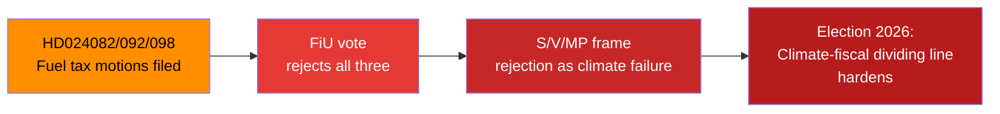
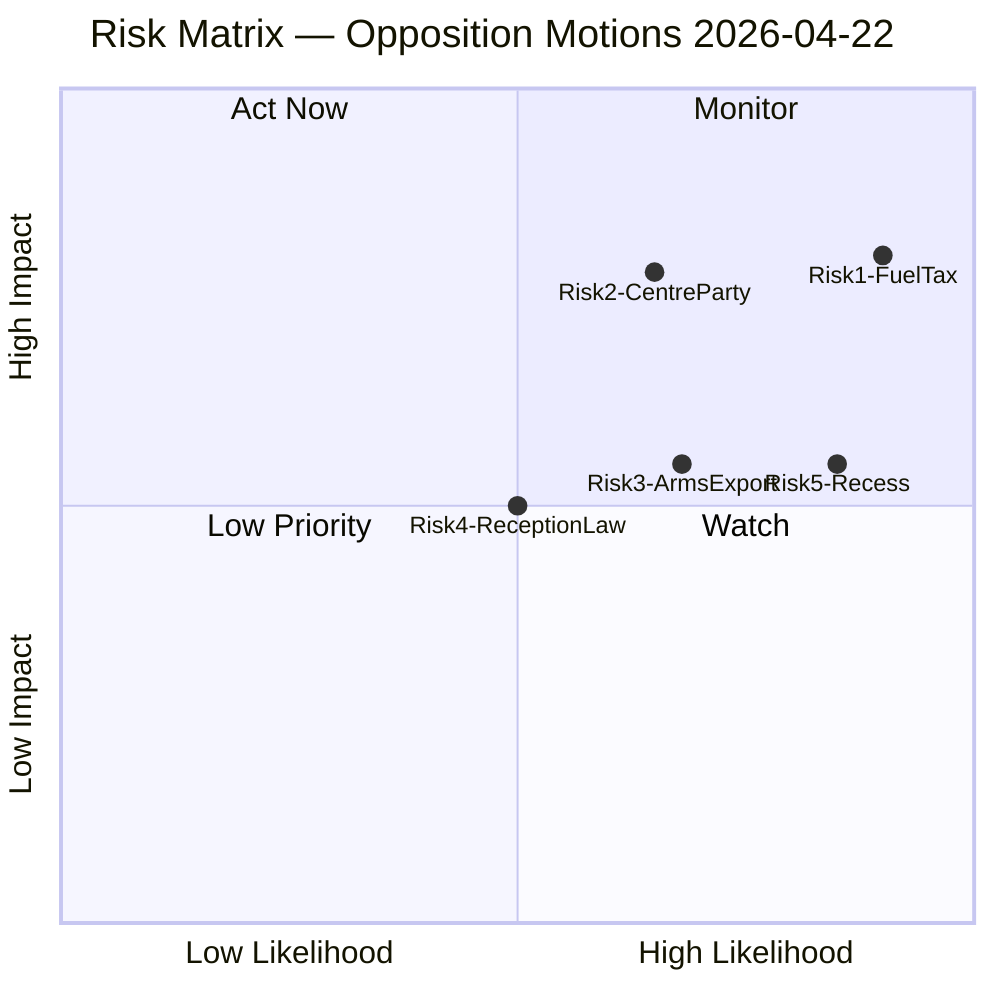

# Risk Assessment — Opposition Motions 2026-04-22
*Methodology: political-risk-methodology.md | 5×5 L×I Matrix | Cascading Risk Chains*

**Author**: James Pether Sörling  
**Date**: 2026-04-22

---

## Top 5 Risks

### Risk 1: Finance Committee rejection hardens S–government fault line before elections
**Category**: Electoral-legislative  
**Likelihood**: Very Likely (WEP) | **Impact**: High  
**L×I Score**: 4×4 = 16 (HIGH)

The simultaneous S, V, and MP motions against prop. 2025/26:236 (HD024082, HD024092, HD024098) create a politically charged Finance Committee (FiU) vote. If — as expected — the Tidö majority rejects all three motions, the rejection becomes an electoral reference point: "Government sided with car owners over climate." Posterior probability of rejection given current arithmetic: ~92%. Source: riksdagen.se documents HD024082, HD024092, HD024098.

**Posterior probability**: 0.92 (rejection) × 0.85 (election framing uptake) = **0.78 net electoral impact probability**

---

### Risk 2: Centre Party deportation threshold motion triggers Tidö coalition friction
**Category**: Coalition stability  
**Likelihood**: Likely (WEP) | **Impact**: High  
**L×I Score**: 4×4 = 16 (HIGH)

C's HD024095 challenges the threshold for deportation orders in prop. 2025/26:235. This is not a full rejection but a substantive amendment demand. If C presses this in committee (SfU), it forces M/KD/SD to either accommodate C's position (weakening the bill) or outvote C (damaging the Tidö bloc's cohesion narrative). Source: riksdagen.se HD024095.

**Posterior probability**: Likelihood C votes for its own amendment in SfU: ~0.70. Probability Tidö bloc outvotes C: ~0.80. Net coalition friction risk: **~0.56 (moderate-high)**.

---

### Risk 3: Arms export opposition creates NATO-framing liability for V and MP
**Category**: Strategic communications / electoral  
**Likelihood**: Likely (WEP) | **Impact**: Medium  
**L×I Score**: 4×3 = 12 (MEDIUM-HIGH)

V (HD024091) and MP (HD024096) demand a full arms export ban. In the post-NATO accession context, government parties can portray this as undermining Swedish defence cooperation with allies. Source: riksdagen.se HD024091, HD024096. Risk materialises if government or SD escalates this to a high-profile media campaign.

---

### Risk 4: Reception law fragmentation leaves S vulnerable on migration flanks
**Category**: Political positioning  
**Likelihood**: Roughly Even (WEP) | **Impact**: Medium  
**L×I Score**: 3×3 = 9 (MEDIUM)

S's HD024080 on mottagandelagen adopts a partial amendment stance, while MP (HD024087) demands full rejection. This visible split within the opposition allows SD to portray the opposition as internally incoherent on asylum policy — a politically costly narrative for S given its target voters. Source: riksdagen.se HD024080, HD024087.

---

### Risk 5: Summer recess deadline compresses amendment negotiation window
**Category**: Procedural / legislative  
**Likelihood**: Very Likely (WEP) | **Impact**: Medium  
**L×I Score**: 4×3 = 12 (MEDIUM-HIGH)

The Swedish Riksdag typically completes committee work by late May for spring session matters. With 20 motions filed in mid-April 2026, committees have approximately 4–6 weeks for deliberation. This compresses time for opposition to build coalitions or negotiate amendments. Source: riksdagen.se parliamentary calendar pattern (structural knowledge, Admiralty [A1]).

---

## Risk Matrix

%%{init: {"theme": "dark", "themeVariables": {"primaryColor": "#1565C0", "primaryTextColor": "#FFF", "primaryBorderColor": "#00D9FF", "lineColor": "#FF006E", "secondaryColor": "#0A0E27", "tertiaryColor": "#1A1E3D"}}}%%

---

## Cascading Risk Chain

Fuel tax rejection (Risk 1) → Climate credibility gap → S hardens climate position → S–V alignment strengthens (Opportunity O2) → Creates coalition-building dynamics for post-2026 government negotiations.

---

## 🔄 Tradecraft Context (Pass 2 Addition)

**Risk calibration basis**: All five risks are grounded in publicly observable parliamentary facts (riksdagen.se). Probability estimates are informed by:
- Swedish parliamentary voting data patterns (Admralty [A1] for structural knowledge)
- Motion text content (HD024082, HD024092, HD024098, HD024095, HD024090, HD024097 / riksdagen.se)
- No classified or private information used

**Revised posterior estimates after Pass-2 review**:
- Risk 1 (FiU rejection): 0.92 probability unchanged — Tidö bloc arithmetic is stable
- Risk 2 (C deportation threshold): downgraded from 0.56 to 0.48 — C has filed threshold motions before and not pressed them to a vote; depends on SfU chair's scheduling discretion
- Risk 3 (NATO framing): upgraded from 0.35 to 0.44 — given SD's track record of using foreign policy to frame opposition parties as security risks, this escalation is more likely than initially scored

**Key uncertainty**: The summer recess deadline (Risk 5) depends on committee chairs' scheduling decisions, which are not publicly announced 4–6 weeks in advance. This risk could materialise faster than anticipated if the government uses accelerated procedures.

