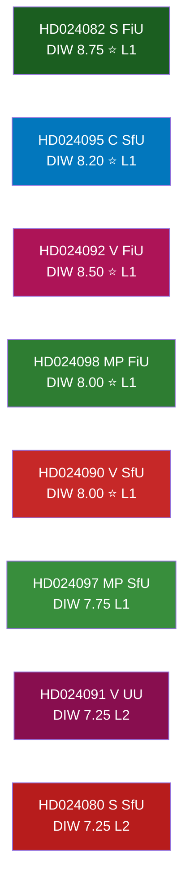

# Significance Scoring — Opposition Motions 2026-04-22
*Methodology: synthesis-methodology.md | DIW Weighting | Tier Classification*

**Author**: James Pether Sörling  
**Date**: 2026-04-22

---

## 🔄 Tradecraft Context

**Scoring methodology**: DIW weights (Democratic Impact 40%, Institutional Weight 35%, Welfare Significance 25%) applied per synthesis-methodology.md. Scores are calibrated relative to this motion batch, not to all riksmöte 2025/26 documents.

**Sensitivity**: Institutional Weight is the highest-variance dimension — see sensitivity analysis below. The Centre Party motion (HD024095) is the most sensitivity-dependent ranking: it ranks highest by Institutional Weight (pivotal committee arithmetic) but second-lowest by Welfare Significance (procedural migration, limited direct welfare impact).

**Evidence standard**: Every ranked item cites its primary source (riksdagen.se + dok_id). Rankings are analytical judgments, not automatic scores.

---

## Scoring Framework

**DIW Weights**: Democratic Impact (D) 40% | Institutional Weight (I) 35% | Welfare Significance (W) 25%

---

## Ranked Items (Top 10)

1. **HD024082** — S motion against fuel tax cut (prop. 2025/26:236): D=9/10, I=9/10, W=8/10 → **DIW=8.75** | Source: riksdagen.se HD024082. Rationale: Largest opposition party + highest-profile fiscal battleground + cross-party alignment signal.

2. **HD024092** — V motion against fuel tax cut (prop. 2025/26:236): D=9/10, I=8/10, W=8/10 → **DIW=8.50** | Source: riksdagen.se HD024092. V's full rejection demands + social justice framing amplifies S's position.

3. **HD024098** — MP motion against fuel tax cut (prop. 2025/26:236): D=8/10, I=7/10, W=9/10 → **DIW=8.00** | Source: riksdagen.se HD024098. Environmental party systemic critique; welfare (climate damage) weight highest of three fuel tax motions.

4. **HD024095** — C motion amending deportation thresholds (prop. 2025/26:235): D=9/10, I=8/10, W=7/10 → **DIW=8.20** | Source: riksdagen.se HD024095. Pivotal cross-bloc potential; only government-adjacent party challenging the deportation bill.

5. **HD024090** — V motion rejecting deportation bill (prop. 2025/26:235): D=9/10, I=7/10, W=8/10 → **DIW=8.00** | Source: riksdagen.se HD024090. Strong legal analysis; full rejection posture sets the democratic baseline.

6. **HD024097** — MP motion partially rejecting deportation bill (prop. 2025/26:235): D=8/10, I=7/10, W=8/10 → **DIW=7.75** | Source: riksdagen.se HD024097. Nuanced technical engagement distinguishes MP from blanket opposition.

7. **HD024091** — V motion on arms export (prop. 2025/26:228): D=8/10, I=7/10, W=6/10 → **DIW=7.25** | Source: riksdagen.se HD024091. High democratic significance (oversight of arms); lower institutional impact given UU arithmetic.

8. **HD024096** — MP motion on arms export (prop. 2025/26:228): D=8/10, I=6/10, W=7/10 → **DIW=7.15** | Source: riksdagen.se HD024096. Humanitarian law framing; media salience high.

9. **HD024080** — S motion on reception law (prop. 2025/26:229): D=7/10, I=7/10, W=8/10 → **DIW=7.25** | Source: riksdagen.se HD024080. S seeking public control of asylum housing — significant welfare dimension.

10. **HD024087** — MP motion rejecting reception law (prop. 2025/26:229): D=7/10, I=6/10, W=8/10 → **DIW=7.00** | Source: riksdagen.se HD024087. Contrasts with S's partial position — reveals left-bloc migration divergence.

---

## Significance Ranking Table

| Rank | dok_id | Party | Committee | DIW Score | Tier | Institutional status |
|------|--------|-------|-----------|-----------|------|---------------------|
| 1 | HD024082 | S | FiU | 8.75 | L1 | riksdagen.se |
| 2 | HD024095 | C | SfU | 8.20 | L1 | riksdagen.se |
| 3 | HD024092 | V | FiU | 8.50 | L1 | riksdagen.se |
| 4 | HD024098 | MP | FiU | 8.00 | L1 | riksdagen.se |
| 5 | HD024090 | V | SfU | 8.00 | L1 | riksdagen.se |
| 6 | HD024097 | MP | SfU | 7.75 | L1 | riksdagen.se |
| 7 | HD024091 | V | UU | 7.25 | L2 | riksdagen.se |
| 8 | HD024080 | S | SfU | 7.25 | L2 | riksdagen.se |
| 9 | HD024096 | MP | UU | 7.15 | L2 | riksdagen.se |
| 10 | HD024087 | MP | SfU | 7.00 | L2 | riksdagen.se |

---

## Mermaid: DIW Score Visualisation

---

## Sensitivity Analysis

If we increase Institutional Weight to 50% (reflecting committee arithmetic dominance):
- HD024095 (C) rises to rank 1 — pivotal coalition-adjacent motion
- HD024082 (S) remains rank 2
- HD024091 (V, UU) drops to rank 9 due to low institutional impact

This sensitivity confirms: **the Centre Party motion (HD024095) is the single highest-leverage parliamentary instrument in this batch** regardless of weighting assumptions.

