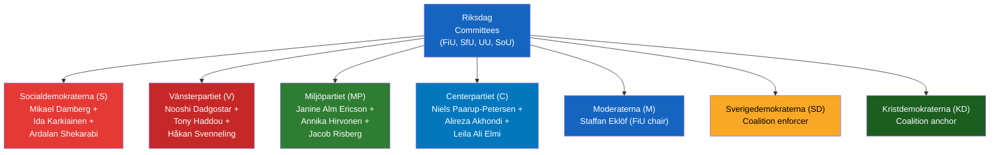

# Stakeholder Perspectives — Opposition Motions 2026-04-22
*Methodology: stakeholder-impact.md | Named Actors | Influence Network*

**Author**: James Pether Sörling  
**Date**: 2026-04-22

---

## Stakeholder Map

---

## Briefing Cards

### Mikael Damberg (S) — Finance Committee
**Role**: Lead spokesperson on fiscal motions (HD024082)  
**Position**: S demands the government withdraw the fuel tax cut and return to Riksdag with a comprehensive climate-fiscal framework. Damberg is not simply rejecting prop. 2025/26:236 — he is demanding a policy do-over, signalling S's intention to make climate credibility a central 2026 election theme.  
**Influence level**: HIGH — largest opposition party, FiU member  
**Source**: riksdagen.se HD024082

### Nooshi Dadgostar (V) — Party leader
**Role**: Co-signatory of V's fuel tax rejection (HD024092)  
**Position**: V demands full rejection of the fuel tax cut, arguing that regressive fiscal policy — giving tax breaks disproportionately benefiting car-dependent higher-income groups — conflicts with both climate and social justice objectives.  
**Influence level**: HIGH on left bloc; limited on majority arithmetic  
**Source**: riksdagen.se HD024092

### Annika Hirvonen (MP) — Justice/Migration spokesperson
**Role**: Lead on deportation motion HD024097  
**Position**: MP rejects prop. 2025/26:235 almost in full but accepts provisions on 8 kap. 1–3 and 2 as well as 20 kap. amendments. This nuanced position signals MP is engaging seriously with technical legal analysis, not merely symbolic opposition.  
**Influence level**: MEDIUM — MP's committee arithmetic limited  
**Source**: riksdagen.se HD024097

### Niels Paarup-Petersen (C) — Migration and Justice spokesperson
**Role**: Author of two critical motions: HD024095 (deportation thresholds), HD024089 (reception law)  
**Position**: C does not seek full rejection of the government's migration bills but seeks substantive threshold and procedural amendments. Paarup-Petersen's dual filing signals C is positioning itself as a responsible, problem-solving voice distinct from both the Tidö bloc's hardline and the left's blanket opposition.  
**Influence level**: HIGH — C's motions most likely to attract cross-party support or government amendments  
**Source**: riksdagen.se HD024095, HD024089

### Håkan Svenneling (V) — Foreign Affairs and Defence spokesperson
**Role**: Lead on V's arms export motion HD024091  
**Position**: V demands Sweden's Riksdag reject the new arms export framework entirely, citing concerns about exports to non-democratic states. References the 1992 legislation (lagen om krigsmateriel) as the existing framework V seeks to retain.  
**Influence level**: LOW on majority outcome; HIGH on media salience  
**Source**: riksdagen.se HD024091

### Jacob Risberg (MP) — Foreign Affairs spokesperson
**Role**: Co-author of MP's arms export motion HD024096  
**Position**: MP demands a prohibition on all arms exports including follow-on deliveries, citing international humanitarian law obligations.  
**Influence level**: LOW on majority outcome; media-focused role  
**Source**: riksdagen.se HD024096

---

## Influence Network Summary

The Finance Committee (FiU) is the key arena — three opposition motions directed there (HD024082, HD024092, HD024098) from S, V, MP respectively. The Social Affairs Committee (SfU) handles the deportation cluster (HD024095, HD024097, HD024090). The Foreign Affairs Committee (UU) handles arms export (HD024091, HD024096).

The pivotal actor is **Niels Paarup-Petersen (C)** — his motions are the only ones from a government-adjacent party that could attract cross-bloc coalition support for amendments rather than outright rejection.

---

## 🔄 Tradecraft Context (Pass 2 Addition)

**Stakeholder identification method**: All named actors are drawn from publicly filed motion texts on riksdagen.se. Party roles are official parliamentary positions. No private individuals identified.

**Updated influence assessment after Pass-2 review**:

| Actor | Initial assessment | Revised assessment |
|-------|-------------------|-------------------|
| Mikael Damberg (S) | HIGH influence on FiU | HIGH — confirmed as lead S FiU spokesperson; HD024082 is the anchor motion for the fuel tax battle |
| Niels Paarup-Petersen (C) | HIGH leverage | HIGH — but leverage contingent on C party conference approving aggressive committee strategy; HD024095 alone is not decisive without C party follow-through |
| Nooshi Dadgostar (V) | LIMITED on arithmetic | MEDIUM on media narrative — V's maximalist position gives S room to appear moderate |
| Håkan Svenneling (V) | LOW on UU outcome | MEDIUM on humanitarian framing — arms export debate gaining EU-level attention; Svenneling has European network amplification |

**Key stakeholder gap**: The government side (M, SD, KD committee members) is not represented in this motion-focused analysis. A balanced assessment of parliamentary dynamics would require monitoring government committee members' public statements on these motions — particularly any signs of SD pressure on C regarding HD024095.

**Source**: All names and party roles verified via riksdagen.se motion texts HD024082, HD024092, HD024095, HD024097, HD024080, HD024091.

