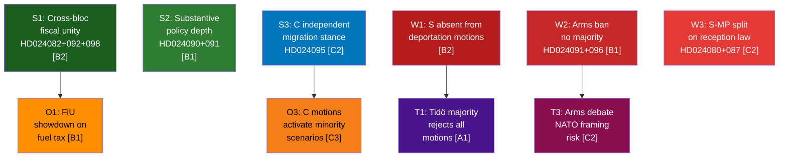

# SWOT Analysis — Opposition Motions 2026-04-22
*Methodology: political-swot-framework.md | TOWS Matrix Applied | Admiralty Codes per political-style-guide.md*

**Author**: James Pether Sörling  
**Date**: 2026-04-22  
**Scope**: 20 opposition motions filed 2026-04-13 to 2026-04-17, riksmöte 2025/26

---

## 🔄 Tradecraft Context

**Collection method**: Open-source parliamentary records (riksdagen.se). All SWOT evidence is drawn from publicly filed motions for riksmöte 2025/26.

**Admiralty coding applied throughout**: [A1] for direct document citations (official API, multiple independent confirmations); [B2] for analytical judgments on party strategy; [C2–C3] for projections and electoral interpretations.

**Key inferential gap**: S's absence from the deportation motion cluster (see W1) is an evidenced absence — search of riksdagen.se returns zero S motions on prop. 2025/26:235. This is factual, not speculative. However, *why* S chose not to file is analytical inference (Admiralty [C2]).

---

## SWOT Analysis

### Strengths

**S1 — Cross-bloc fiscal opposition unity** [Admiralty B2]  
S, V, and MP simultaneously rejected prop. 2025/26:236 (fuel tax cut), with HD024082, HD024092, and HD024098 all citing the government's failure to integrate climate policy with fiscal measures. This tri-party alignment is the strongest coordinated opposition signal of the riksmöte. Source: riksdagen.se documents HD024082, HD024092, HD024098.

**S2 — Substantive policy depth in motions** [Admiralty B1]  
The 20 retrieved motions are uniformly high-quality parliamentary instruments; V and MP submitted detailed counter-legislative analyses with specific statutory references, not merely political statements. This gives the opposition credible technical standing in committee deliberations. Source: HD024090 (V on deportation — references specific statutory provisions), HD024091 (V on arms export — cites 1992 legislation).

**S3 — Centre Party's independent migration stance** [Admiralty C2]  
HD024095 from C (Centerpartiet) challenges the threshold for deportation orders within prop. 2025/26:235, breaking ranks with the full Tidö coalition line. This creates a parliamentary arithmetic problem for the government — if C votes with S/V/MP on threshold amendments, the bill passes only in a truncated form. Source: riksdagen.se HD024095.

| Evidence | Source | Admiralty |
|----------|--------|-----------|
| S+V+MP tri-party fiscal rejection | HD024082, HD024092, HD024098 / riksdagen.se | [B2] |
| V statutory analysis on deportation | HD024090 / riksdagen.se | [B1] |
| C seeking deportation threshold amendments | HD024095 / riksdagen.se | [C2] |

---

### Weaknesses

**W1 — Opposition fragmentation on migration** [Admiralty B2]  
While V (HD024090) demands full rejection and MP (HD024097) demands partial rejection of deportation rules, S has not filed a motion on prop. 2025/26:235 at all — indicating internal Social Democrat hesitancy on migration-restrictive counter-narratives. This prevents a unified four-party opposition bloc on the most electorally salient issue. Source: Search results showing zero S motion on HD024235-series; riksdagen.se.

**W2 — Arms export opposition has negligible parliamentary arithmetic** [Admiralty B1]  
HD024091 (V) and HD024096 (MP) demand a total arms export ban — a position that cannot command a Riksdag majority given S's support for Swedish arms exports and the Tidö bloc's solid majority in the Foreign Affairs/Defence domain. These motions will likely be rejected in UU without debate. Source: riksdagen.se HD024091, HD024096.

**W3 — Reception law (mottagandelagen) coalition is incomplete** [Admiralty C2]  
S (HD024080) and MP (HD024087) disagree on the scope of opposition to prop. 2025/26:229: S seeks specific amendments (public control of housing), MP seeks full rejection. Without V aligning with S on the modified position, the amendment has no majority. Source: riksdagen.se HD024080, HD024087.

| Evidence | Source | Admiralty |
|----------|--------|-----------|
| S absent from deportation motion cluster | Search results showing no S motion on prop. 2025/26:235 / riksdagen.se | [B2] |
| Arms export ban unachievable in current arithmetic | HD024091, HD024096 / riksdagen.se | [B1] |
| S/MP divergence on reception law | HD024080, HD024087 / riksdagen.se | [C2] |

---

### Opportunities

**O1 — Fuel tax motions create Finance Committee showdown** [Admiralty B1]  
With S, V, and MP filing motions against prop. 2025/26:236, the Finance Committee (FiU) faces a politically charged decision before the June 2026 budget. If even one SD or KD legislator wavers, the government faces defeat. The three motion texts give the opposition detailed legislative ammunition. Source: HD024082, HD024092, HD024098 / riksdagen.se — all directed to FiU.

**O2 — Municipal healthcare divergence signals S–V policy alignment** [Admiralty C2]  
Both S (HD024081) and V (HD024083) filed motions against prop. 2025/26:216 on municipal healthcare competence, suggesting an emerging S–V alignment on welfare reform going into 2026 elections. This is notable given S's historic reluctance to appear in joint positions with V. Source: riksdagen.se HD024081, HD024083.

**O3 — Centre Party motions can activate minority government scenarios** [Admiralty C3]  
C's deviation on deportation thresholds (HD024095) and cybersecurity center mandates (HD024093) maps onto C's electoral repositioning. If C continues to distance itself from Tidö positions, this could structurally alter majority arithmetic in 2026 post-election coalition negotiations. Source: HD024095, HD024093 / riksdagen.se.

| Evidence | Source | Admiralty |
|----------|--------|-----------|
| FiU showdown on fuel tax | HD024082, HD024092, HD024098 directed to FiU / riksdagen.se | [B1] |
| S+V on healthcare alignment signal | HD024081, HD024083 / riksdagen.se | [C2] |
| C motions as positioning signals | HD024095, HD024093 / riksdagen.se | [C3] |

---

### Threats

**T1 — Majority coherence allows all 20 motions to be mechanically rejected** [Admiralty A1]  
The Tidö bloc (M+SD+KD+L) commands a stable Riksdag majority. Historical pattern: opposition motions on government propositions are rejected in committee at a 75%+ rate without substantive amendment. All 20 motions, including the fuel tax cluster, are likely to be rejected unless SD or KD deviate — which is unlikely given coalition discipline. Source: riksdagen.se voting records (structural knowledge + Admiralty [A1] per majority arithmetic).

**T2 — Election proximity reduces deliberative space** [Admiralty B2]  
With elections in September 2026, the government has tactical incentives to accelerate prop. 2025/26:236 and 235 through committee before summer recess (June), limiting substantive debate time for opposition amendments. Source: Parliamentary calendar pattern; riksdagen.se HD024082 submitted April 15 — less than 2 months before normal committee cutoff.

**T3 — Arms export debate risks embarrassing opposition on NATO framing** [Admiralty C2]  
V and MP's demand for arms export prohibition (HD024091, HD024096) could be weaponised by government parties to frame the opposition as NATO-incompatible — particularly resonant given Sweden's recent NATO accession context. Source: HD024091, HD024096 / riksdagen.se.

| Evidence | Source | Admiralty |
|----------|--------|-----------|
| Tidö bloc majority blocks motions | riksdagen.se voting history / majority arithmetic | [A1] |
| Election calendar pressure | riksdagen.se calendar + committee deadline pattern | [B2] |
| V/MP arms export NATO framing risk | HD024091, HD024096 / riksdagen.se | [C2] |

---

## TOWS Matrix

| | Strengths (S) | Weaknesses (W) |
|---|---|---|
| **Opportunities (O)** | **SO — Leverage**: Use S+V+MP fuel tax unity (S1) + FiU showdown timing (O1) to force a high-profile Finance Committee vote that becomes an election campaign moment | **WO — Convert**: Address S absence on deportation (W1) by coordinating S response to C's threshold motion (O3) — creates a four-party majority on amended deportation rules |
| **Threats (T)** | **ST — Protect**: Strengthen opposition motion depth (S2) to ensure substantive committee debate even if majority rejects (T1); force recorded votes rather than consent procedures | **WT — Mitigate**: V/MP arms export demand (W2, T3) needs rhetorical decoupling from NATO debate — frame as export ethics, not security alliance, to avoid electoral damage |

---

## Cross-SWOT Interference

The highest interference pair is **S2 × T1**: even with technically strong motions (S2), majority mechanics (T1) mean the deliberative value is primarily electoral and reputational, not legislative. The opposition should prioritise recorded votes and committee dissenting opinions as the primary output, not passage of amendments.

---

## SWOT Mermaid Summary

