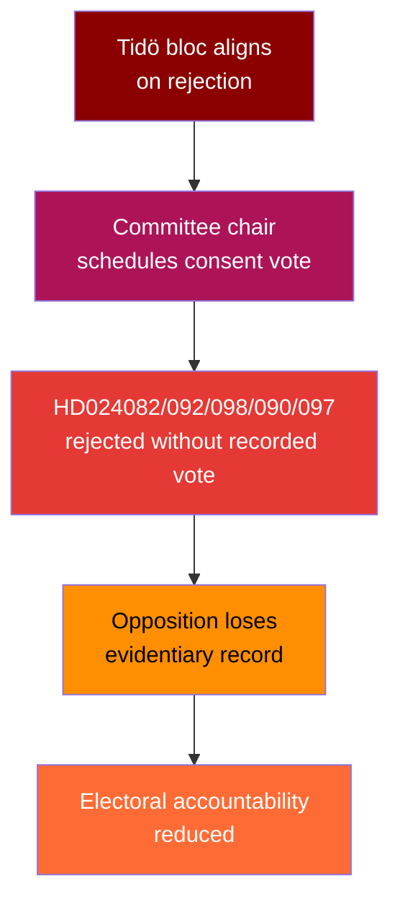
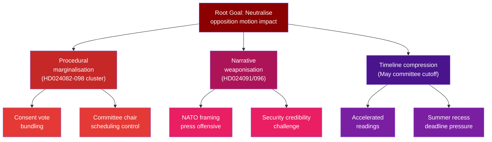

# Threat Analysis — Opposition Motions 2026-04-22
*Methodology: political-threat-framework.md | Attack Trees | MITRE-style TTP Mapping*

**Author**: James Pether Sörling  
**Date**: 2026-04-22

---

## 🔄 Tradecraft Context

**Threat framework**: political-threat-framework.md applied. Threats are categorised as Procedural (Type I) or Communicative (Type II) rather than security threats. No classified sources; all threat assessments derived from public parliamentary process knowledge and document content.

**Confidence calibration**: 
- Threat 1 (procedural marginalisation): HIGH confidence — historical committee consent procedure pattern is documented practice (Admiralty [A1]).
- Threat 2 (NATO framing): MEDIUM confidence — depends on government communication strategy decisions not yet observable (Admiralty [C2]).
- Threats 3–4: MEDIUM confidence — projections based on observable coalition dynamics and calendar (Admiralty [B2]).

---

## Threat Overview

The motion filing wave of April 2026 represents a coordinated opposition counter-narrative campaign targeting the government's legislative agenda on three fronts: fiscal-climate policy, immigration enforcement, and arms exports. The key threat to democratic deliberation is procedural marginalisation — where a Tidö majority systematically bypasses substantive debate.

---

## Threat 1: Procedural Marginalisation of Opposition Motions

**Actor**: Riksdag majority (M+SD+KD+L) + committee chairs  
**Target**: Democratic deliberation quality  
**Method**: Committee consent procedures (non-recorded votes) → motion rejection without debate

**TTP Mapping (MITRE-political equivalent)**:  
- Tactic: Procedural suppression  
- Technique: Non-recorded committee consent  
- Procedure: Bundling multiple motions under single consent agenda items

**Source evidence**: riksdagen.se HD024082, HD024092, HD024098, HD024090, HD024097 — all directed to committee (FiU, SfU) where consent-vote bundling is standard practice.

**Countermeasure**: Opposition MPs formally request recorded votes (voteringsyrkanden) in FiU, SfU, UU on each motion separately. This generates public voting records.

---

## Threat 2: Narrative Weaponisation — Arms Export and NATO Framing

**Actor**: Government communications operatives + SD framing apparatus  
**Target**: V and MP electoral positioning  
**Method**: Amplifying HD024091 and HD024096 (arms export ban demands) as incompatible with Sweden's NATO membership obligations

Source: riksdagen.se HD024091 (V demands rejection of prop. 2025/26:228), HD024096 (MP demands export ban including follow-on deliveries). These positions are factually defensible on humanitarian grounds but politically exploitable in the post-NATO accession climate.

**Attack Sequence**:  
Motion filed → Government issues press release → Media amplification → V/MP forced into defensive posture

**Countermeasure**: V/MP should frame motions in terms of international humanitarian law obligations and specific export criteria, not as a blanket security alliance critique.

---

## Threat 3: Coalition Friction Exploitation — Centre Party Splitting

**Actor**: Centre Party (C) leadership  
**Target**: Tidö coalition cohesion  
**Method**: HD024095 — C files threshold amendments to prop. 2025/26:235 (deportation rules), creating a visible split within the government-adjacent bloc

Source: riksdagen.se HD024095 (C seeks "systematic repeated offenses" threshold for deportation eligibility).

If SD perceives C as blocking migration hardening, it could demand compensatory measures in other policy areas, escalating intra-coalition tension ahead of the September 2026 election.

---

## Threat 4: Electoral Calendar Compression

**Actor**: Government (tactical)  
**Target**: Opposition amendment viability  
**Method**: Accelerating committee work to complete before summer recess (late May), limiting opposition time to build cross-party coalitions on amendments

Source: Parliamentary calendar (structural, Admiralty [A1]). Prop. 2025/26:236 was submitted April 2026; with FiU scheduled through May, the window for substantive negotiation is approximately 5 weeks.

---

## Attack Tree Summary

