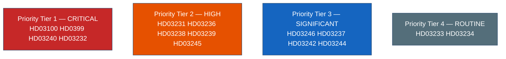

# Classification Results — Swedish Government Propositions 2026-04-22

**Analyst**: James Pether Sörling  
**Framework**: political-classification-guide.md (7-dimension classification)  
**Date**: 2026-04-22  
**GDPR basis**: Art. 9(2)(e) publicly made political data; Art. 9(2)(g) substantial public interest  

## Classification Dimensions

| Dimension | Description |
|-----------|-------------|
| P | Political temperature (1=routine → 5=crisis) |
| T | Time sensitivity (1=archival → 5=breaking) |
| A | Audience (1=specialist → 5=general public) |
| E | Electoral relevance (1=none → 5=direct) |
| I | International dimension (1=domestic → 5=global) |
| C | Controversy level (1=consensus → 5=highly contested) |
| R | Recurrence (1=one-off → 5=ongoing programme) |

## Document Classification Matrix

| dok_id | P | T | A | E | I | C | R | Tier | Retention |
|--------|---|---|---|---|---|---|---|------|-----------|
| HD03100 | 5 | 5 | 5 | 5 | 3 | 4 | 5 | CRITICAL | Permanent |
| HD0399 | 4 | 4 | 4 | 4 | 2 | 3 | 4 | CRITICAL | 10 years |
| HD03240 | 4 | 3 | 3 | 3 | 2 | 3 | 4 | CRITICAL | 10 years |
| HD03232 | 4 | 3 | 3 | 3 | 5 | 3 | 3 | CRITICAL | Permanent |
| HD03231 | 4 | 3 | 3 | 3 | 5 | 3 | 3 | HIGH | Permanent |
| HD03236 | 4 | 4 | 5 | 5 | 2 | 4 | 3 | HIGH | 10 years |
| HD03238 | 3 | 3 | 3 | 3 | 2 | 3 | 4 | HIGH | 10 years |
| HD03239 | 3 | 3 | 4 | 3 | 2 | 4 | 3 | HIGH | 10 years |
| HD03245 | 3 | 2 | 4 | 3 | 2 | 3 | 3 | HIGH | 10 years |
| HD03246 | 3 | 3 | 4 | 4 | 1 | 4 | 3 | SIGNIFICANT | 7 years |
| HD03237 | 3 | 3 | 3 | 3 | 1 | 2 | 4 | SIGNIFICANT | 7 years |
| HD03242 | 3 | 2 | 3 | 2 | 3 | 4 | 3 | SIGNIFICANT | 7 years |
| HD03244 | 2 | 2 | 2 | 2 | 2 | 2 | 3 | SIGNIFICANT | 5 years |
| HD03233 | 2 | 2 | 3 | 2 | 2 | 2 | 3 | ROUTINE | 5 years |
| HD03234 | 2 | 1 | 2 | 1 | 1 | 2 | 2 | ROUTINE | 5 years |

## Access Classification

All documents are **PUBLIC** — published on riksdagen.se under the principle of offentlighetsprincipen. No access restrictions apply. Analysis reflects publicly made political positions (GDPR Art. 9(2)(e)).

## Priority Justification (DPIA Notes)

- No new high-risk processing of personal data in this analysis
- Named politicians: public figures in their official capacity (GDPR does not restrict analysis of public roles)
- No biometric, health, or financial personal data processed
- DPIA not required for this batch analysis
