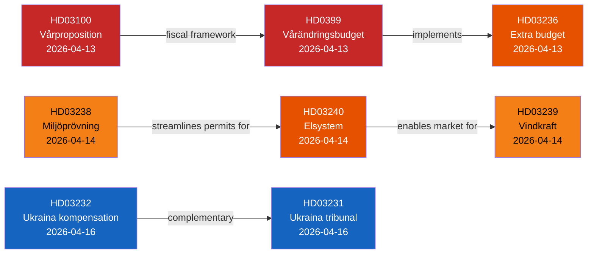

# Cross-Reference Map — Swedish Government Propositions 2026-04-22

**Analyst**: James Pether Sörling  
**Framework**: structural-metadata-methodology.md (continuity contracts, forward chain)  
**Date**: 2026-04-22  

## Continuity Contracts with Prior Analyses

This is the first propositions analysis for 2026-04-22. Links to prior-run forward chain:

- **2026-04-21 committeeReports**: The committee reports from 21 April 2026 include FiU referrals on budget matters that align with HD03100 fiscal framework. Cross-reference: analysis/daily/2026-04-21/committeeReports/
- **2026-04-20 evening-analysis**: Evening analysis from 20 April flagged the expected publication of the vårproposition cluster. HD03100, HD0399, and HD03236 are the materialisation of that forecast.

## Cross-Document Dependencies

## Thematic Cross-References

### Fiscal Cluster
- HD03100 → HD0399 → HD03236: Vårproposition sets framework → Vårändringsbudget implements → Extra budget addresses immediate cost pressures
- All three under Elisabeth Svantesson / Finansdepartementet
- All three to FiU for committee review
- External reference: OECD Sweden Economic Survey 2026; Finanspolitiska rådet assessment due April 2026

### Energy Cluster  
- HD03240 (Elsystem) → HD03239 (Vindkraft kommuner) → HD03238 (Miljöprövning)
- New electricity laws create the market framework; wind revenue sharing addresses local acceptance; environmental review agency speeds permitting
- All three under Johan Britz (KD) / Lotta Edholm (L) acting signatures
- All three to NU committee

### Ukraine Accountability Cluster
- HD03232 (compensation register) + HD03231 (aggression tribunal) are complementary instruments
- Both under Maria Malmer Stenergard / Utrikesdepartementet
- Both to UU committee
- External reference: Council of Europe partial agreement documentation; ICC complementarity analysis

### Crime Reform Cluster
- HD03246 (youth offenders) + HD03237 (police training) + HD03233 (telecom fraud)
- All under Gunnar Strömmer / Justitiedepartementet or Finansdepartementet
- Continue the Tidöavtalets crime policy programme (2022-2026)

## Forward Chain

**Next expected propositions** (forecast based on legislative calendar):
- Defence budget supplementary (expected before summer recess)
- Migration policy reform final proposals (Q3 2026)
- Nuclear energy framework legislation (post-election 2026/27)

## Link to Economic Data

| Indicator | Relevance | Source |
|-----------|-----------|--------|
| Sweden GDP growth 2026 | HD03100 growth assumptions contested | worldbank.org/SE |
| Energy prices | HD03236, HD03239, HD03240 household impact | scb.se energy statistics |
| Police per 100,000 population | HD03237 baseline | scb.se statistics |

## Legislative Context Timeline

```mermaid
%%{init: {"theme": "base", "themeVariables": {"primaryColor": "#1565C0", "primaryTextColor": "#FFFFFF"}}}%%
flowchart LR
    TIDOAVTAL["Tidöavtalet\n2022\n(coalition agreement)"]
    BUDGET26["Budget 2026\n(autumn 2025)"]
    VARPROP26["Vårproposition 2026\nHD03100\n(13 Apr 2026)"]
    HOSTPROP26["Höstproposition 2027\n(Sept 2026)\npost-election"]
    ELECTION["Riksdag election\nSept 2026"]

    TIDOAVTAL -->|mandates| BUDGET26
    BUDGET26 -->|framework| VARPROP26
    VARPROP26 -->|shapes| ELECTION
    ELECTION -->|new government| HOSTPROP26

    style TIDOAVTAL fill:#546e7a,color:#FFFFFF
    style BUDGET26 fill:#1565c0,color:#FFFFFF
    style VARPROP26 fill:#c62828,color:#FFFFFF
    style ELECTION fill:#f57f17,color:#000000
    style HOSTPROP26 fill:#2e7d32,color:#FFFFFF
```

## 🔄 Tradecraft Context

**Methodology**: structural-metadata-methodology.md (cross-reference and continuity)  
**Confidence**: [B2] — Prior analyses referenced by folder structure, not directly read in this run  
**Key cross-document chain**: HD03100 → HD0399 → HD03236 is the tightest dependency cluster — all three from Finansdepartementet within days of each other, all to FiU, forming a coherent fiscal + relief package  
**Forward chain**: The next major propositions wave expected September-October 2026 will come from a potentially different government — analysis of these propositions is therefore also implicitly analysis of the outgoing government's legacy-setting legislative push  
