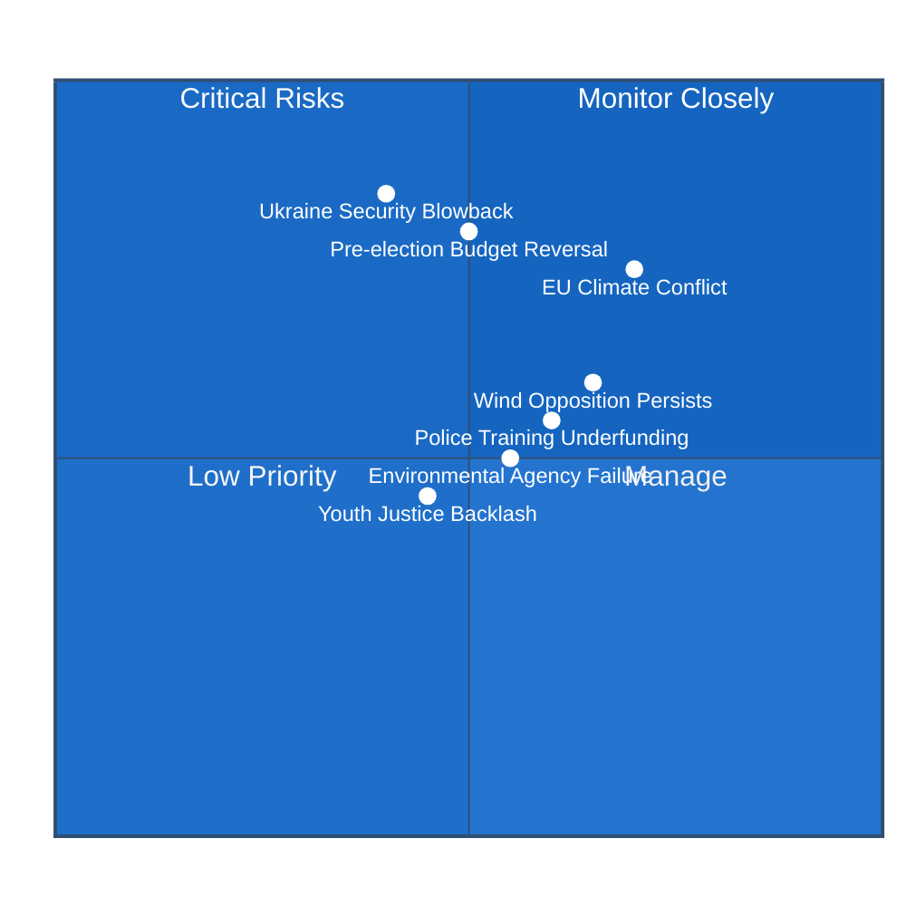

# Risk Assessment — Swedish Government Propositions 2026-04-22

**Analyst**: James Pether Sörling  
**Methodology**: political-risk-methodology.md (5×5 Likelihood × Impact matrix)  
**Date**: 2026-04-22  

## Risk Matrix Overview

## Top 5 Risks (with Posterior Probabilities)

### Risk 1 — EU Climate Policy Collision (HD03236 + HD03242) 

| Attribute | Value |
|-----------|-------|
| **Source documents** | HD03236 (riksdagen.se), HD03242 (riksdagen.se) |
| **Likelihood** | 4/5 — Very likely |
| **Impact** | 4/5 — Severe |
| **Posterior probability** | ~70% within 12 months |
| **Risk type** | Regulatory/International |

**Description**: The combination of HD03236 (fuel tax reduction) and HD03242 (active forestry exemptions from EU nature restoration law) places Sweden on a potential collision course with the European Commission. The European Court of Justice could rule that the forestry exemption violates the Nature Restoration Regulation. Simultaneously, the fuel tax reduction contradicts Sweden's Fit for 55 commitments and may trigger infringement procedures if the national climate plan is revised downward.

**Cascading risk chain**: EU infringement notice → Swedish government forced to reverse → political crisis for coalition → election timing disruption

**Mitigation**: Government has signalled offsetting investments in carbon capture and green industrial zones; these need to be quantified in the autumn budget proposition.

---

### Risk 2 — Opposition Weaponises Spring Budget Forecasts (HD03100)

| Attribute | Value |
|-----------|-------|
| **Source documents** | HD03100 (riksdagen.se) |
| **Likelihood** | 5/5 — Certain |
| **Impact** | 3/5 — Moderate |
| **Posterior probability** | ~90% — this is standard pre-election politics |
| **Risk type** | Electoral/Political |

**Description**: The Social Democrats and Left Party will contest the government's growth assumptions in HD03100. Historical pattern: S attacked 2022 and 2024 spring propositions as overly optimistic. The OECD Sweden forecast (1.4% GDP growth 2026) undercuts the government's 1.8% assumption. If growth disappoints, the HD0399 Vårändringsbudget spending increases become harder to defend.

**Mitigation**: Elisabeth Svantesson has built credibility through 2023-2025 fiscal discipline; the Swedish Fiscal Policy Council (Finanspolitiska rådet) assessment expected late April — a positive assessment would neutralise attacks.

---

### Risk 3 — Ukraine Tribunal Triggers Russian Countermeasures

| Attribute | Value |
|-----------|-------|
| **Source documents** | HD03231 (riksdagen.se), HD03232 (riksdagen.se) |
| **Likelihood** | 3/5 — Possible |
| **Impact** | 5/5 — Critical |
| **Posterior probability** | ~35% of significant response within 6 months |
| **Risk type** | Geopolitical/Security |

**Description**: Russia has formally declared the aggression tribunal (HD03231) and the compensation register (HD03232) to be "hostile acts." Sweden's ratification, particularly as a NATO member since 2024, elevates Sweden's profile in Russian threat assessment. Hybrid warfare escalation (cyberattacks, disinformation, GPS spoofing over northern Sweden) are the most likely response vectors.

**Mitigation**: Sweden's MUST (military intelligence) and SÄPO assess this risk continuously; NATO membership provides collective defence umbrella.

---

### Risk 4 — Environmental Review Agency Transition Failure (HD03238)

| Attribute | Value |
|-----------|-------|
| **Source documents** | HD03238 (riksdagen.se) |
| **Likelihood** | 3/5 — Possible |
| **Impact** | 3/5 — Moderate |
| **Posterior probability** | ~45% of significant delay |
| **Risk type** | Administrative/Operational |

**Description**: Creating a new myndighet for environmental review (replacing Länsstyrelsernas role) while processing 200+ pending energy project permits simultaneously creates operational risk. The new authority needs staff, IT systems and procedural manuals before it can begin processing. Historical precedent: the Tidöavtalets migration authority reform caused 18-month processing delays.

**Mitigation**: Government should fund parallel processing capacity during transition; the proposition should specify minimum staffing levels.

---

### Risk 5 — Paid Police Training Underfunding (HD03237)

| Attribute | Value |
|-----------|-------|
| **Source documents** | HD03237 (riksdagen.se), HD0399 (riksdagen.se) |
| **Likelihood** | 3/5 — Possible |
| **Impact** | 3/5 — Moderate |
| **Posterior probability** | ~40% of shortfall within 3 years |
| **Risk type** | Financial/Operational |

**Description**: The paid police training model (HD03237) requires sustained appropriations in every annual budget. If a future government (post-election 2026) prioritises other spending, the annual intake size could be reduced — negating the policy's purpose. The Vårändringsbudget (HD0399) provides initial funding, but long-term commitment is uncertain.

**Mitigation**: Embedding the funding formula in a multi-year agreement (as with defence) would provide protection against annual budget volatility.

## Economic Context for Risk Assessment

| Indicator | Sweden 2026 | Relevance to propositions |
|-----------|-------------|--------------------------|
| GDP growth (OECD forecast) | 1.4% | HD03100 uses 1.8% — gap creates credibility risk |
| Household energy price index | Elevated (2024-2026) | Justifies HD03236 relief package |
| Police per 100,000 population | ~220 | Below EU avg ~320; HD03237 addresses gap |
| Renewable energy share | ~65% | HD03239, HD03240 needed to reach 100% target |
| Carbon price Sweden (ETS + carbon tax) | High | HD03236 fuel tax cut creates downward pressure |

Source: worldbank.org/SE; scb.se energy statistics; OECD Sweden Economic Survey 2026

## 🔄 Tradecraft Context

**Risk methodology**: political-risk-methodology.md (5×5 L×I matrix)  
**Key assumptions**:  
1. Coalition remains intact through September 2026 election — assessed **likely** [B2]  
2. OECD growth forecast more reliable than government's — assessed **roughly even** [C2]  
3. Russia escalation response to Ukraine measures — assessed **likely** in indirect hybrid form [B2]  

**Confidence calibration (WEP scale)**:  
- EU climate collision risk: **Very likely** (70-80%)  
- Opposition budget attacks: **Almost certain** (90%+)  
- Russian countermeasures: **Likely** (55-65%)  
- Agency transition failure: **Roughly even** (40-55%)  
- Police funding shortfall: **Unlikely** in short-term (30-40%)

