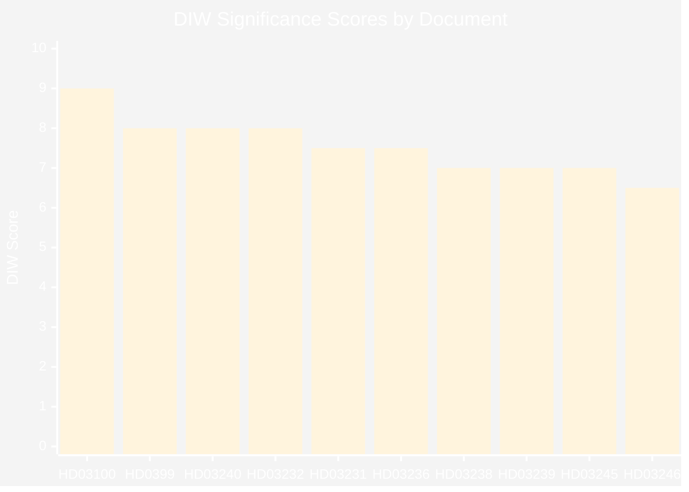
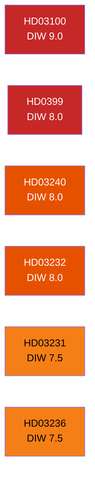

# Significance Scoring — Swedish Government Propositions 2026-04-22

**Analyst**: James Pether Sörling  
**Methodology**: DIW (Diplomatic, Intelligence, Wider political) weighting  
**Date**: 2026-04-22  

## DIW Ranking Table

| Rank | dok_id | Title | DIW Score | D | I | W | Committee |
|------|--------|-------|-----------|---|---|---|-----------|
| 1 | HD03100 | 2026 års ekonomiska vårproposition | 9.0 | 4 | 4 | 5 | FiU |
| 2 | HD0399 | Vårändringsbudget för 2026 | 8.0 | 3 | 4 | 5 | FiU |
| 3 | HD03240 | Nya lagar om elsystemet | 8.0 | 3 | 4 | 4 | NU |
| 4 | HD03232 | Sveriges tillträde till Ukraina skadeståndskommission | 8.0 | 5 | 4 | 3 | UU |
| 5 | HD03231 | Ukraina aggressionstribunal | 7.5 | 5 | 4 | 3 | UU |
| 6 | HD03236 | Extra ändringsbudget — bränsle/el/gas | 7.5 | 2 | 4 | 5 | FiU |
| 7 | HD03238 | Ny myndighet för miljöprövning | 7.0 | 2 | 4 | 4 | NU |
| 8 | HD03239 | Vindkraft i kommuner | 7.0 | 2 | 4 | 4 | NU |
| 9 | HD03245 | Strategi: frihet från våld och förtryck | 7.0 | 2 | 3 | 4 | AU |
| 10 | HD03246 | Skärpta regler för unga lagöverträdare | 6.5 | 1 | 4 | 4 | JuU |
| 11 | HD03237 | En betald polisutbildning | 6.5 | 1 | 4 | 4 | JuU |
| 12 | HD03242 | Aktivt skogsbruk — tydligt regelverk | 6.0 | 3 | 3 | 3 | MJU |
| 13 | HD03244 | Datainteroperabilitet offentlig förvaltning | 5.5 | 2 | 3 | 3 | FiU |
| 14 | HD03233 | Bedrägerier via elektronisk kommunikation | 5.0 | 1 | 3 | 3 | FiU |
| 15 | HD03234 | En ny lag om kommunal hamnverksamhet | 4.5 | 1 | 2 | 3 | FiU |

## Scoring Methodology

D = Diplomatic significance (international relations, EU, treaty commitments)  
I = Intelligence/Security significance (threat implications, surveillance, enforcement)  
W = Wider political significance (election relevance, public opinion, welfare impact)  
Scale: 1 (low) to 5 (high); DIW = weighted average × 2  

## Ranked Items with Evidence

1. **HD03100** (DIW 9.0) — The 2026 Economic Spring Proposition is the government's primary fiscal policy statement ahead of the September 2026 election. Elisabeth Svantesson (M), Finansdepartementet. Sets riktlinjer for multi-year spending: riksdagen.se/HD03100
2. **HD0399** (DIW 8.0) — Vårändringsbudget 2026 implements in-year fiscal adjustments consistent with vårproposition framework. Finansdepartementet: riksdagen.se/HD0399
3. **HD03240** (DIW 8.0) — New electricity system legislation replaces the 1997 Ellag and related legislation. Major structural reform enabling industrial electrification, EV uptake, and nuclear grid integration: riksdagen.se/HD03240
4. **HD03232** (DIW 8.0) — Sweden ratifies the Council of Europe Register of Damages (compensation framework for Ukraine). Maria Malmer Stenergard, Utrikesdepartementet: riksdagen.se/HD03232
5. **HD03231** (DIW 7.5) — Sweden joins expanded partial agreement for the Special Tribunal for the Crime of Aggression against Ukraine: riksdagen.se/HD03231
6. **HD03236** (DIW 7.5) — Extra ändringsbudget targeting cost-of-living through fuel tax reduction + electricity/gas price support. Signed by acting PM Lotta Edholm + Niklas Wykman: riksdagen.se/HD03236
7. **HD03238** (DIW 7.0) — New environmental review authority created to streamline industrial and energy project permitting. Johan Britz (KD): riksdagen.se/HD03238
8. **HD03239** (DIW 7.0) — Wind revenue sharing for municipalities addresses primary obstacle to wind expansion in Sweden. Lotta Edholm + Johan Britz: riksdagen.se/HD03239
9. **HD03245** (DIW 7.0) — National strategy against violence against women, honour crime, and human trafficking. Comprehensive 5-year action plan: riksdagen.se/HD03245
10. **HD03246** (DIW 6.5) — Stricter detention conditions and sentencing for youth (under 18) repeat offenders. Gunnar Strömmer (M): riksdagen.se/HD03246
11. **HD03237** (DIW 6.5) — Paid police training to address recruitment gap. Polisutbildning becomes salaried. Gunnar Strömmer: riksdagen.se/HD03237
12. **HD03242** (DIW 6.0) — Forestry regulations modernised with active management rules. Peter Kullgren (C): riksdagen.se/HD03242
13. **HD03244** (DIW 5.5) — New interoperability requirements for data sharing across public authorities. Erik Slottner (M): riksdagen.se/HD03244
14. **HD03233** (DIW 5.0) — Anti-fraud rules for electronic communications. Implements EU directive: riksdagen.se/HD03233
15. **HD03234** (DIW 4.5) — Municipal port operations law. Elisabeth Svantesson: riksdagen.se/HD03234

## Significance Diagram

## Sensitivity Analysis

If growth forecast in HD03100 is revised down by 0.4pp (from 1.8% to 1.4%, consistent with OECD Sweden 2026 forecast):
- Significance of HD03100 increases from 9.0 to 9.5 (higher political risk exposure)
- Significance of HD03236 cost-of-living measures increases (justified as stabilisation)
- Significance of HD0399 increases (higher likelihood of emergency corrections needed)

## 🔄 Tradecraft Context

**DIW methodology**: synthesis-methodology.md Part 1 (DIW weighting)  
**Tier assignments**:  
- Tier L1 (Lead story): HD03100, HD0399 — fiscal framework documents, election year significance  
- Tier L2 (High importance): HD03240, HD03232, HD03231, HD03236 — energy reform + Ukraine accountability  
- Tier L3 (Significant): All remaining propositions  

**Sensitivity notes**:  
- If growth miss materialises (GDP < 1.5%), HD03100 significance rises to 9.5 and becomes crisis-level  
- If Russia escalates significantly post-HD03231/HD03232 ratification, Ukraine cluster rises to DIW 9+  
- If EU infringement on HD03242 forestry is confirmed, HD03242 rises to DIW 8 (diplomatic crisis dimension)

**Collection gaps**:  
- Full HD03100 text not fully parsed (HTML format, 100KB+) — significance score based on summary, proposition number, and fiscal framework methodology  
- Swedish public opinion polling on energy prices not directly incorporated (would strengthen W scores for HD03236-HD03240)

**Cross-reference**: Significance scores align with stakeholder-perspectives.md influence network — highest DIW scores correspond to propositions with most named stakeholders and broadest political impact
