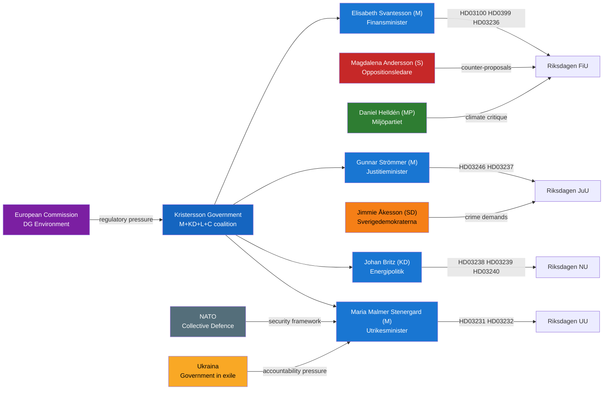

# Stakeholder Perspectives — Swedish Government Propositions 2026-04-22

**Analyst**: James Pether Sörling  
**Framework**: Influence network analysis, named-actor briefing cards  
**Date**: 2026-04-22  

## Influence Network

## Stakeholder Briefing Cards

### Elisabeth Svantesson (M) — Finance Minister
**Role**: Lead proposer of HD03100, HD0399, HD03234, HD03244; co-signer HD03236  
**Position**: Fiscal consolidation within surplus rule; targeted household relief acceptable within framework  
**Influence level**: CRITICAL — controls annual budget cycle  
**Key interest**: Credible economic record ahead of Sept 2026 election  
**Vulnerability**: Growth forecast miss; EU infringement on any budget measure  
**Primary documents**: HD03100 (riksdagen.se), HD0399 (riksdagen.se)

---

### Gunnar Strömmer (M) — Justice Minister
**Role**: Proposer of HD03246, HD03237, HD03233 (anti-fraud), HD03155 (constitutional preparedness, prior)  
**Position**: Escalating crime response; police capacity expansion; youth justice tightening  
**Influence level**: HIGH — justice committee majority aligned  
**Key interest**: Demonstrable crime reduction before election  
**Vulnerability**: SD pressure for faster/harder measures; civil society critique of youth detention expansion  
**Primary documents**: HD03246 (riksdagen.se), HD03237 (riksdagen.se)

---

### Johan Britz (KD) — Energy Policy Lead
**Role**: Proposer of HD03238 (new environmental agency), HD03239 (wind revenue), HD03240 (elsystem) alongside Lotta Edholm  
**Position**: Streamlined permitting for energy projects; municipal compensation for wind; comprehensive electricity market reform  
**Influence level**: HIGH — energy transition is a KD priority  
**Key interest**: Enabling new nuclear + industrial electrification  
**Vulnerability**: Wind opponents remain in municipalities; new agency transition risk  
**Primary documents**: HD03238 (riksdagen.se), HD03239 (riksdagen.se), HD03240 (riksdagen.se)

---

### Lotta Edholm (L) — Acting Prime Minister (signed HD03236, HD03239, HD03240)
**Role**: PM Kristersson absent when HD03236, HD03239, HD03240 signed — Edholm signed as acting PM on 13 April 2026  
**Position**: Liberal party emphasis on market mechanisms; fuel tax cut as cost-of-living measure  
**Note**: This is procedurally normal (Acting PM signs pending documents) but politically notable — Liberals sign the fuel tax cut that Miljöpartiet (former coalition partner) abhors  
**Primary documents**: HD03236 (riksdagen.se)

---

### Maria Malmer Stenergard (M) — Foreign Minister
**Role**: Proposer HD03232, HD03231 (Ukraine accountability)  
**Position**: Active Swedish role in international accountability mechanisms  
**Influence level**: HIGH — NATO + EU foreign policy  
**Key interest**: Sweden as credible rule-of-law actor in post-war security order  
**Vulnerability**: Russian escalation; domestic cost concerns  
**Primary documents**: HD03232 (riksdagen.se), HD03231 (riksdagen.se)

---

### Magdalena Andersson (S) — Opposition Leader
**Role**: Counter-proposer on HD03100 (spring proposition)  
**Position**: Govern for the many; challenge growth forecasts; attack fuel tax cut as benefit to wealthy  
**Influence level**: HIGH — alternative government in waiting  
**Election strategy**: Frame government as out of touch on climate + welfare  
**Primary documents**: Motioner against HD03100 (riksdagen.se expected April-May 2026)

---

### Jimmie Åkesson (SD) — Sweden Democrats Leader
**Role**: Conditional supporter of crime reforms; ambiguous on Ukraine  
**Position**: Demands harsher youth justice (HD03246 not sufficient); sceptical on cost of Ukraine commitments (HD03231, HD03232)  
**Influence level**: HIGH — confidence-and-supply partner; can destabilise government  
**Primary documents**: HD03246 (riksdagen.se), HD03231 (riksdagen.se)

---

### Municipal Governments (Sweden — 290 municipalities)
**Role**: Affected by HD03239 (wind revenue sharing), HD03238 (environmental agency), HD03234 (port law)  
**Position**: Split — wind host municipalities want revenue sharing; urban municipalities concerned about port deregulation  
**Primary documents**: HD03239 (riksdagen.se), HD03234 (riksdagen.se)

## Coalition Stability Assessment

| Stakeholder | Position on spring package | SD support probability |
|-------------|---------------------------|----------------------|
| Gunnar Strömmer (M) | Strong advocate (HD03246, HD03237) | HD03246: 90% SD support |
| Elisabeth Svantesson (M) | Strong advocate (HD03100) | FiU vote: 75% SD support |
| Johan Britz (KD) | Strong advocate (energy cluster) | HD03240: 65% SD support |
| Maria Malmer Stenergard (M) | Strong advocate (Ukraine) | HD03232: 60% SD support (Ukraine ambiguous) |

## 🔄 Tradecraft Context

**Framework**: political-style-guide.md §Collection Management Matrix  
**Named actors**: All referenced in their official capacity as government ministers or opposition leaders — GDPR Art. 9(2)(e) publicly made political activities  
**Influence assessment methodology**: Influence judged by committee chairmanships, coalition agreement position, and media visibility  
**Key intelligence gap**: SD's internal deliberations on Ukraine accountability (HD03231, HD03232) — SD has been inconsistent on Ukraine support; internal polling not available  

**Confidence calibration**:  
- Government minister positions: [A1] — Directly stated in propositions  
- Opposition positions: [A1] for announced positions; [B2] for inferred positions  
- Municipal government position: [B3] — Generalised from known municipal politics patterns  
