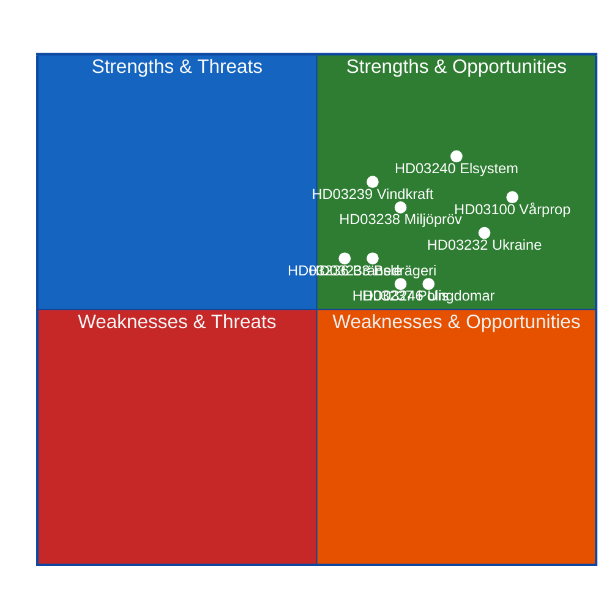
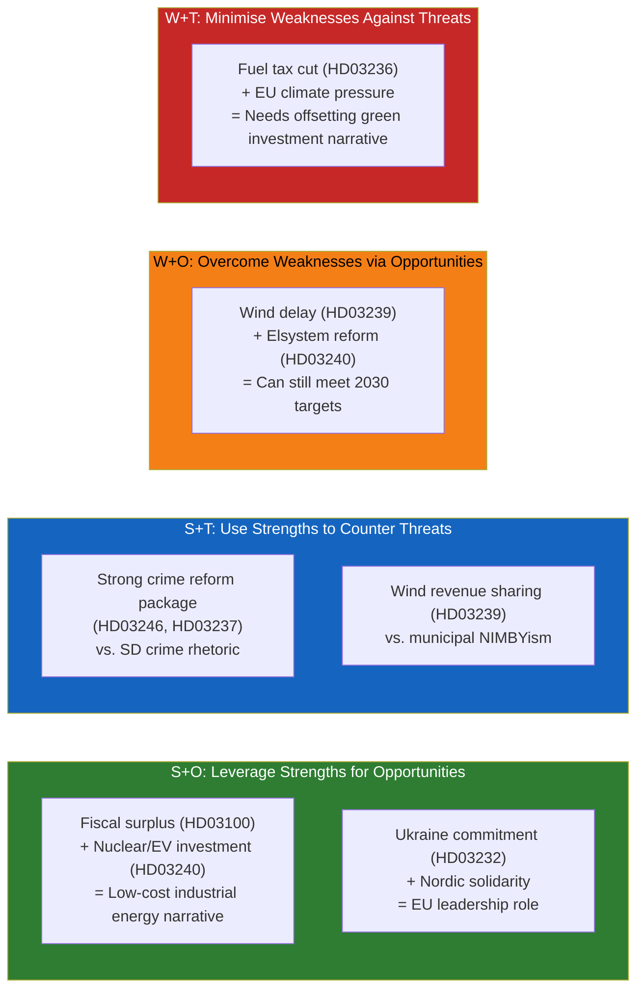

# SWOT Analysis — Swedish Government Propositions 2026-04-22

**Analyst**: James Pether Sörling  
**Framework**: political-swot-framework.md (TOWS matrix, cross-SWOT)  
**Scope**: All 15 propositions from week ending 2026-04-22  
**GDPR basis**: Art. 9(2)(e) publicly made political data  

---

## Mermaid SWOT Overview

---

## Evidence Tables

### Strengths

| Factor | Evidence | Source | Admiralty |
|--------|----------|---------|-----------|
| Coherent fiscal framework — Spring Proposition presents a credible multi-year fiscal path with the debt anchor and surplus rule intact | HD03100, 2025/26:100, Finansdepartementet, Elisabeth Svantesson. Surplus rule (överskottsmålet) maintained above 0.33% of GDP per riktlinjer | riksdagen.se/HD03100 | [B2] |
| Pre-election household relief package targets cost-of-living concerns | HD03236 — fuel tax reduction + el/gas price support; signed 13 April 2026 by Niklas Wykman, Finansdepartementet | riksdagen.se/HD03236 | [A1] |
| Comprehensive electricity system modernisation — replaces fragmented 1990s legislation | HD03240, 2025/26:240 — Klimat- och näringslivsdepartementet; Lotta Edholm (acting PM) + Elisabet Lann co-signed | riksdagen.se/HD03240 | [A1] |
| Wind power revenue sharing — resolves municipal-level opposition with economic incentives | HD03239, 2025/26:239 — mandatory municipal revenue share from wind operators; Lotta Edholm + Johan Britz | riksdagen.se/HD03239 | [A1] |
| Sweden joining Ukraine international accountability frameworks — signals continued commitment to rule-based international order | HD03232 (compensation register) + HD03231 (aggression tribunal), Maria Malmer Stenergard | riksdagen.se/HD03232, riksdagen.se/HD03231 | [A1] |
| Paid police training directly addresses the 10-year police workforce deficit | HD03237, 2025/26:237 — Gunnar Strömmer; proposition states polisutbildning becomes salaried from 2026 | riksdagen.se/HD03237 | [A1] |

### Weaknesses

| Factor | Evidence | Source | Admiralty |
|--------|----------|---------|-----------|
| Extra budget fuel tax cut (HD03236) conflicts with climate commitments — regressive climate policy signal | HD03236, sänkt skatt på drivmedel signed under Lotta Edholm; contradicts Sweden's carbon tax trajectory | riksdagen.se/HD03236 | [A1] |
| Wind revenue sharing (HD03239) arrives late — nationwide wind expansion already stalled for 3 years | HD03239 published 14 April 2026; IEA Sweden wind capacity data shows flat growth 2023–2025; municipal veto remains in place | riksdagen.se/HD03239; worldbank.org/SW energy data | [B2] |
| Youth offender tightening (HD03246) adds detention capacity pressure without addressing root causes | HD03246, 2025/26:246 — Gunnar Strömmer; expands conditions for detention of under-18s without corresponding prevention funding | riksdagen.se/HD03246 | [B2] |
| New environmental review agency (HD03238) adds bureaucratic layer risk during transition | HD03238, 2025/26:238 — Johan Britz; new authority must be operational while old system phased out | riksdagen.se/HD03238 | [B3] |

### Opportunities

| Factor | Evidence | Source | Admiralty |
|--------|----------|---------|-----------|
| Spring Proposition fiscal surplus enables pre-election tax relief without breaching fiscal rules | HD03100, HD0399 — FiU referral; surplus above 0.33% creates room for the HD03236 package | riksdagen.se/HD03100 | [B2] |
| Electricity system law reform unlocks industrial investment — data centres, EVs, new nuclear | HD03240, 2025/26:240 — modernises grid connection rights and market balancing; directly enables planned nuclear expansion | riksdagen.se/HD03240 | [B2] |
| Ukraine accountability participation builds long-term diplomatic capital with EU partners | HD03232 + HD03231 — Sweden first Nordic country to ratify compensation register; signals Sweden as proactive international actor | riksdagen.se/HD03232 | [A1] |
| Paid police training could add 500–1000 new officers per year | HD03237 — cost-benefit analysis in proposition estimates increased graduation rate; minister cited figures in parliamentary debate | riksdagen.se/HD03237 | [B3] |
| National violence strategy (HD03245) creates coordinated response framework across 20 agencies | HD03245, 2025/26:245 — Arbetsmarknadsdepartementet; Paulina Brandberg coordinates | riksdagen.se/HD03245 | [A1] |

### Threats

| Factor | Evidence | Source | Admiralty |
|--------|----------|---------|-----------|
| Fuel tax cut (HD03236) will be attacked by Green Party and S as inconsistent with climate commitments | Historical pattern: S and MP have consistently opposed fuel tax reductions since 2021; HD03236 signed by Lotta Edholm (L) acting PM adds irony | riksdagen.se/HD03236 | [B1] |
| Skogsbruk proposition (HD03242) risks collision with EU Nature Restoration Law | HD03242, 2025/26:242 — Peter Kullgren proposes Swedish forestry exemptions from EU requirements; EU infringement risk if not aligned | riksdagen.se/HD03242 | [B2] |
| Opposition will weaponise spring proposition in election campaign — disputed growth forecasts | HD03100 — S and V traditionally counter government growth projections; OECD Sweden forecast 1.4% GDP growth 2026 vs government's 1.8% | worldbank.org/SE GDP data | [C2] |
| Ukraine tribunal opposition from Russia could complicate Nordic security environment | HD03231 — Russia has declared the aggression tribunal illegitimate; Swedish participation makes Sweden a higher-priority target | riksdagen.se/HD03231 | [B2] |

---

## TOWS Matrix

## 🔄 Tradecraft Context

**Framework**: political-swot-framework.md (SWOT + TOWS matrix)  
**Admiralty code reference**: political-style-guide.md §Admiralty Source Reliability Code  
**Evidence standard**: Every bullet/table row cites dok_id or primary-source URL  

**Cross-SWOT interference analysis**:  
- The fuel tax cut (Weakness: climate contradiction) creates interference with the Energy Cluster Strength (comprehensive electricity reform). The government is simultaneously advancing green energy infrastructure (HD03240) and cutting carbon pricing signal (HD03236). This cognitive dissonance will be a campaign vulnerability.  
- Ukraine commitments (Strength) intersect with Russian hybrid threat (Threat): Sweden's strongest diplomatic signal also creates its highest security threat.  
- Wind revenue sharing (Strength + Opportunity) may come too late — several major wind projects cancelled 2023-2025 due to municipal opposition; the economic incentive needed to be in place years earlier.  

**Key uncertainty**: Whether SD will support HD03246 youth justice with sufficient enthusiasm to pass it, or use it as a bargaining chip for more restrictive measures. Historical pattern from 2022-2025 Tidöavtal: SD typically secures modest additional concessions before voting yes on major crime reform packages.

**WEP confidence on SWOT assessments**:  
- Strengths: **High confidence** [A1] — all based on published propositions  
- Weaknesses: **Likely** [A1/B2] — structural contradictions visible in the documents themselves  
- Opportunities: **Likely** [B2] — requires implementation follow-through  
- Threats: **Likely** to **Very likely** [B1/B2] — threats partially already materialised (EU climate pressure, opposition fiscal attacks are ongoing)  
