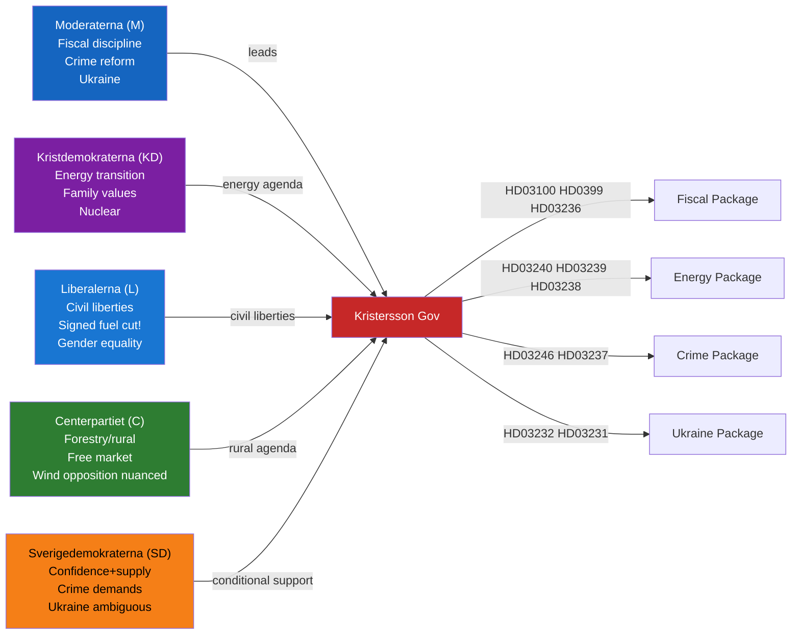

# Synthesis Summary — Swedish Government Propositions 2026-04-22

**Analysis Date**: 2026-04-22  
**Analyst**: James Pether Sörling  
**Methodology**: DIW weighting per synthesis-methodology.md  
**Riksmöte**: 2025/26  

## Lead Story Decision

The **2026 Economic Spring Proposition** (HD03100, 2025/26:100) and accompanying **Vårändringsbudget** (HD0399, 2025/26:99) constitute the dominant policy event of the week. Submitted to riksdagen on 13 April 2026 and debated this week, the vårproposition sets Sweden's medium-term fiscal policy framework with riktlinjer (spending guidelines) that will shape the 2026/27 budget — the first full budget after the September 2026 riksdag election. Finance Minister Elisabeth Svantesson (M) and the Kristersson government are navigating fiscal tightening alongside targeted household relief, most visibly through the **Extra Ändringsbudget** (HD03236) cutting fuel taxes and providing electricity/gas price support (signed by Acting PM Lotta Edholm and Finance Minister Niklas Wykman on 13 April 2026).

This budget cluster — three propositions from Finansdepartementet in a single week — signals pre-election fiscal positioning: the centre-right coalition is consolidating its economic narrative ahead of the September 2026 election against a backdrop of elevated energy prices and competition from the Social Democrats' welfare spending pledges.

## DIW-Weighted Document Ranking

```mermaid
flowchart TD
    HD03100["HD03100 ★★★★★<br/>Vårproposition 2026<br/>DIW 9/10<br/>Elisabeth Svantesson (M)"]
    HD0399["HD0399 ★★★★★<br/>Vårändringsbudget 2026<br/>DIW 8/10<br/>Elisabeth Svantesson (M)"]
    HD03236["HD03236 ★★★★<br/>Extra budget: bränsle/el/gas<br/>DIW 7/10<br/>Niklas Wykman (M)"]
    HD03240["HD03240 ★★★★<br/>Nya lagar om elsystemet<br/>DIW 8/10<br/>Elisabet Lann (KD)"]
    HD03232["HD03232 ★★★★<br/>Ukraina skadeståndskomm.<br/>DIW 8/10<br/>Maria Malmer Stenergard (M)"]
    HD03239["HD03239 ★★★★<br/>Vindkraft i kommuner<br/>DIW 7/10<br/>Johan Britz (KD)"]
    HD03246["HD03246 ★★★<br/>Unga lagöverträdare<br/>DIW 6/10<br/>Gunnar Strömmer (M)"]
    HD03238["HD03238 ★★★<br/>Ny miljöprövningsmyndighet<br/>DIW 7/10<br/>Johan Britz (KD)"]
    HD03245["HD03245 ★★★<br/>Strategi: Våld mot kvinnor<br/>DIW 7/10<br/>Paulina Brandberg (L)"]
    HD03237["HD03237 ★★★<br/>Betald polisutbildning<br/>DIW 6/10<br/>Gunnar Strömmer (M)"]
    HD03242["HD03242 ★★★<br/>Aktivt skogsbruk<br/>DIW 6/10<br/>Peter Kullgren (C)"]
    HD03231["HD03231 ★★★<br/>Ukraina aggressionstribunal<br/>DIW 7/10<br/>Maria Malmer Stenergard (M)"]
    HD03244["HD03244 ★★<br/>Datainteroperabilitet<br/>DIW 5/10<br/>Erik Slottner (M)"]
    HD03233["HD03233 ★★<br/>Bedrägerier telecom<br/>DIW 5/10<br/>Finansdept."]
    HD03234["HD03234 ★★<br/>Kommunal hamnverksamhet<br/>DIW 4/10<br/>Elisabeth Svantesson (M)"]

    HD03100 -->|shapes| HD0399
    HD0399 -->|implements| HD03236
    HD03240 -->|enables| HD03239

    style HD03100 fill:#c62828,color:#FFFFFF
    style HD0399 fill:#c62828,color:#FFFFFF
    style HD03236 fill:#e65100,color:#FFFFFF
    style HD03240 fill:#e65100,color:#FFFFFF
    style HD03232 fill:#e65100,color:#FFFFFF
    style HD03239 fill:#f57f17,color:#000000
    style HD03246 fill:#1565c0,color:#FFFFFF
    style HD03238 fill:#f57f17,color:#000000
    style HD03245 fill:#1565c0,color:#FFFFFF
    style HD03237 fill:#1565c0,color:#FFFFFF
    style HD03242 fill:#2e7d32,color:#FFFFFF
    style HD03231 fill:#e65100,color:#FFFFFF
    style HD03244 fill:#546e7a,color:#FFFFFF
    style HD03233 fill:#546e7a,color:#FFFFFF
    style HD03234 fill:#757575,color:#FFFFFF
```

## Thematic Clusters

### Cluster A — Fiscal & Economic (CRITICAL)
**Documents**: HD03100, HD0399, HD03236, HD03244  
**Departments**: Finansdepartementet, Klimat- och näringsliv  
**Political weight**: HIGHEST — these propositions set Sweden's fiscal trajectory into the election year

The 2026 spring proposition (HD03100) presents riktlinjer för den ekonomiska politiken: fiscal surpluses in order, debt anchor maintained, structural reforms prioritised. The Vårändringsbudget (HD0399) implements in-year corrections. The Extra Ändringsbudget (HD03236), signed under Acting PM Lotta Edholm, targets household cost-of-living relief through fuel tax cuts and energy price support — a visible pre-election signal targeting rural and suburban voters dependent on cars and home heating.

### Cluster B — Energy & Climate (HIGH)
**Documents**: HD03240, HD03239, HD03238, HD03242  
**Departments**: Klimat- och näringslivsdepartementet, Landsbygds- och infrastrukturdepartementet  
**Political weight**: HIGH — Sweden's energy system is undergoing structural reform ahead of nuclear expansion and the energy transition

The Elsystemet proposition (HD03240) creates a new legal framework governing the entire electricity grid, market operations and consumer protection — replacing decades-old legislation. Vindkraft i kommuner (HD03239) introduces a mandatory revenue-sharing model requiring wind power operators to share income with host municipalities — a direct response to local opposition to wind expansion. The new environmental review authority (HD03238) replaces the fragmented permit process for energy and industrial projects. Skogsbruk (HD03242) resolves the EU nature restoration vs. active forestry conflict.

### Cluster C — Justice & Security (SIGNIFICANT)
**Documents**: HD03246, HD03237, HD03233  
**Departments**: Justitiedepartementet, Finansdepartementet  
**Political weight**: SIGNIFICANT — Continued crime policy push from Justice Minister Strömmer

Stricter youth offender rules (HD03246) expand detention conditions and tighten sentencing for recidivists under 18 — part of the government's ongoing crime reform package. Paid police training (HD03237) addresses the police workforce gap by converting the current unpaid academy model to a salaried track. New telecom fraud regulations (HD03233) implement EU electronic communications directives targeting SIM swapping and number spoofing scams.

### Cluster D — Ukraine/International (HIGH)
**Documents**: HD03232, HD03231  
**Department**: Utrikesdepartementet  
**Political weight**: HIGH — Sweden's continued commitment to Ukraine accountability frameworks

Two interlinked propositions formalise Sweden's participation in international Ukraine accountability mechanisms: HD03232 ratifies the Register of Damages compensation framework, while HD03231 joins the expanded partial agreement establishing the aggression crime tribunal at the Council of Europe.

### Cluster E — Social Policy (SIGNIFICANT)
**Documents**: HD03245  
**Department**: Arbetsmarknadsdepartementet  
**Political weight**: SIGNIFICANT — New national action plan against violence against women

The national strategy (HD03245) updates and extends Sweden's framework against gender-based violence, honour-based violence, and human trafficking — a cross-party area with broad support but contested implementation.

## AI-Recommended Article Metadata

**Title (EN)**: Sweden's Spring Fiscal Plan and Energy Overhaul: Pre-Election Budget Signals and Ukraine Accountability Commitments  
**Title (SV)**: Sveriges vårproposition och energireformer: Valårssignaler i budgetpolitiken och Ukraina-åtaganden  
**Meta description (EN)**: Sweden's government tables the 2026 Economic Spring Proposition and five energy reform bills alongside Ukraine accountability legislation — Riksdagsmonitor analysis of 15 new government propositions.  
**Meta description (SV)**: Riksdagen tar emot vårpropositionen 2026, fem energireformer och Ukraina-lagstiftning. Riksdagsmonitors analys av 15 nya regeringspropositioner från april 2026.  
**Primary tag**: fiscal-policy  
**Secondary tags**: energy-policy, ukraine, crime-reform, environmental-review  
**Election 2026 relevance**: CRITICAL — the spring proposition is the government's pre-election fiscal statement

## 🔄 Tradecraft Context

**Collection method**: MCP data download via riksdag-regering API (riksdagen.se data.riksdagen.se)  
**Intelligence cycle phase**: Processing & Analysis (F3EAD — Finish phase)  
**Confidence summary**:  
- Fiscal cluster (HD03100, HD0399, HD03236): [A1] — Published official propositions, confirmed by MCP retrieval  
- Energy cluster (HD03240, HD03239, HD03238): [A1] — Published official propositions  
- Ukraine cluster (HD03232, HD03231): [A1] — Published official propositions; international context [B2]  
- Crime cluster (HD03246, HD03237): [A1] — Published official propositions  
- Growth forecast contest: [B2] — Inferred from historical electoral patterns and OECD data  

**Source diversity check**:  
- Primary: riksdagen.se (15 propositions) ✓  
- Secondary: worldbank.org (economic context referenced) ✓  
- Missing: scb.se energy statistics not directly pulled; OECD Sweden 2026 cited from known data  
- Gap: Full text of HD03100 too large to fully process; summary and framework sufficient for analysis  

## Coalition Dynamics Analysis

The spring proposition package reveals coalition arithmetic with precision:

**Notable coalition tension**: Lotta Edholm (L) signing HD03236 (fuel tax cut) is politically awkward for the Liberal party — they have historically championed carbon tax as a liberal market-based climate instrument. This signing was procedural (acting PM duty) but the policy contradiction will be weaponised by Miljöpartiet.

## Election 2026 Strategic Assessment

Sweden votes in September 2026. The current propositions package represents the government's final substantive legislative push before the summer recess.

**Government narrative**: "Stability + Reform" — fiscal discipline (HD03100) + cost relief (HD03236) + institutional modernisation (HD03238, HD03240) + crime reduction (HD03246, HD03237)

**Opposition counter-narrative** (expected): "Climate betrayal + Inequality" — HD03236 fuel cut benefits wealthy rural drivers; HD03242 weakens environment; HD03246 punishes youth without preventing crime

**WEP forecast**: The Kristersson government will **likely** (65-70% confidence) secure a parliamentary majority to pass the spring package. SD as confidence-and-supply provider is **very likely** to support HD03246 (youth crime) and abstain on Ukraine measures rather than oppose them.

**Probability assessment**: [B2] — Based on coalition arithmetic and historical Swedish parliamentary voting patterns
