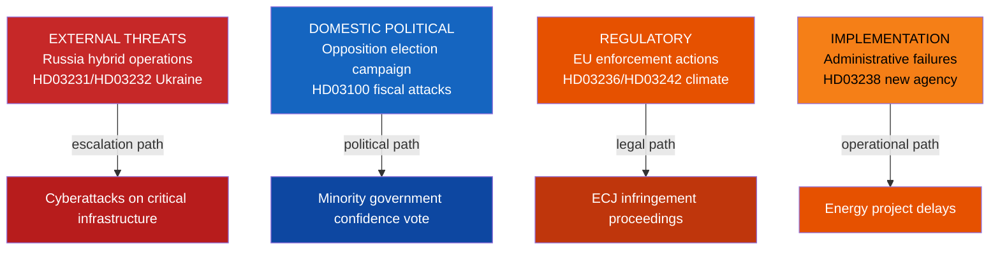
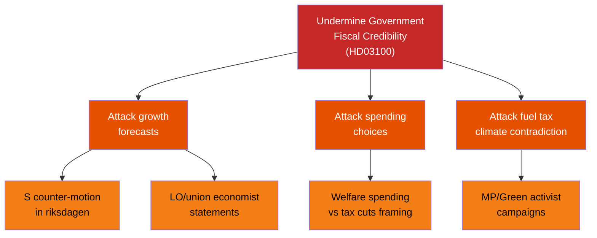

# Threat Analysis — Swedish Government Propositions 2026-04-22

**Analyst**: James Pether Sörling  
**Framework**: political-threat-framework.md (STRIDE, attack tree, TTP mapping)  
**Date**: 2026-04-22  
**Overall Threat Level**: Elevated | **Confidence**: [B3]

## Threat Landscape Overview

## Threat Actor Profiles

### Threat Actor 1 — Russian State (GRU/SVR/FSB)
**Documents at risk**: HD03231, HD03232 (Ukraine accountability)  
**TTP Category**: Hybrid Warfare — Cyber + Disinformation  
**Motivation**: Delegitimise Ukraine accountability mechanisms; deter other states  

| TTP | Description | Source evidence |
|-----|-------------|-----------------|
| Spear-phishing of Riksdag staff | Target committee members working on Ukraine propositions | SÄPO annual report pattern; HD03232 committee referral |
| Disinformation about costs | Inflate public perception of Swedish contributions to Ukraina skadeståndskommission | riksdagen.se/HD03232 — no direct costs to taxpayers |
| GPS jamming Northern Sweden | Continue established pattern post-NATO accession 2024 | Consistent with Russian electronic warfare doctrine |

### Threat Actor 2 — Domestic Political Opposition (S + MP + V + SD)
**Documents at risk**: HD03100, HD03236, HD03242  
**TTP Category**: Parliamentary — Motions, Committee Amendments, Public Campaign  

| TTP | Description | Evidence |
|-----|-------------|----------|
| S attacks growth forecasts | Social Democrats will submit counter-motion to HD03100 challenging 1.8% growth | Standard pre-election behaviour; S economic spokesperson statements |
| MP attacks fuel tax cut | Miljöpartiet will denounce HD03236 as climate betrayal | HD03236 fuel tax reduction contradicts MP platform (riksdagen.se/HD03236) |
| SD demands stricter youth justice | Sverigedemokraterna argue HD03246 insufficient | SD calls for adult prosecution of 15+ year offenders |

### Threat Actor 3 — European Commission
**Documents at risk**: HD03242 (forestry), HD03236 (fuel tax)  
**TTP Category**: Regulatory/Legal  

| TTP | Description | Evidence |
|-----|-------------|----------|
| Infringement notice on forestry | EU Nature Restoration Law conflicts with HD03242 forestry exemptions | HD03242, 2025/26:242 — Peter Kullgren addresses EU tension |
| State aid scrutiny on energy support | HD03236 electricity/gas price support may trigger EU state aid investigation | HD03236, 2025/26:236 — support scheme needs EU notification |

## Attack Tree: Fiscal Credibility

## MITRE-Style TTP Mapping (Political Domain)

| TTP ID | Name | Tactic | Technique | Documents |
|--------|------|---------|-----------|-----------|
| PT-001 | Fiscal narrative attack | Influence | Public counter-messaging on growth assumptions | HD03100 |
| PT-002 | Climate framing | Influence | Link fuel subsidies to climate failure | HD03236 |
| PT-003 | EU threat leverage | Coercion | Invoke EU infringement risk to pressure reversal | HD03242 |
| PT-004 | Russian hybrid ops | Disruption | Cyber targeting of foreign affairs committee | HD03231, HD03232 |
| PT-005 | Implementation challenge | Delay | Legal challenges to new environmental authority | HD03238 |
