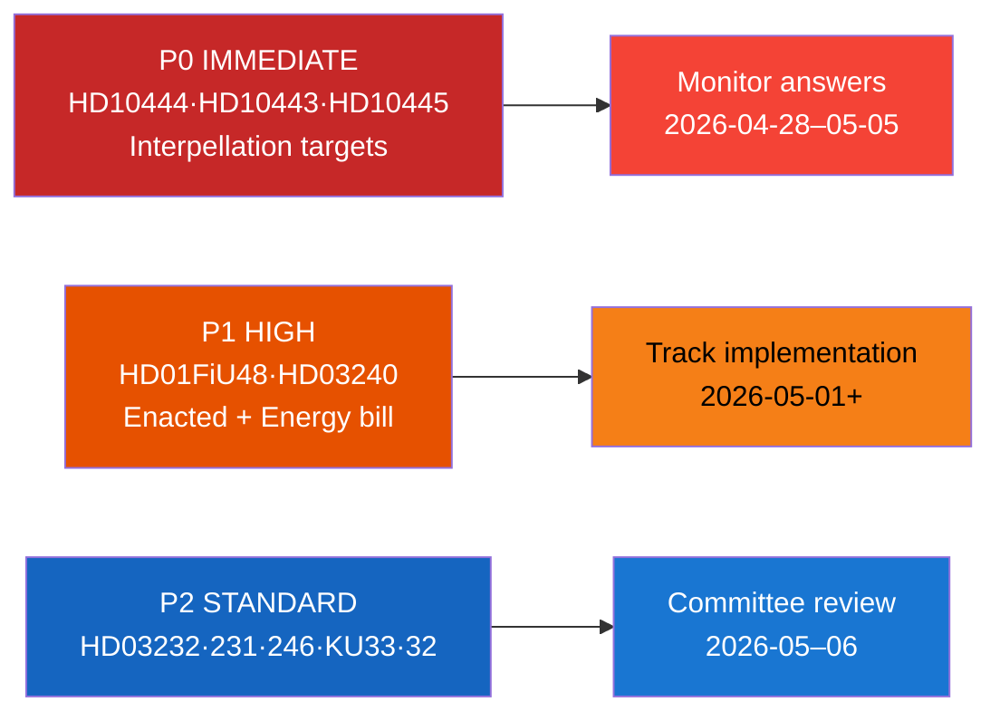

# Classification Results — Riksdag Realtime Monitor 2026-04-22
**Analyst**: James Pether Sörling | **Classification**: Public
**Methodology**: political-classification-guide.md, ai-driven-analysis-guide.md v6.4

---

## Classification Framework (7 Dimensions)

### Dimensions
1. **Policy Domain** — Primary policy area
2. **Political Valence** — Partisan direction (government/opposition/cross-party)
3. **Legislative Stage** — Current parliamentary position
4. **Urgency** — Immediate/Near-term/Medium-term
5. **Electoral Relevance** — Impact on September 2026 election narrative
6. **GDPR Classification** — Art. 9 handling
7. **Retention** — Analytical retention period

---

## Document Classifications

### HD10444 — Arbetsgivaravgift Abuse [Interpellation]

| Dimension | Classification |
|-----------|---------------|
| Policy Domain | Fiscal policy / Labour market |
| Political Valence | Opposition attack (S → M coalition) |
| Legislative Stage | Interpellation filed — awaiting ministerial answer |
| Urgency | IMMEDIATE — debate scheduled within 2 weeks |
| Electoral Relevance | HIGH — core fiscal credibility narrative for Election 2026 |
| GDPR | Art. 9(2)(e) publicly filed; Data minimisation applied |
| Retention | 5 years (electoral significance) |

### HD10443 — Social Dumpning [Interpellation]

| Dimension | Classification |
|-----------|---------------|
| Policy Domain | Social welfare / Municipal governance |
| Political Valence | Opposition (S → KD) |
| Legislative Stage | Interpellation filed |
| Urgency | IMMEDIATE |
| Electoral Relevance | HIGH — welfare state protection narrative |
| GDPR | Art. 9(2)(e) publicly filed |
| Retention | 5 years |

### HD10445 — Housing Pre-emption [Interpellation]

| Dimension | Classification |
|-----------|---------------|
| Policy Domain | Housing policy / Urban segregation |
| Political Valence | Opposition (S → KD) |
| Legislative Stage | Interpellation filed |
| Urgency | NEAR-TERM |
| Electoral Relevance | HIGH — Stockholm suburban segregation |
| GDPR | Art. 9(2)(e) publicly filed |
| Retention | 5 years |

### HD10446 — False Death Declarations [Interpellation]

| Dimension | Classification |
|-----------|---------------|
| Policy Domain | Civil administration / Skatteverket |
| Political Valence | Opposition (S → M) |
| Legislative Stage | Interpellation filed |
| Urgency | NEAR-TERM |
| Electoral Relevance | MEDIUM — administrative competence framing |
| GDPR | Art. 9(2)(g) public interest; data minimisation |
| Retention | 3 years |

### HD01FiU48 — Extra Ändringsbudget [Betänkande ENACTED]

| Dimension | Classification |
|-----------|---------------|
| Policy Domain | Fiscal policy / Energy pricing |
| Political Valence | Cross-party (M+SD+KD+L+C majority) |
| Legislative Stage | **Enacted** — 2026-04-21 |
| Urgency | HIGH — takes effect 2026-05-01 |
| Electoral Relevance | HIGH — government relief narrative |
| GDPR | N/A (legislative, no personal data) |
| Retention | Permanent (legislative record) |

### HD03240 — Nya Lagar om Elsystemet [Proposition]

| Dimension | Classification |
|-----------|---------------|
| Policy Domain | Energy policy / Electricity system |
| Political Valence | Government |
| Legislative Stage | Proposition submitted — committee review pending |
| Urgency | MEDIUM-TERM |
| Electoral Relevance | HIGH — energy security + climate narratives |
| GDPR | N/A |
| Retention | Permanent |

### HD03232/HD03231 — Ukraine Tribunals [Propositions]

| Dimension | Classification |
|-----------|---------------|
| Policy Domain | Foreign affairs / International law |
| Political Valence | Government (broad consensus expected) |
| Legislative Stage | Propositions submitted |
| Urgency | MEDIUM-TERM |
| Electoral Relevance | MEDIUM — Sweden's Ukraine solidarity stance |
| GDPR | N/A |
| Retention | Permanent |

---

## Priority Tier Classification

### Tier P0 — Highest Priority (immediate monitoring)
- HD10444, HD10443, HD10445 (interpellations targeting ministers)

### Tier P1 — High Priority (track through committee/debate)
- HD01FiU48 (enacted — implementation monitoring)
- HD03240 (new electricity system law — committee)

### Tier P2 — Standard Priority
- HD03232, HD03231, HD03246, HD01KU33, HD01KU32, HD03242

---

## Information Access Control
- All documents: **Public access** (Offentlighetsprincipen — Swedish Freedom of the Press Act)
- Source: data.riksdagen.se (official open data)
- No restricted or classified material in this analysis

