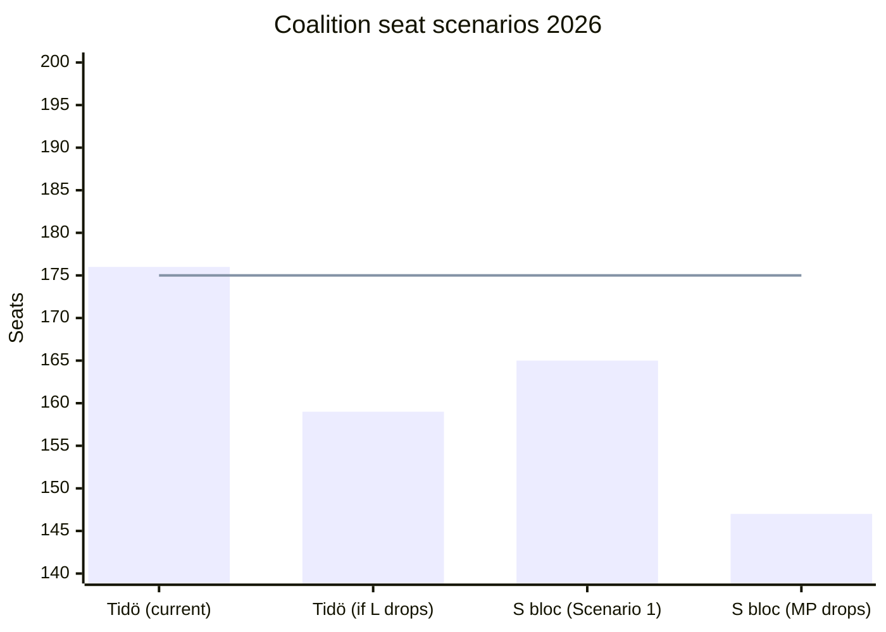

# Coalition Mathematics — Riksdag Realtime Monitor 2026-04-22
**Analyst**: James Pether Sörling | **Classification**: Public | **Cycle**: Realtime-2338

---

## Current Riksdag Seat Distribution (2022–2026 mandate)

| Party | Seats | Bloc |
|-------|-------|------|
| SD | 73 | Tidö support |
| S | 107 | Opposition |
| M | 68 | Tidö government |
| V | 24 | Opposition |
| C | 24 | Pivot |
| KD | 19 | Tidö government |
| MP | 18 | Opposition |
| L | 16 | Tidö government |
| **Total** | **349** | |

**Tidö governing majority**: M+KD+L = 103 seats; with SD support = 176 seats (majority = 175)
**Opposition potential**: S+V+MP = 149; needs C (24) for 173 — short of majority without SD or breakdown of Tidö

---

## Post-Election Scenario Mathematics (September 2026)

### Coalition A: Tidö Continuation (M+KD+L+SD support)
- Requires M+KD+L ≥ 100 + SD ≥ 70 → ≥ 175/349
- Current probability: MODERATE (scenario 2 → 55%)
- Risk: L drops below 4% threshold → Tidö loses 16 seats → falls to ~159/349 → minority without SD active support

### Coalition B: S-led alternative (S+V+MP+C)
- Requires S ≥ 95 + V ≥ 20 + MP ≥ 15 + C ≥ 24 → ≥ 154/349 (majority = 175 — falls short)
- S+V+MP+C needs more: requires either S >102 or C > 28 to reach 175
- Current probability: LOW-MODERATE; only viable under Scenario 1 (accountability breakthrough)

### Coalition C: Grand Centre Bloc (M+C+L+S abstain)
- Requires M+C+L ≥ 115 (passive S abstention or confidence-and-supply)
- Historically rejected by Swedish political culture; not plausible without crisis
- Current probability: VERY LOW

---

## Today's Electoral Mathematics Shifts

| Event | Direction | Seat impact estimate |
|-------|-----------|---------------------|
| S accountability offensive (HD10444/443/445/446) | S +1–3% if KJ-1 materialises | +3–9 seats for S bloc [B2] |
| HD01FiU48 fuel cut enacted | Coalition claim +0.5–1% with rural segment | +1–3 seats for Tidö [B2] |
| C deportation nuance (HD024095) | C towards independent pivot | C seat-share unchanged; coalition arithmetic risk |
| Energy legislation sprint | Coalition credibility signal | No immediate seat impact |

---

## Sainte-Laguë Threshold Sensitivity

**Critical 4% threshold parties**: L (currently ~4.5%) and MP (currently ~3.8–4.2%)

- If L falls below 4%: Tidö coalition loses 16 seats → drops to ~159 with SD → below majority
- If MP falls below 4%: S bloc loses 18 seats → S+V+C = ~147 → cannot form government without SD defection
- Both thresholds are within current polling error bands

*Note: 175 = majority threshold. Tidö current projects above threshold; S bloc Scenario 1 projects below.*
