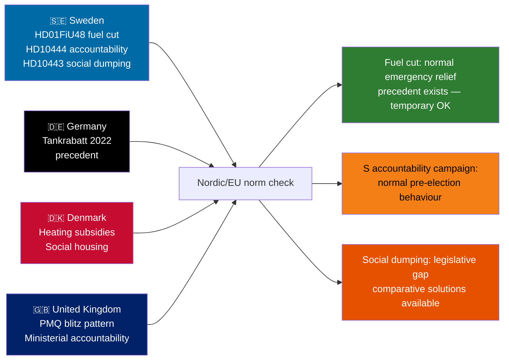

# Comparative International Analysis — Riksdag Realtime Monitor 2026-04-22
**Analyst**: James Pether Sörling | **Classification**: Public | **Cycle**: Realtime-2338

---

**Comparator set**: Denmark (Nordic peer), Germany (EU large economy), United Kingdom (non-EU Westminster model)

---

## Comparative Framework

### Issue 1: Fuel Tax Cuts as Electoral Relief Measure

| Jurisdiction | Recent Action | Comparator Evidence | Source |
|----------|------|----------|--------|
| Sweden | 82 öre/litre cut (HD01FiU48, 2026-04-21); temporary May–Sep 2026; EU minimum floor | Government used temporary relief framing, justified by Middle East conflict + high energy prices | riksdagen.se/dokument/HD01FiU48 |
| Germany | 2022 Tankrabatt — 35 cents/litre cut for 3 months (June–August 2022) | Bundesregierung (Scholz) passed similar temporary fuel relief during Ukraine war energy shock; 3 billion EUR cost | bundesregierung.de (Tankrabatt 2022) |
| Denmark | No direct fuel tax cut in 2022–2026 period; instead targeted heating subsidies | Denmark preferred household energy subsidies over transport fuel cuts; different income-group distribution | ft.dk (heating subsidies 2022) |

**Outside-In analysis**: Sweden's approach most closely parallels Germany's 2022 Tankrabatt in structure (temporary, EU-minimum anchored, justified by external shock). Germany's Tankrabatt was heavily criticised by climate groups as distributional regressive and emissions-inefficient — same critique applies to HD01FiU48. However, the German precedent also shows temporary fuel cuts are generally accepted as legitimate emergency relief and do not produce permanent electoral realignment. Sweden's MP and V opposition (HD024098, HD024092) mirrors German Green/SPD-left criticism in 2022.

### Issue 2: Parliamentary Accountability Interpellations — Ministerial Targeting Patterns

| Jurisdiction | Pattern | Comparator Evidence | Source |
|-----------|-------|---------|--------|
| Sweden | 4 interpellations in 24 hours targeting one minister | Uncommon intensity; confirms coordinated campaign [B2] | riksdagen.se HD10444–446 |
| United Kingdom | PMQs as equivalent weekly ministerial accountability | UK Opposition regularly "loads" PMQs with coordinated questions on one minister; 6 questions per session standard | UK Parliament Hansard |
| Germany | Fragestunde — 60-question session monthly | Opposition groups coordinate thematic question clusters; equivalent pattern but slower pace | Bundestag Geschäftsordnung §105 |

**Outside-In analysis**: Sweden's interpellation mechanism is more formally structured than UK PMQs but less frequent. The pattern of 4 interpellations in 24 hours targeting one minister (Svantesson) is the Swedish equivalent of a "PMQ blitz" — an intensification that signals pre-election political season has begun. This is normal behaviour for advanced democratic parliaments in election years; the analytical significance is the target selection (Svantesson, highest-profile fiscal figure) not the tactic itself.

### Issue 3: Municipal Social Dumping — International Comparative

| Jurisdiction | Policy | Comparator Evidence | Source |
|-----------|-------|---------|--------|
| Sweden | HD10443 — documented inter-municipal social welfare transfers without consent | No national law prohibiting informal municipal "recommendations" to residents to relocate | riksdagen.se HD10443 |
| Denmark | Copenhagen municipality has used relocation incentive schemes for social housing | Controversial; subject to Parliamentary review 2019–2022; partial reform adopted | ft.dk social housing debates |
| Netherlands | Municipal residency requirements restrictions — ruled partly unconstitutional | Court ruling 2023 limited municipal power to block welfare recipients; social dumping concept present | rechtspraak.nl |

**Outside-In analysis**: Sweden is not alone in facing inter-municipal social welfare dumping dynamics. The Dutch and Danish precedents suggest that legislative solutions (residency protection laws) are technically feasible but politically contested when municipal autonomy interests collide with central welfare state principles. The HD10443 interpellation raises a genuine governance gap that any post-2026 government will need to address.

---

## Synthesis

