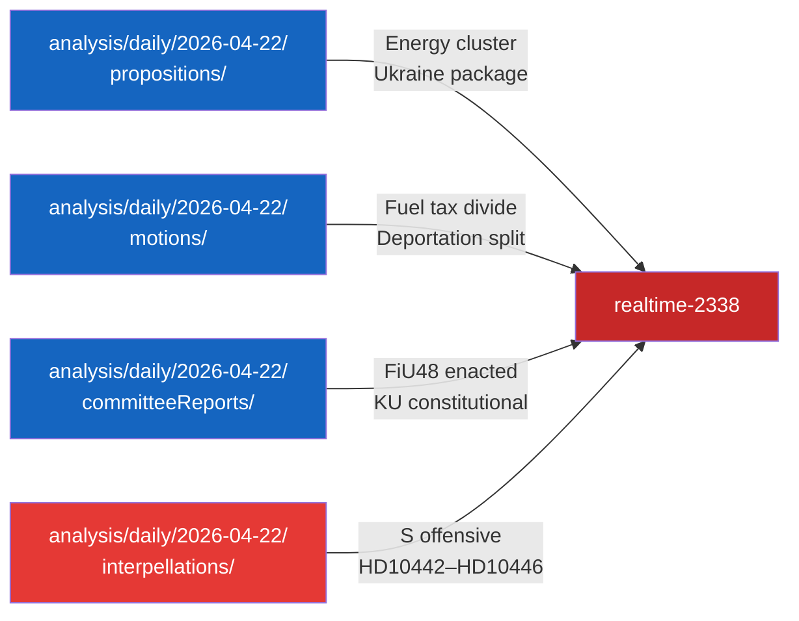

# Cross-Reference Map — Riksdag Realtime Monitor 2026-04-22
**Analyst**: James Pether Sörling | **Classification**: Public | **Cycle**: Realtime-2338

---

## Policy Clusters

### Cluster A — Fiscal & Economic Coherence
- HD01FiU48 ↔ HD03236 (Extra budget prop.) ↔ HD024098/092 (opposition motions)
- HD10444 ↔ employer contribution reduction (enacted April 2026) ↔ Aftonbladet investigation
- Cluster logic: The fuel tax relief and employer contribution policy share the same fiscal instrument (tax reduction for economic stimulus) and the same accountability vulnerability (risk of exploitation)

### Cluster B — Ukraine Diplomatic Package
- HD03232 ↔ HD03231 (both Utrikesdepartementet, both 2026-04-16)
- Both represent Sweden's commitment to Ukraine's transitional justice architecture
- Cross-reference: Sweden's NATO membership context (ratified 2024) amplifies the diplomatic significance

### Cluster C — Energy & Climate Transition
- HD03240 (Nya lagar om elsystemet) ↔ HD03239 (Vindkraft i kommuner) ↔ HD03238 (Ny miljöprövningsmyndighet)
- Three-part energy reform package submitted April 13–14, 2026
- Thematic coherence: electricity system law + wind power incentives + environmental permitting reform

### Cluster D — Parliamentary Accountability (Today)
- HD10444 ↔ HD10443 ↔ HD10445 ↔ HD10446 (all S interpellations, 2026-04-22)
- HD10442 (filed 2026-04-21, S/Svantesson eating disorder)
- Cluster logic: 5 interpellations in 2 days, 3 targeting Svantesson = coordinated S campaign

### Cluster E — Constitutional Reform
- HD01KU33 ↔ HD01KU32 (both KU betänkanden, both constitutional amendments first reading, 2026-04-17)
- Both require second vote after 2026 election to become law — creates a post-election governance agenda

---

## Legislative Chains

### Chain 1: Fuel Tax Relief
```
prop. 2025/26:236 (HD03236) →
FiU48 (HD01FiU48, adopted 2026-04-21) →
Law amendment (effective 2026-05-01) →
Opposition motions HD024098/092 (overridden)
```

### Chain 2: Energy System Reform
```
prop. 2025/26:240 (HD03240) →
prop. 2025/26:239 (HD03239) →
prop. 2025/26:238 (HD03238) →
Committee review (pending)
```

### Chain 3: Ministerial Accountability
```
Past Svantesson statements →
Aftonbladet investigation →
HD10444 interpellation (2026-04-22) →
Debate answer (2026-04-28–05-05) →
[Potential KU review]
```

---

## Sibling Folders — Tier-C Cross-Type Citations

### analysis/daily/2026-04-22/propositions/
- Synthesis summary reviewed: HD03100 (vårproposition), HD03236 (extra budget), HD03240 (el-system), HD03239 (vindkraft), HD03238 (miljöprövning), HD03246 (unga), HD03231/232 (Ukraina)
- Cross-reference: Propositions cluster C (energy reform) and cluster B (Ukraine) directly feed this realtime analysis
- PIR inherited: "What is the coalition's energy security legislative timetable before September 2026 election?"

### analysis/daily/2026-04-22/motions/
- Synthesis summary reviewed: HD024082–HD024098 (fuel tax opposition, deportation, arms)
- Cross-reference: S/V/MP triple fuel tax rejection (HD024082, HD024092, HD024098) establishes the opposition's climate-fiscal dividing line
- PIR inherited: "How will opposition parties exploit the fuel tax cut in the election campaign?"

### analysis/daily/2026-04-22/committeeReports/
- Synthesis summary reviewed: HD01FiU48 (extra budget ENACTED), HD01KU33/32 (constitutional), HD01CU27/28 (housing)
- Cross-reference: HD01FiU48 enacted — direct cause of today's accountability interpellations
- PIR inherited: "When will KU constitutional amendments (KU33/32) come to second reading post-election?"

### analysis/daily/2026-04-22/interpellations/
- Synthesis summary reviewed: HD10442–HD10446 (S accountability offensive)
- Cross-reference: HD10442 (eating disorder, filed 2026-04-21) is the pre-existing live risk that today's new interpellations reinforce
- PIR inherited: "Is the S accountability strategy a one-day event or a sustained multi-week campaign?"

---

## Coordinated-Activity Patterns

1. **S interpellation cluster**: 4 interpellations in 24 hours, all authored by S MPs, all targeting coalition ministers on documented past statements or policy failures — clear coordination indicator [B2]
2. **S+V+MP fuel tax motions**: Three parties simultaneously filed fuel tax rejection motions on the same proposition — opportunistic coordination, not pre-planned (motions filed on different days but same legislative target) [B2]
3. **Energy legislation cluster**: Three related energy propositions (HD03238, HD03239, HD03240) submitted within 48 hours — government legislative sprint indicator [A2]


