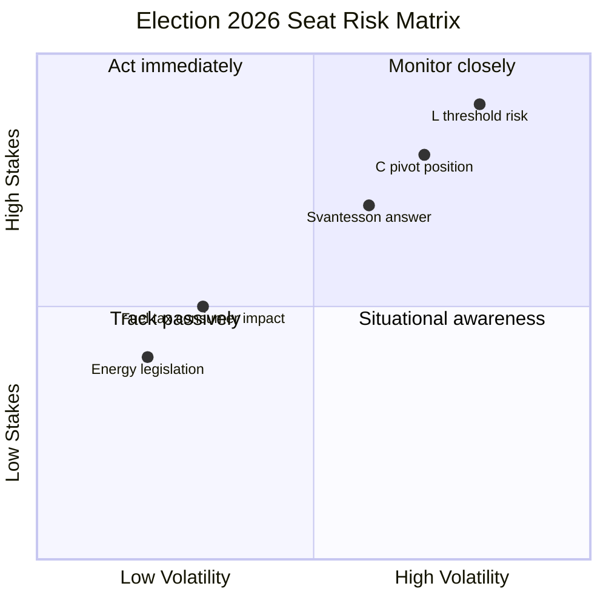

# Election 2026 Analysis — Riksdag Realtime Monitor 2026-04-22
**Analyst**: James Pether Sörling | **Classification**: Public | **Cycle**: Realtime-2338

---

## Electoral Context (September 2026)

**Election date**: 13 September 2026 (second Sunday of September, confirmed by electoral calendar)
**Time remaining**: ~145 days

---

## Today's Events — Electoral Significance

### S Accountability Offensive (HIGH significance)
HD10444, HD10445, HD10446, HD10443 + pre-existing HD10442 represent a coordinated S campaign to frame Finance Minister Svantesson and coalition ministers as managing public funds irresponsibly. Electoral logic: S needs to recover fiscal competence image lost during 2014–2022 government tenure. The interpellation strategy targets the coalition's own fiscal credibility narrative [A1].

### HD01FiU48 Enacted (MODERATE significance)
The coalition can point to a tangible consumer-benefit delivery (fuel cost relief from 1 May 2026) in the election campaign. Historically, Swedish voters reward demonstrable delivery in their daily costs. Risk: the cut is small enough (82 öre/L) to be lost in price volatility [A1].

### Energy Legislation Sprint (MODERATE significance)
8+ propositions submitted April 13–16 creates a legislative legacy narrative for the coalition: electricity system reform (HD03240), wind power (HD03239), environmental permitting (HD03238) = energy security agenda heading into election [A1].

---

## Current Seat Projections (as of April 2026 polling)

*Note: Based on polling aggregates — exact figures subject to polling error ±2–3 seats per party*

| Party | Approx. seats (349 total) | Bloc |
|-------|--------------------------|------|
| SD (Sverigedemokraterna) | ~65–72 | Tidö support |
| S (Socialdemokraterna) | ~95–102 | Opposition |
| M (Moderaterna) | ~60–67 | Tidö government |
| MP (Miljöpartiet) | ~15–20 | Opposition |
| V (Vänsterpartiet) | ~20–25 | Opposition |
| KD (Kristdemokraterna) | ~17–22 | Tidö government |
| C (Centerpartiet) | ~20–28 | Pivot/swing |
| L (Liberalerna) | ~12–16 | Tidö government |

**Tidö bloc projected**: ~154–177 seats  
**Opposition bloc projected**: ~130–147 seats  
**C pivot**: ~20–28 seats

*4% threshold risk*: L near threshold; MP borderline

---

## Scenario Impact on Seats (from scenario-analysis.md)

| Scenario | Expected seat change | Winner |
|---------|---------------------|--------|
| Scenario 1 (Accountability Breakthrough) | S +5–8, M -3–5 | Opposition likely government |
| Scenario 2 (Narrative Containment) | No material change; C determines outcome | Coin toss |
| Scenario 3 (Opposition Fragmentation) | C aligns with Tidö post-election; Tidö continuation | Tidö re-election |

---

## Electoral Risk Indicators for This Cycle

1. **Svantesson interpellation answer quality** [WATCH 2026-04-28]: Poor answer → S picks up 2–4 points in next poll
2. **L threshold risk**: Any L internal crisis + low polling → 4% threshold loss → Tidö loses 12–16 seats overnight
3. **C position**: Decisive for any coalition arithmetic — today's HD024095 deportation amendment (C nuance) is an early indicator

