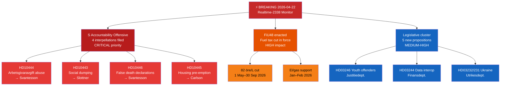

# Executive Brief — Riksdag Realtime Monitor 2026-04-22 23:38
**Classification**: Public | **Analyst**: James Pether Sörling | **Cycle**: Realtime-2338
**Methodology**: ai-driven-analysis-guide.md v6.4 | **Admiralty baseline**: [A2]

---

## 🎯 BLUF

The Swedish Riksdag enters the final pre-election legislative sprint with three simultaneous breaking-news vectors: (1) the Social Democrats have launched a coordinated four-interpellation accountability offensive against Finance Minister Elisabeth Svantesson (M) and coalition partners on 2026-04-22, targeting weaknesses in labour, housing, social welfare and civil administration ahead of September 2026 election; (2) the extra supplementary budget cutting fuel taxes was adopted by Riksdag on 2026-04-21, with opposition split along climate-economic lines; and (3) a cluster of substantive propositions on energy, forestry, justice and Ukraine diplomacy signals the Kristersson government's accelerating legislative agenda in the final session before dissolution.

The S accountability offensive — three separate interpellations targeting Finance Minister Svantesson alone — is the highest-urgency political intelligence signal of the evening. This pattern of multi-vector parliamentary pressure on a single minister indicates a coordinated pre-election strategy to force ministerial missteps in public answers.

---

## 🧭 3 Decisions This Brief Supports

1. **Editorial decision**: Whether to cover the S accountability offensive as a unified political story (coordinated attack on Svantesson) or as separate interpellations — the unified framing is analytically stronger.
2. **Monitoring priority**: Whether to escalate tracking on the employer contribution exploitation case (HD10444) given the Aftonbladet reporting connection — HIGH priority recommended.
3. **Forecast horizon**: Whether the extra budget fuel tax cut (HD01FiU48 passed) will produce measurable opposition climate-narrative gains ahead of the June budget debate — track via media framing metrics next 7 days.

---

## ⚡ 60-Second Read

- **S triple-strike on Svantesson** [B2]: HD10444 (employer contribution abuse), HD10442 (eating disorder court case), HD10446 (false death declarations) — three vectors simultaneously
- **HD10445 housing**: S targets government failure on pre-emption rights for key properties in Stockholm suburbs (Sätra, Vårberg, Rågsved) — segregation policy vector [B2]
- **HD10443 social dumping**: Municipal social welfare dumping — S targets Civilminister Slottner (KD) on migrant/vulnerable populations transferred between municipalities [B2]
- **HD01FiU48 ENACTED**: Extra ändringsbudget — 82 öre/L fuel tax cut from 1 May 2026; electricity/gas support for households; 4.1 billion SEK fiscal impact [A1]
- **New propositions (Apr 14–16)**: Youth offenders (HD03246), data interoperability (HD03244), active forestry (HD03242), Ukraine damage tribunal (HD03232/HD03231)
- **Election 2026 lens**: Every interpellation is targeted at a named minister — this is debate-priming for the election campaign

---

## 📅 Top Forward Trigger
**Watch 2026-04-28 to 2026-05-05**: Ministerial answers to the four interpellations will be debated in the Riksdag chamber. Svantesson's responses to HD10442 (eating disorder court case) and HD10444 (employer contributions) carry the highest media-volatility risk. A single factually contested answer could become the week's dominant political story ahead of the June budget debate.

---

## 🔍 Confidence Label
**Overall assessment confidence**: HIGH [B2] — based on direct MCP retrieval of parliamentary documents and cross-reference with today's sibling analysis folders (propositions, motions, committeeReports, interpellations).

---

## 📊 Intelligence Landscape Map

