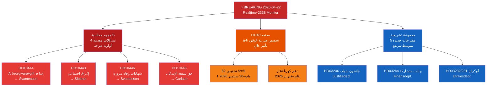

<!-- dir: rtl -->
# ملخص تنفيذي — مراقب البرلمان السويدي (ريكسداغ) في الوقت الفعلي 2026-04-22 23:38
**التصنيف**: عام | **المحلل**: James Pether Sörling | **الدورة**: Realtime-2338
**المنهجية**: ai-driven-analysis-guide.md v6.4 | **مستوى أدميرالتي**: [A2]

---

## 🎯 الملخص التنفيذي (BLUF)

يدخل البرلمان السويدي (Riksdag) السباق التشريعي الأخير قبل الانتخابات مع ثلاثة محاور أخبار عاجلة متزامنة: (1) شنّ الاشتراكيون الديمقراطيون في 22 أبريل 2026 هجوماً تساؤلياً (interpellation) رباعياً منسقاً ضد وزيرة المالية إليزابيث سفانتسون (M) وشركاء الائتلاف، مستهدفاً نقاط الضعف في سوق العمل والإسكان والرعاية الاجتماعية والإدارة المدنية قبيل انتخابات سبتمبر 2026؛ (2) تمت الموافقة على الميزانية التكميلية الاستثنائية بتخفيض ضريبة الوقود من قِبل البرلمان في 21 أبريل 2026، مع انقسام المعارضة على خطوط مناخية-اقتصادية؛ و(3) مجموعة من المقترحات الجوهرية حول الطاقة والغابات والعدالة والدبلوماسية الأوكرانية تُشير إلى تسارع جدول الأعمال التشريعي لحكومة كريسترسون في الجلسة الأخيرة قبل الحل.

الهجوم المحاسبي لحزب S — ثلاثة تساؤلات برلمانية منفصلة تستهدف وزيرة المالية سفانتسون وحدها — هو إشارة الاستخبارات السياسية ذات الأولوية القصوى لهذا المساء. يُشير هذا النمط من الضغط البرلماني متعدد القنوات على وزير واحد إلى استراتيجية ما قبل الانتخابات المنسقة لإجبار الوزراء على ارتكاب أخطاء في الردود العلنية.

---

## 🧭 3 قرارات يدعمها هذا الملخص

1. **قرار تحريري**: هل يُغطَّى هجوم المساءلة لحزب S كقصة سياسية موحدة (هجوم منسق على سفانتسون) أم كتساؤلات منفصلة — الإطار الموحد أقوى تحليلياً.
2. **أولوية المراقبة**: هل يجب تصعيد تتبع قضية إساءة استخدام اشتراكات أصحاب العمل (HD10444) بالنظر إلى الصلة بتغطية صحيفة Aftonbladet — توصية بأولوية عالية.
3. **أفق التوقع**: هل سيُنتج تخفيض ضريبة الوقود في الميزانية الاستثنائية (HD01FiU48 المعتمدة) مكاسب سردية مناخية قابلة للقياس للمعارضة قبل مناقشة ميزانية يونيو — متابعة عبر مقاييس الإطار الإعلامي خلال 7 أيام.

---

## ⚡ قراءة في 60 ثانية

- **الضربة الثلاثية لحزب S على سفانتسون** [B2]: HD10444 (إساءة استخدام اشتراكات أصحاب العمل)، HD10442 (قضية قضائية لاضطراب الأكل)، HD10446 (شهادات وفاة مزورة) — ثلاثة محاور في آنٍ واحد
- **HD10445 الإسكان**: يستهدف حزب S فشل الحكومة في حق الشفعة للعقارات الرئيسية في ضواحي ستوكهولم (Sätra، Vårberg، Rågsved) — محور سياسة الفصل العنصري [B2]
- **HD10443 الإغراق الاجتماعي**: إغراق المساعدات الاجتماعية البلدية — يستهدف حزب S الوزير المدني سلوتنر (KD) بشأن المهاجرين والفئات الضعيفة المنقولة بين البلديات [B2]
- **HD01FiU48 معتمد**: ميزانية تعديلية استثنائية — تخفيض 82 öre/لتر من ضريبة الوقود بدءاً من 1 مايو 2026؛ دعم الكهرباء/الغاز للأسر؛ تأثير مالي 4.1 مليار كرونة سويدية [A1]
- **مقترحات جديدة (14–16 أبريل)**: الجانحون من الشباب (HD03246)، قابلية التشغيل البيني للبيانات (HD03244)، إدارة الغابات النشطة (HD03242)، محكمة أضرار أوكرانيا (HD03232/HD03231)
- **عدسة انتخابات 2026**: كل تساؤل برلماني موجه ضد وزير مسمى بالاسم — هذا تمهيد للمناظرات الانتخابية

---

## 📅 أهم المحفزات المستقبلية
**مراقبة الفترة 28 أبريل–5 مايو 2026**: ستُناقَش الردود الوزارية على التساؤلات الأربعة في قاعة البرلمان. تحمل ردود سفانتسون على HD10442 (قضية اضطراب الأكل) و HD10444 (اشتراكات أصحاب العمل) أعلى خطر تقلب إعلامي. رد واحد مثير للجدل يمكن أن يصبح القصة السياسية المهيمنة للأسبوع قبل نقاش ميزانية يونيو.

---

## 🔍 مستوى الثقة
**الثقة الإجمالية في التقييم**: عالية [B2] — استناداً إلى استرداد مباشر عبر MCP للوثائق البرلمانية والإسناد التقاطعي مع مجلدات التحليل الشقيقة اليوم (المقترحات، الاقتراحات، تقارير اللجان، التساؤلات).

---

## 📊 خريطة مشهد الاستخبارات

<!-- source-sha: 34bcedb9f943f85646d8e864b41374efd2461075 -->
