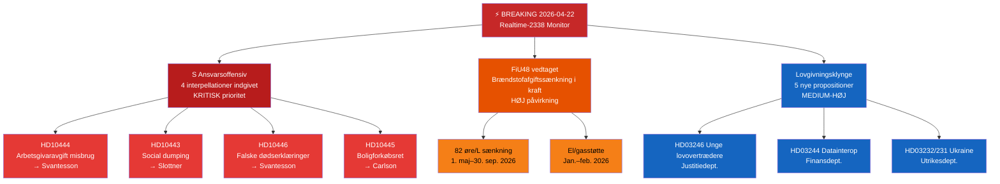

# Executive Brief — Riksdag Realtidsmonitor 2026-04-22 23:38
**Klassificering**: Offentlig | **Analytiker**: James Pether Sörling | **Cyklus**: Realtime-2338
**Metodologi**: ai-driven-analysis-guide.md v6.4 | **Admiralty-baseline**: [A2]

---

## 🎯 BLUF

Den svenske Riksdag indgår i den endelige lovgivningssprint forud for valget med tre samtidige breaking-nyhedsvektorer: (1) Socialdemokraterne har iværksat en koordineret firedobbelt interpellationsoffensiv mod finansminister Elisabeth Svantesson (M) og koalitionspartnere den 22. april 2026, målrettet svagheder inden for arbejdsmarked, boliger, socialt sikkerhedsnet og civil forvaltning forud for valget i september 2026; (2) den ekstra tillægsbudget med sænket brændstofafgift blev vedtaget af Riksdag den 21. april 2026, med oppositionen splittet langs klima-økonomiske linjer; og (3) en klynge af substantielle propositioner om energi, skovbrug, retsvæsen og Ukraine-diplomati signalerer Kristersson-regeringens accelererende lovgivningsdagsorden i den endelige session inden opløsning.

S's ansvarsoffensiv — tre separate interpellationer rettet mod finansminister Svantesson alene — er aftenens politiske efterretningssignal af højeste prioritet. Dette mønster med flerkanals parlamentarisk pres mod en enkelt minister indikerer en koordineret forvalgsstrategi til at tvinge ministerielle fejltrin i offentlige svar.

---

## 🧭 3 Beslutninger dette brief understøtter

1. **Redaktionel beslutning**: Om S's ansvarsoffensiv skal dækkes som én samlet politisk historie (koordineret angreb på Svantesson) eller som separate interpellationer — den samlede ramme er analytisk stærkere.
2. **Overvågningsprioritet**: Om sporing af arbejdsgiverbidragsmisbrugssagen (HD10444) skal eskaleres givet forbindelsen til Aftonbladets rapportering — HØJ prioritet anbefales.
3. **Prognosehorisont**: Om den ekstra budgets brændstofafgiftssænkning (HD01FiU48 vedtaget) vil producere målbare oppositionelle klimanarrativgevinster forud for junibudgetdebatten — spor via medierammemålinger de næste 7 dage.

---

## ⚡ 60-sekunders læsning

- **S's trippelangreb på Svantesson** [B2]: HD10444 (misbrug af arbejdsgiverbidrag), HD10442 (spiseforstyrrelsesdomstolssag), HD10446 (falske dødserklæringer) — tre vektorer simultant
- **HD10445 boliger**: S retter fokus mod regeringens svigt med forkøbsret for nøgleejendomme i Stockholms forstæder (Sätra, Vårberg, Rågsved) — segregationspolitisk vektor [B2]
- **HD10443 social dumping**: Kommunal socialbidragsdumping — S retter sig mod civilminister Slottner (KD) om migranter/udsatte befolkningsgrupper overført mellem kommuner [B2]
- **HD01FiU48 VEDTAGET**: Ekstra ændringsbudget — 82 øre/L brændstofafgiftssænkning fra 1. maj 2026; el/gasstøtte til husstande; 4,1 mia. SEK i fiskal påvirkning [A1]
- **Nye propositioner (14.–16. apr.)**: Unge lovovertrædere (HD03246), datainteroperabilitet (HD03244), aktivt skovbrug (HD03242), Ukraine-erstatningstribunal (HD03232/HD03231)
- **Vallinse 2026**: Enhver interpellation er rettet mod en navngiven minister — dette er debatprimering forud for valgkampen

---

## 📅 Øverste fremadrettede trigger
**Overvåg 28. april–5. maj 2026**: Ministerielle svar på de fire interpellationer vil blive debatteret i Riksdag-salen. Svantessons svar på HD10442 (spiseforstyrrelsesdomstolssag) og HD10444 (arbejdsgiverbidrag) bærer den højeste mediavolatilitetsrisiko. Et enkelt faktuelt omstridt svar kan blive ugens dominerende politiske historie forud for junibudgetdebatten.

---

## 🔍 Konfidensmærkning
**Samlet vurderingskonfidence**: HØJ [B2] — baseret på direkte MCP-hentning af parlamentariske dokumenter og krydshenvising med dagens søster-analysemapper (propositioner, motioner, udvalgsrapporter, interpellationer).

---

## 📊 Efterretningslandskabskort

<!-- source-sha: 34bcedb9f943f85646d8e864b41374efd2461075 -->
