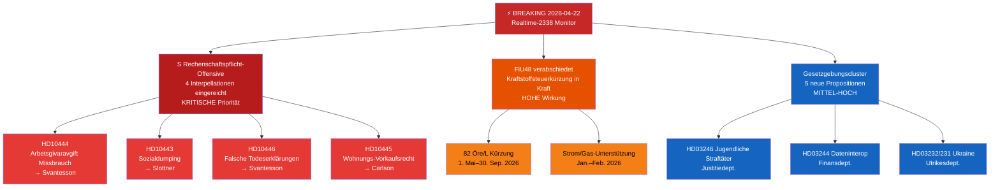

# Executive Brief — Riksdag Echtzeit-Monitor 2026-04-22 23:38
**Klassifizierung**: Öffentlich | **Analytiker**: James Pether Sörling | **Zyklus**: Realtime-2338
**Methodik**: ai-driven-analysis-guide.md v6.4 | **Admiralty-Basislinie**: [A2]

---

## 🎯 BLUF

Der schwedische Riksdag tritt in den finalen vorwahlmäßigen Gesetzgebungssprint ein mit drei gleichzeitigen Breaking-News-Vektoren: (1) Die Sozialdemokraten haben am 22. April 2026 eine koordinierte vierfache Interpellationsoffensive gegen Finanzministerin Elisabeth Svantesson (M) und Koalitionspartner gestartet, die auf Schwächen in Arbeitsmarkt, Wohnen, Sozialwesen und Zivilverwa­ltung vor der Wahl im September 2026 abzielt; (2) der außerordentliche Ergänzungshaushalt mit Kraftstoffsteuerentlastung wurde am 21. April 2026 vom Riksdag verabschiedet, wobei die Opposition entlang klima-ökonomischer Linien gespalten ist; und (3) ein Bündel substantieller Propositionen zu Energie, Forstwirtschaft, Justiz und Ukraine-Diplomatie signalisiert die sich beschleunigende Gesetzgebungsagenda der Regierung Kristersson in der letzten Sitzung vor der Auflösung.

Die Rechenschaftspflicht-Offensive der S — drei separate Interpellationen, die allein gegen Finanzministerin Svantesson gerichtet sind — ist das politische Geheimdienstsignal höchster Priorität des Abends. Dieses Muster des parlamentarischen Mehrkanal-Drucks auf einen einzelnen Minister deutet auf eine koordinierte Vorwahlstrategie hin, um ministerielle Fehler in öffentlichen Antworten zu erzwingen.

---

## 🧭 3 Entscheidungen, die dieses Brief unterstützt

1. **Redaktionelle Entscheidung**: Ob die Rechenschaftspflicht-Offensive der S als einheitliche politische Geschichte (koordinierter Angriff auf Svantesson) oder als separate Interpellationen behandelt werden soll — die einheitliche Rahmung ist analytisch stärker.
2. **Überwachungspriorität**: Ob die Verfolgung des Arbeitgeberb­eitrags-Missbrauchsfalls (HD10444) angesichts der Verbindung zur Berichterstattung des Aftonbladet eskaliert werden soll — HOHE Priorität empfohlen.
3. **Prognosehorizont**: Ob der Kraftstoffsteuerschnitt im Sonderhaushalt (HD01FiU48 verabschiedet) messbare oppositionelle Klimanarrativerst­ärkungen vor der Juni-Haushaltsdebatte erzeugen wird — Verfolgung über Medienrahmungsmetriken in den nächsten 7 Tagen.

---

## ⚡ 60-Sekunden-Lektüre

- **S's Dreifach-Angriff auf Svantesson** [B2]: HD10444 (Missbrauch von Arbeitgeberbeiträgen), HD10442 (Essstörungs-Gerichtsfall), HD10446 (falsche Todeserklärungen) — drei Vektoren gleichzeitig
- **HD10445 Wohnen**: S richtet den Fokus auf das Versagen der Regierung beim Vorkaufsrecht für Schlüsselliegenschaften in Stockholmer Vororten (Sätra, Vårberg, Rågsved) — Segregationspolitikvektor [B2]
- **HD10443 Sozialdumping**: Kommunales Sozialleistungs-Dumping — S richtet sich gegen Zivilminister Slottner (KD) wegen Migranten/gefährdeten Bevölkerungsgruppen, die zwischen Kommunen übertragen werden [B2]
- **HD01FiU48 VERABSCHIEDET**: Außerordentlicher Ergänzungshaushalt — 82 Öre/L Kraftstoffsteuerkürzung ab 1. Mai 2026; Strom/Gas-Unterstützung für Haushalte; 4,1 Mrd. SEK Fiskalwirkung [A1]
- **Neue Propositionen (14.–16. Apr.)**: Jugendliche Straftäter (HD03246), Dateninteroperabilität (HD03244), aktive Forstwirtschaft (HD03242), Ukraine-Schadenstribunal (HD03232/HD03231)
- **Wahllinse 2026**: Jede Interpellation richtet sich gegen einen namentlich genannten Minister — das ist Debattenvorbereitung für den Wahlkampf

---

## 📅 Wichtigster Vorwärts-Auslöser
**Beobachten 28. April–5. Mai 2026**: Ministerielle Antworten auf die vier Interpellationen werden im Riksdag-Plenarsaal debattiert. Svantessons Antworten auf HD10442 (Essstörungs-Gerichtsfall) und HD10444 (Arbeitgeberbeiträge) tragen das höchste Medienvolatilitätsrisiko. Eine einzige sachlich umstrittene Antwort könnte zur dominanten politischen Geschichte der Woche vor der Juni-Haushaltsdebatte werden.

---

## 🔍 Konfidenz-Kennzeichnung
**Gesamtbewertungsvertrauen**: HOCH [B2] — basierend auf direktem MCP-Abruf parlamentarischer Dokumente und Querverweisen mit den heutigen Schwesteranalyse-Ordnern (Propositionen, Motionen, Ausschussberichte, Interpellationen).

---

## 📊 Karte der Geheimdienstlage

<!-- source-sha: 34bcedb9f943f85646d8e864b41374efd2461075 -->
