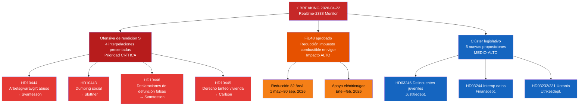

# Resumen Ejecutivo — Monitor en Tiempo Real del Riksdag 2026-04-22 23:38
**Clasificación**: Pública | **Analista**: James Pether Sörling | **Ciclo**: Realtime-2338
**Metodología**: ai-driven-analysis-guide.md v6.4 | **Línea base Admiralty**: [A2]

---

## 🎯 BLUF

El Riksdag sueco entra en el sprint legislativo final antes de las elecciones con tres vectores de noticias urgentes simultáneos: (1) los Socialdemócratas han lanzado el 22 de abril de 2026 una ofensiva interpelativa coordinada de cuatro frentes contra la ministra de finanzas Elisabeth Svantesson (M) y los socios de coalición, apuntando a debilidades en el mercado laboral, vivienda, bienestar social y administración civil de cara a las elecciones de septiembre de 2026; (2) el presupuesto suplementario extraordinario con reducción del impuesto al combustible fue adoptado por el Riksdag el 21 de abril de 2026, con la oposición dividida en líneas climático-económicas; y (3) un conjunto de proposiciones sustantivas sobre energía, silvicultura, justicia y diplomacia ucraniana señala la aceleración de la agenda legislativa del gobierno Kristersson en la sesión final antes de la disolución.

La ofensiva de rendición de cuentas de S — tres interpelaciones separadas dirigidas solo a la ministra de finanzas Svantesson — es la señal de inteligencia política de mayor prioridad de la tarde. Este patrón de presión parlamentaria multicanal sobre un solo ministro indica una estrategia preelectoral coordinada para provocar errores ministeriales en respuestas públicas.

---

## 🧭 3 Decisiones que apoya este resumen

1. **Decisión editorial**: Si la ofensiva de rendición de cuentas de S debe cubrirse como una historia política unificada (ataque coordinado a Svantesson) o como interpelaciones separadas — el enfoque unificado es analíticamente más sólido.
2. **Prioridad de vigilancia**: Si se debe escalar el seguimiento del caso de abuso de cotizaciones patronales (HD10444) dada la conexión con la cobertura de Aftonbladet — prioridad ALTA recomendada.
3. **Horizonte de pronóstico**: Si la reducción del impuesto al combustible en el presupuesto extraordinario (HD01FiU48 aprobado) producirá ganancias narrativas climáticas medibles para la oposición antes del debate presupuestario de junio — seguimiento a través de métricas de encuadre mediático en los próximos 7 días.

---

## ⚡ Lectura de 60 segundos

- **Triple golpe de S a Svantesson** [B2]: HD10444 (abuso de cotizaciones patronales), HD10442 (caso judicial de trastorno alimentario), HD10446 (declaraciones de defunción falsas) — tres vectores simultáneamente
- **HD10445 vivienda**: S apunta al fracaso del gobierno en el derecho de tanteo para propiedades clave en los suburbios de Estocolmo (Sätra, Vårberg, Rågsved) — vector de política de segregación [B2]
- **HD10443 dumping social**: Dumping municipal de asistencia social — S apunta al ministro civil Slottner (KD) sobre migrantes/poblaciones vulnerables transferidas entre municipios [B2]
- **HD01FiU48 APROBADO**: Presupuesto suplementario extraordinario — reducción de 82 öre/L del impuesto al combustible a partir del 1 de mayo de 2026; apoyo eléctrico/gas para hogares; impacto fiscal de 4,1 mil millones SEK [A1]
- **Nuevas proposiciones (14–16 abr.)**: Delincuentes juveniles (HD03246), interoperabilidad de datos (HD03244), silvicultura activa (HD03242), tribunal de daños de Ucrania (HD03232/HD03231)
- **Lente electoral 2026**: Cada interpelación está dirigida a un ministro nombrado — esto es una preparación del debate para la campaña electoral

---

## 📅 Desencadenante prioritario hacia adelante
**Vigilar del 28 de abril al 5 de mayo de 2026**: Las respuestas ministeriales a las cuatro interpelaciones serán debatidas en el pleno del Riksdag. Las respuestas de Svantesson a HD10442 (caso judicial de trastorno alimentario) y HD10444 (cotizaciones patronales) conllevan el mayor riesgo de volatilidad mediática. Una sola respuesta factualmente controvertida podría convertirse en la historia política dominante de la semana antes del debate presupuestario de junio.

---

## 🔍 Etiqueta de confianza
**Confianza de evaluación general**: ALTA [B2] — basada en la recuperación directa por MCP de documentos parlamentarios y verificación cruzada con las carpetas de análisis hermanas del día (proposiciones, mociones, informes de comisión, interpelaciones).

---

## 📊 Mapa del panorama de inteligencia

<!-- source-sha: 34bcedb9f943f85646d8e864b41374efd2461075 -->
