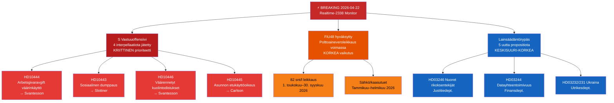

# Toimeenpaneva tiivistelmä — Riksdag Reaaliaikamonitori 2026-04-22 23:38
**Luokittelu**: Julkinen | **Analyytikko**: James Pether Sörling | **Sykli**: Realtime-2338
**Metodologia**: ai-driven-analysis-guide.md v6.4 | **Admiralty-perustaso**: [A2]

---

## 🎯 BLUF

Ruotsin Riksdag astuu viimeiseen vaaleja edeltävään lainsäädäntöspurttiin kolmen samanaikaisen uutisvektorin myötä: (1) Sosiaalidemokraatit ovat käynnistäneet koordinoidun nelinkertaisen interpellaatio-offensiivin valtiovarainministeri Elisabeth Svantessonia (M) ja koalitionkumppaneita vastaan 22. huhtikuuta 2026, kohdistuen työ­markkina-, asunto-, sosiaaliturva- ja siviilihallinnon heikkouksiin ennen syyskuun 2026 vaaleja; (2) ylimääräinen lisätalousarvio polttoaineveroleikkauksella hyväksyttiin Riksdagissa 21. huhtikuuta 2026, opposition jakautuessa ilmasto-taloudellisten linjojen mukaan; ja (3) joukko merkittäviä propositioita energiasta, metsätaloudesta, oikeudesta ja Ukraina-diplomatiasta signaloi Kristersson-hallituksen kiihtyvää lainsäädäntöohjelmaa viimeisessä istunnossa ennen hajottamista.

S:n vastuuoffensiivi — kolme erillistä interpellaatiota pelkästään valtiovarainministeri Svantessonia vastaan — on illan korkein poliittisen tiedustelusignaalin prioriteetti. Tämä monikanavaisen parlamentaarisen painostuksen kaava yhtä ministeriä kohtaan osoittaa koordinoitua vaaliedustelustrategiaa, jonka tavoitteena on pakottaa ministeriaaliset virheet julkisissa vastauksissa.

---

## 🧭 3 Päätöstä, joita tämä tiivistelmä tukee

1. **Toimituksellinen päätös**: Pitäisikö S:n vastuuoffensiivi kattaa yhtenäisenä poliittisena tarinana (koordinoitu hyökkäys Svantessonia vastaan) vai erillisinä interpellaatioina — yhtenäinen kehystys on analyyttisesti vahvempi.
2. **Seurantaprioriteetti**: Pitäisikö työnantajamaksuväärinkäyttötapauksen (HD10444) seuranta eskaloida Aftonbladetin raportointiyhteyden vuoksi — KORKEA prioriteetti suositellaan.
3. **Ennustehorisontti**: Tuottaako ylimääräisen budjetin polttoaineveroleikkaus (HD01FiU48 hyväksytty) mitattavia opposition ilmastonarratiivityöntöjä ennen kesäkuun budjettikeskustelua — seuraa mediakehystysstatistiikan kautta seuraavat 7 päivää.

---

## ⚡ 60 sekunnin lukeminen

- **S:n kolmoislyönti Svantessonia vastaan** [B2]: HD10444 (työnantajamaksujen väärinkäyttö), HD10442 (syömishäiriötuomioistuintapaus), HD10446 (väärennetyt kuolintodistukset) — kolme vektoria samanaikaisesti
- **HD10445 asunnot**: S kohdistaa huomion hallituksen epäonnistumiseen etukäyttöoikeuden suhteen avainomaisuuksiin Tukholman lähiöissä (Sätra, Vårberg, Rågsved) — segregaatiopoliittinen vektori [B2]
- **HD10443 sosiaalinen dumppaus**: Kunnallinen sosiaaliturvadumppaus — S kohdistuu siviiliministeri Slottneriin (KD) siirtolaisista/haavoittuvista väestöistä, jotka siirretään kuntien välillä [B2]
- **HD01FiU48 HYVÄKSYTTY**: Ylimääräinen muutostalousarvio — 82 snt/l polttoaineveroleikkaus 1. toukokuuta 2026 alkaen; sähkö/kaasutuet kotitalouksille; 4,1 miljardin SEK budjettivaikutus [A1]
- **Uudet propositiot (14.–16. huhtik.)**: Nuoret rikoksentekijät (HD03246), datayhteentoimivuus (HD03244), aktiivinen metsätalous (HD03242), Ukraina-vahinkotuomioistuin (HD03232/HD03231)
- **Vaalilinssit 2026**: Jokainen interpellaatio on kohdistettu nimettyä ministeriä vastaan — tämä on vaalikampanjan debattilämmittely

---

## 📅 Tärkein eteenpäin suuntautuva laukaisin
**Seuraa 28. huhtikuuta–5. toukokuuta 2026**: Neljän interpellaation ministeriaaliset vastaukset käsitellään Riksdagin täysistunnossa. Svantessons vastaukset HD10442:een (syömishäiriötuomioistuintapaus) ja HD10444:ään (työnantajamaksut) kantavat korkeinta mediavolatilitettiriskiä. Yksi tosiasiallisesti kiistelty vastaus voi muodostua viikon hallitsevasta poliittisesta tarinasta ennen kesäkuun budjettikeskustelua.

---

## 🔍 Luottamusmerkintä
**Kokonaisarvioinnin luottamusaste**: KORKEA [B2] — perustuu suoraan MCP-hakuun parlamentaarisista asiakirjoista ja ristiinviittauksiin päivän sisaranalyysikansioihin (propositiot, mootiot, valiokuntakertomukset, interpellaatiot).

---

## 📊 Tiedustelumaisemankartta

<!-- source-sha: 34bcedb9f943f85646d8e864b41374efd2461075 -->
