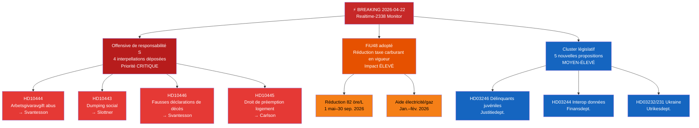

# Synthèse exécutive — Riksdag Moniteur en Temps Réel 2026-04-22 23:38
**Classification** : Publique | **Analyste** : James Pether Sörling | **Cycle** : Realtime-2338
**Méthodologie** : ai-driven-analysis-guide.md v6.4 | **Référence Admiralty** : [A2]

---

## 🎯 BLUF

Le Riksdag suédois entre dans le sprint législatif final avant les élections avec trois vecteurs d'actualité urgente simultanés : (1) les Sociaux-démocrates ont lancé le 22 avril 2026 une offensive interpellatoire coordonnée à quatre volets contre la ministre des finances Elisabeth Svantesson (M) et les partenaires de coalition, ciblant des faiblesses dans les domaines du travail, du logement, de la protection sociale et de l'administration civile à l'approche des élections de septembre 2026 ; (2) le budget supplémentaire exceptionnel réduisant la taxe sur les carburants a été adopté par le Riksdag le 21 avril 2026, l'opposition étant divisée selon des lignes climato-économiques ; et (3) un ensemble de propositions substantielles sur l'énergie, la sylviculture, la justice et la diplomatie ukrainienne signale l'accélération du programme législatif du gouvernement Kristersson lors de la dernière session avant dissolution.

L'offensive de responsabilité de S — trois interpellations distinctes visant uniquement la ministre des finances Svantesson — est le signal de renseignement politique de plus haute priorité de la soirée. Ce schéma de pression parlementaire multicanal sur un seul ministre indique une stratégie préélectorale coordonnée visant à provoquer des erreurs ministérielles dans les réponses publiques.

---

## 🧭 3 Décisions que cette synthèse soutient

1. **Décision rédactionnelle** : Faut-il couvrir l'offensive de responsabilité de S comme une histoire politique unifiée (attaque coordonnée sur Svantesson) ou comme des interpellations séparées — l'approche unifiée est analytiquement plus solide.
2. **Priorité de surveillance** : Faut-il intensifier le suivi de l'affaire d'abus de cotisations patronales (HD10444) compte tenu du lien avec la couverture d'Aftonbladet — priorité HAUTE recommandée.
3. **Horizon de prévision** : La réduction de la taxe carburant dans le budget exceptionnel (HD01FiU48 adopté) produira-t-elle des gains narratifs climatiques mesurables pour l'opposition avant le débat budgétaire de juin — suivi via les métriques de cadrage médiatique dans les 7 prochains jours.

---

## ⚡ Lecture en 60 secondes

- **Triple frappe de S sur Svantesson** [B2] : HD10444 (abus de cotisations patronales), HD10442 (affaire judiciaire sur les troubles alimentaires), HD10446 (fausses déclarations de décès) — trois vecteurs simultanément
- **HD10445 logement** : S cible l'échec du gouvernement sur le droit de préemption pour les propriétés clés dans les banlieues de Stockholm (Sätra, Vårberg, Rågsved) — vecteur de politique de ségrégation [B2]
- **HD10443 dumping social** : Dumping communal des aides sociales — S cible le ministre civil Slottner (KD) sur les migrants/populations vulnérables transférés entre municipalités [B2]
- **HD01FiU48 ADOPTÉ** : Budget rectificatif exceptionnel — réduction de 82 öre/L de la taxe carburant à partir du 1er mai 2026 ; aide électricité/gaz pour les ménages ; impact budgétaire de 4,1 milliards SEK [A1]
- **Nouvelles propositions (14–16 avr.)** : Délinquants juvéniles (HD03246), interopérabilité des données (HD03244), sylviculture active (HD03242), tribunal des dommages ukrainiens (HD03232/HD03231)
- **Prisme électoral 2026** : Chaque interpellation vise un ministre nommément désigné — c'est un amorçage du débat pour la campagne électorale

---

## 📅 Déclencheur prioritaire à venir
**Surveiller du 28 avril au 5 mai 2026** : Les réponses ministérielles aux quatre interpellations seront débattues dans l'hémicycle du Riksdag. Les réponses de Svantesson à HD10442 (affaire judiciaire sur les troubles alimentaires) et HD10444 (cotisations patronales) comportent le risque de volatilité médiatique le plus élevé. Une seule réponse factuellement contestée pourrait devenir l'histoire politique dominante de la semaine avant le débat budgétaire de juin.

---

## 🔍 Étiquette de confiance
**Confiance globale de l'évaluation** : HAUTE [B2] — basée sur la récupération directe par MCP de documents parlementaires et la vérification croisée avec les dossiers d'analyse connexes du jour (propositions, motions, rapports de commission, interpellations).

---

## 📊 Carte du paysage du renseignement

<!-- source-sha: 34bcedb9f943f85646d8e864b41374efd2461075 -->
