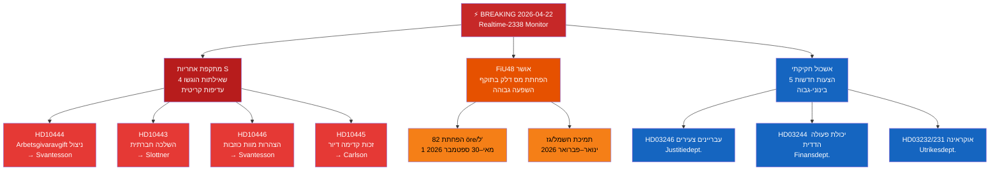

<!-- dir: rtl -->
# תקציר מנהלים — מנטור הריקסדאג בזמן אמת 2026-04-22 23:38
**סיווג**: ציבורי | **אנליסט**: James Pether Sörling | **מחזור**: Realtime-2338
**מתודולוגיה**: ai-driven-analysis-guide.md v6.4 | **ציון Admiralty**: [A2]

---

## 🎯 BLUF

הריקסדאג השוודי נכנס לספרינט החקיקה הסופי לפני הבחירות עם שלושה וקטורי חדשות דחופים בו-זמניים: (1) הסוציאל-דמוקרטים השיקו ב-22 באפריל 2026 מתקפת שאילתה (interpellation) מתואמת ורב-זרועית נגד שרת האוצר אליזבת סוונטסון (M) ושותפי הקואליציה, תוך מיקוד בחולשות בשוק העבודה, דיור, רווחה חברתית ומנהל אזרחי לפני בחירות ספטמבר 2026; (2) התקציב המשלים החריג עם הפחתת מס הדלק אושר על ידי הריקסדאג ב-21 באפריל 2026, עם מתנגדים מחולקים לאורך קווים אקלימיים-כלכליים; ו-(3) אשכול של הצעות מהותיות בנושאי אנרגיה, יערנות, משפט ודיפלומטיה אוקראינית מאותת על האצת סדר היום החקיקתי של ממשלת קריסטרסון בפגישה האחרונה לפני הפירוק.

מתקפת האחריות של S — שלוש שאילתות נפרדות המכוונות לשרת האוצר סוונטסון בלבד — היא איתות מודיעין פוליטי בעדיפות גבוהה ביותר של הערב. דפוס זה של לחץ פרלמנטרי רב-ערוצי על שר אחד מצביע על אסטרטגיה מתואמת לפני הבחירות לאלץ שגיאות שרותיות בתשובות ציבוריות.

---

## 🧭 3 החלטות שתקציר זה תומך בהן

1. **החלטה עריכתית**: האם לסקור את מתקפת האחריות של S כסיפור פוליטי מאוחד (התקפה מתואמת על סוונטסון) או כשאילתות נפרדות — המסגור המאוחד חזק יותר מבחינה אנליטית.
2. **עדיפות ניטור**: האם יש להסלים את מעקב תיק ניצול דמי מעסיקים (HD10444) בהתחשב בקשר לדיווח של Aftonbladet — מומלצת עדיפות גבוהה.
3. **אופק תחזית**: האם הפחתת מס הדלק בתקציב החריג (HD01FiU48 שאושר) תייצר רווחים נרטיביים אקלימיים מדידים למתנגדים לפני דיון תקציב יוני — מעקב דרך מדדי מסגור מדיה ב-7 ימים הבאים.

---

## ⚡ קריאה ב-60 שניות

- **מכה משולשת של S על סוונטסון** [B2]: HD10444 (ניצול דמי מעסיקים), HD10442 (תיק בית משפט הפרעות אכילה), HD10446 (הצהרות מוות כוזבות) — שלושה וקטורים בו-זמנית
- **HD10445 דיור**: S מכוונת לכישלון הממשלה בזכות קדימה לנכסים מרכזיים בפרברי שטוקהולם (Sätra, Vårberg, Rågsved) — וקטור מדיניות הפרדה [B2]
- **HD10443 השלכה חברתית**: השלכת סיוע סוציאלי עירוני — S מכוונת לשר האזרחי סלוטנר (KD) על מהגרים/אוכלוסיות פגיעות שמועברות בין רשויות מקומיות [B2]
- **HD01FiU48 אושר**: תקציב שינוי חריג — הפחתת 82 öre/ל' ממס דלק החל מ-1 במאי 2026; תמיכה חשמל/גז לבתי אב; השפעה פיסקלית של 4.1 מיליארד SEK [A1]
- **הצעות חדשות (14–16 באפר')**: עבריינים צעירים (HD03246), יכולת פעולה הדדית של נתונים (HD03244), יערנות פעילה (HD03242), בית דין לנזקי אוקראינה (HD03232/HD03231)
- **עדשת בחירות 2026**: כל שאילתה מכוונת נגד שר שמו נקוב — זו הכנת דיון לקראת קמפיין הבחירות

---

## 📅 הגורם המפעיל המוביל קדימה
**לעקוב 28 באפריל–5 במאי 2026**: תשובות שרותיות לארבע השאילתות יידונו במליאת הריקסדאג. תשובות סוונטסון על HD10442 (תיק הפרעות אכילה) ו-HD10444 (דמי מעסיקים) נושאות את הסיכון הגבוה ביותר לתנודתיות תקשורתית. תשובה אחת שנויה במחלוקת יכולה להפוך לסיפור הפוליטי הדומיננטי של השבוע לפני דיון תקציב יוני.

---

## 🔍 תווית אמינות
**אמינות הערכה כוללת**: גבוהה [B2] — מבוסס על אחזור ישיר דרך MCP של מסמכים פרלמנטריים והפניה צולבת עם תיקיות ניתוח אחיות של היום (הצעות, הצעות חבר, דוחות ועדה, שאילתות).

---

## 📊 מפת נוף המודיעין

<!-- source-sha: 34bcedb9f943f85646d8e864b41374efd2461075 -->
