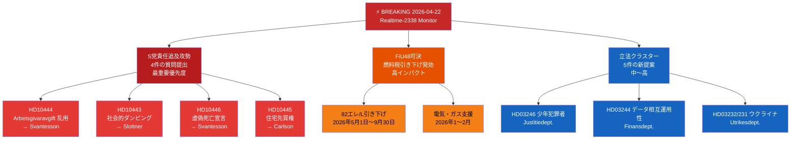

# エグゼクティブ・ブリーフ — リクスダーグ リアルタイム・モニター 2026-04-22 23:38
**分類**: 公開 | **アナリスト**: James Pether Sörling | **サイクル**: Realtime-2338
**方法論**: ai-driven-analysis-guide.md v6.4 | **アドミラルティ基準**: [A2]

---

## 🎯 BLUF（要点）

スウェーデン議会（Riksdag）は、3つの同時進行する緊急ニュース・ベクターとともに選挙前最後の立法スプリントに突入しています。(1) 社会民主党は2026年4月22日、財務大臣エリザベット・スバンテソン（M）および連立パートナーに対し、2026年9月選挙前の労働市場・住宅・社会福祉・民政行政の弱点を標的に、協調的な4本立ての質問（interpellation）攻勢を開始した。(2) 燃料税引き下げを含む臨時補正予算が2026年4月21日に議会で可決され、野党は気候・経済路線で分裂した。(3) エネルギー、林業、司法、ウクライナ外交に関する実質的な提案の集まりが、解散前最後の会期におけるクリステション政権の立法議題の加速を示している。

S党の責任追及攻勢——財務大臣スバンテソン単独に向けられた3件の別々の質問——は、今夜最優先の政治情報シグナルです。単一大臣に対する多チャンネルの議会圧力というこのパターンは、公開答弁での大臣の失言を引き出すために設計された、協調された選挙前戦略を示しています。

---

## 🧭 このブリーフが支援する3つの意思決定

1. **編集上の判断**: S党の責任追及攻勢を統一された政治ストーリー（スバンテソンへの協調攻撃）として報道するか、個別の質問として扱うか——統合的フレームの方が分析的に優れている。
2. **監視優先度**: Aftonbladetの報道との関連を踏まえ、使用者負担金乱用事件（HD10444）の追跡をエスカレートすべきか——高優先度を推奨。
3. **予測ホライゾン**: 臨時予算での燃料税引き下げ（HD01FiU48可決）が、6月予算議論前に野党の気候ナラティブ上の利益を測定可能な形でもたらすか——今後7日間のメディア・フレーミング指標で追跡。

---

## ⚡ 60秒読み

- **S党のスバンテソンへの三重攻撃** [B2]: HD10444（使用者負担金の乱用）、HD10442（摂食障害訴訟事件）、HD10446（虚偽の死亡宣言）——3つのベクターが同時に
- **HD10445 住宅**: S党がストックホルム郊外（Sätra、Vårberg、Rågsved）の主要物件の先買権をめぐる政府の失敗を標的に——分離政策ベクター [B2]
- **HD10443 社会的ダンピング**: 自治体の社会扶助ダンピング——S党が自治体間を移送される移民・脆弱集団問題でスロットネル文民大臣（KD）を標的に [B2]
- **HD01FiU48 可決**: 臨時修正予算——2026年5月1日から1リットルあたり82エレの燃料税引き下げ；家庭向け電気・ガス支援；財政影響41億SEK [A1]
- **新提案（4月14〜16日）**: 少年犯罪者（HD03246）、データ相互運用性（HD03244）、積極的林業（HD03242）、ウクライナ損害賠償法廷（HD03232/HD03231）
- **2026年選挙の視点**: 各質問は実名の大臣を標的にしており——これは選挙キャンペーンに向けた討論の準備です

---

## 📅 最優先の前方トリガー
**2026年4月28日〜5月5日を注視**: 4件の質問への大臣回答が議会本会議で討論されます。スバンテソンのHD10442（摂食障害訴訟）とHD10444（使用者負担金）への回答が最も高いメディア・ボラティリティ・リスクを持ちます。事実上争われた単一の回答が、6月予算議論前の週の主要政治ストーリーになる可能性があります。

---

## 🔍 信頼度ラベル
**総合評価信頼度**: 高 [B2]——議会文書のMCP直接取得と今日の姉妹分析フォルダー（提案、動議、委員会報告、質問）との相互参照に基づく。

---

## 📊 情報環境マップ

<!-- source-sha: 34bcedb9f943f85646d8e864b41374efd2461075 -->
