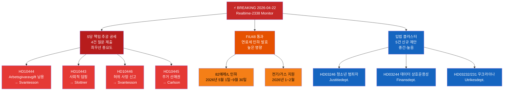

# 이그제큐티브 브리핑 — 릭스다그 실시간 모니터 2026-04-22 23:38
**분류**: 공개 | **분석가**: James Pether Sörling | **주기**: Realtime-2338
**방법론**: ai-driven-analysis-guide.md v6.4 | **어드미럴티 기준선**: [A2]

---

## 🎯 핵심 요약 (BLUF)

스웨덴 릭스다그(Riksdag)는 세 가지 동시 긴급 뉴스 벡터와 함께 선거 전 최후의 입법 스프린트에 돌입하고 있습니다. (1) 사회민주당은 2026년 4월 22일, 2026년 9월 선거를 앞두고 노동시장·주거·사회복지·민간행정의 약점을 겨냥해 재무장관 엘리자베트 스반테손(M) 및 연립 파트너에 대한 조율된 4건의 질문(interpellation) 공세를 시작했습니다. (2) 연료세 인하가 포함된 임시 추경예산이 2026년 4월 21일 의회에서 통과되었으며, 야당은 기후-경제 노선을 따라 분열되었습니다. (3) 에너지, 임업, 법무, 우크라이나 외교에 관한 실질적인 제안들의 집합이 해산 전 마지막 회기에서 크리스테르손 정부의 입법 의제 가속화를 시사합니다.

S당의 책임 추궁 공세——재무장관 스반테손만을 대상으로 하는 3건의 별도 질문——은 오늘 밤 최우선 정치 정보 신호입니다. 단일 장관에 대한 다채널 의회 압박이라는 이 패턴은 공개 답변에서 장관의 실수를 유도하기 위한 조율된 선거 전 전략을 나타냅니다.

---

## 🧭 이 브리핑이 지원하는 3가지 결정

1. **편집 결정**: S당의 책임 추궁 공세를 통합된 정치 이야기(스반테손에 대한 조율된 공격)로 다룰지, 별도의 질문들로 다룰지——통합 프레이밍이 분석적으로 더 강합니다.
2. **모니터링 우선순위**: Aftonbladet 보도와의 연관성을 감안해 사용자 부담금 남용 사건(HD10444) 추적을 강화할 것인지——높은 우선순위 권장.
3. **예측 지평선**: 임시 예산의 연료세 인하(HD01FiU48 통과)가 6월 예산 토론 전에 야당에 측정 가능한 기후 내러티브 이득을 가져올지——향후 7일간 미디어 프레이밍 지표를 통해 추적.

---

## ⚡ 60초 읽기

- **S당의 스반테손에 대한 삼중 타격** [B2]: HD10444(사용자 부담금 남용), HD10442(섭식장애 법원 사건), HD10446(허위 사망 신고)——3개 벡터 동시에
- **HD10445 주거**: S당이 스톡홀름 교외(Sätra, Vårberg, Rågsved)의 핵심 부동산에 대한 선매권 관련 정부 실패를 겨냥——분리 정책 벡터 [B2]
- **HD10443 사회적 덤핑**: 지자체 사회 지원 덤핑——S당이 자치단체 간 이전되는 이주민/취약계층 문제로 슬로트네르 민간부장관(KD)을 겨냥 [B2]
- **HD01FiU48 통과**: 임시 수정예산——2026년 5월 1일부터 리터당 82 에레 연료세 인하; 가정용 전기/가스 지원; 재정 영향 41억 SEK [A1]
- **신규 제안(4월 14~16일)**: 청소년 범죄자(HD03246), 데이터 상호운용성(HD03244), 적극적 임업(HD03242), 우크라이나 손해배상 재판소(HD03232/HD03231)
- **2026년 선거 렌즈**: 각 질문은 실명 장관을 겨냥——이는 선거 캠페인을 위한 토론 준비입니다

---

## 📅 최우선 전방 트리거
**2026년 4월 28일~5월 5일 주시**: 4건의 질문에 대한 장관 답변이 릭스다그 본회의에서 토론됩니다. 스반테손의 HD10442(섭식장애 법원 사건)와 HD10444(사용자 부담금)에 대한 답변이 가장 높은 미디어 변동성 위험을 내포합니다. 단 하나의 사실 논쟁 답변이 6월 예산 토론 전 해당 주의 지배적인 정치 이야기가 될 수 있습니다.

---

## 🔍 신뢰도 레이블
**전체 평가 신뢰도**: 높음 [B2]——의회 문서의 MCP 직접 검색과 오늘의 자매 분석 폴더(제안, 동의안, 위원회 보고서, 질문)와의 교차 검증을 기반으로 함.

---

## 📊 정보 환경 지도

<!-- source-sha: 34bcedb9f943f85646d8e864b41374efd2461075 -->
