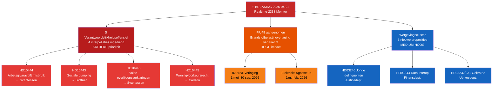

# Executive Brief — Riksdag Realtime Monitor 2026-04-22 23:38
**Classificatie**: Openbaar | **Analist**: James Pether Sörling | **Cyclus**: Realtime-2338
**Methodologie**: ai-driven-analysis-guide.md v6.4 | **Admiralty-basislijn**: [A2]

---

## 🎯 BLUF

De Zweedse Riksdag gaat de laatste wetgevingssprint in voor de verkiezingen met drie gelijktijdige urgente nieuwsvectoren: (1) de Sociaaldemocraten hebben op 22 april 2026 een gecoördineerde viervoudige interpellatieoffensief gelanceerd tegen minister van Financiën Elisabeth Svantesson (M) en coalitiepartners, gericht op zwakheden in de arbeidsmarkt, huisvesting, sociale zekerheid en civiel bestuur voor de verkiezingen van september 2026; (2) het buitengewone aanvullende budget met brandstofbelastingverlaging werd op 21 april 2026 door de Riksdag aangenomen, waarbij de oppositie verdeeld is langs klimaat-economische lijnen; en (3) een cluster van substantiële proposities over energie, bosbouw, justitie en Oekraïne-diplomatie signaleert de versnellende wetgevingsagenda van de regering-Kristersson in de laatste zitting voor ontbinding.

Het verantwoordelijkheidsoffensief van S — drie afzonderlijke interpellaties gericht uitsluitend op minister van Financiën Svantesson — is het politiek inlichtingensignaal van de hoogste prioriteit van de avond. Dit patroon van parlementaire meerkanaalsdruk op één minister duidt op een gecoördineerde pre-verkiezingsstrategie om ministeriële misstappen in openbare antwoorden te forceren.

---

## 🧭 3 Beslissingen die dit brief ondersteunt

1. **Redactionele beslissing**: Of het verantwoordelijkheidsoffensief van S als één geïntegreerd politiek verhaal (gecoördineerde aanval op Svantesson) of als afzonderlijke interpellaties moet worden gedekt — de geïntegreerde framing is analytisch sterker.
2. **Bewakingsprioriteit**: Of de tracking van de werkgeversbijdrage-misbruikszaak (HD10444) gezien de verbinding met de berichtgeving van Aftonbladet geëscaleerd moet worden — HOGE prioriteit aanbevolen.
3. **Prognose-horizon**: Of de brandstofbelastingverlaging in het uitzonderlijke budget (HD01FiU48 aangenomen) meetbare klimaatnarratieve winsten voor de oppositie zal opleveren voor het junibudgetdebat — volgen via mediaframingstatistieken de komende 7 dagen.

---

## ⚡ 60-seconden lezing

- **S's drievoudige aanval op Svantesson** [B2]: HD10444 (misbruik van werkgeversbijdragen), HD10442 (rechtszaak eetstoornissen), HD10446 (valse overlijdensverklaringen) — drie vectoren gelijktijdig
- **HD10445 huisvesting**: S richt zich op het falen van de regering op het voorkeursrecht voor sleuteleigendommen in Stockholmse buitenwijken (Sätra, Vårberg, Rågsved) — segregatiebeleidsvector [B2]
- **HD10443 sociale dumping**: Gemeentelijke uitkeringsdumping — S richt zich op Civielminister Slottner (KD) over migranten/kwetsbare bevolkingsgroepen die tussen gemeenten worden overgedragen [B2]
- **HD01FiU48 AANGENOMEN**: Buitengewone wijzigingsbegroting — 82 öre/L brandstofbelastingverlaging per 1 mei 2026; elektriciteit/gassteun voor huishoudens; 4,1 miljard SEK fiscale impact [A1]
- **Nieuwe proposities (14–16 apr.)**: Jonge delinquenten (HD03246), data-interoperabiliteit (HD03244), actief bosbeheer (HD03242), Oekraïne-schadentribunaal (HD03232/HD03231)
- **Verkiezingslens 2026**: Elke interpellatie is gericht op een met naam genoemde minister — dit is debatvoorbereiding voor de verkiezingscampagne

---

## 📅 Prioritaire voorwaartse trigger
**Volg 28 april–5 mei 2026**: Ministeriële antwoorden op de vier interpellaties worden gedebatteerd in de plenaire vergadering van de Riksdag. Svantessons antwoorden op HD10442 (rechtszaak eetstoornissen) en HD10444 (werkgeversbijdragen) dragen het hoogste mediavolatiliteitsrisico. Één enkel feitelijk betwist antwoord kan het dominante politieke verhaal van de week worden voor het junibudgetdebat.

---

## 🔍 Vertrouwenslabel
**Algeheel beoordelingsvertrouwen**: HOOG [B2] — gebaseerd op directe MCP-ophaling van parlementaire documenten en kruisverwijzingen met de zusteranalysemappen van vandaag (proposities, moties, commissierapporten, interpellaties).

---

## 📊 Kaart van het inlichtingenlandschap

<!-- source-sha: 34bcedb9f943f85646d8e864b41374efd2461075 -->
