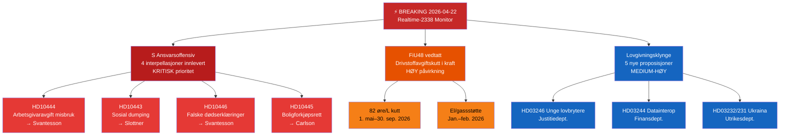

# Executive Brief — Riksdag Sanntidsmonitor 2026-04-22 23:38
**Klassifisering**: Offentlig | **Analytiker**: James Pether Sörling | **Syklus**: Realtime-2338
**Metodologi**: ai-driven-analysis-guide.md v6.4 | **Admiralty-grunnlinje**: [A2]

---

## 🎯 BLUF

Den svenske Riksdag går inn i den endelige lovgivningsspurten før valget med tre samtidige breaking-nyhetsvektorer: (1) Sosialdemokratene har lansert en koordinert firedobbel interpellasjonsoffensiv mot finansminister Elisabeth Svantesson (M) og koalisjonspartnere den 22. april 2026, rettet mot svakheter innen arbeidsliv, bolig, sosial velferd og sivil forvaltning foran valget i september 2026; (2) den ekstra tilleggsbudsjettet med redusert drivstoffavgift ble vedtatt av Riksdagen den 21. april 2026, med opposisjonen splittet langs klima-økonomiske linjer; og (3) en klynge av substantielle proposisjoner om energi, skogbruk, justis og Ukraina-diplomati signalerer Kristersson-regjeringens akselererende lovgivningsagenda i den siste sesjonen før oppløsning.

S sin ansvarsoffensiv — tre separate interpellasjoner rettet mot finansminister Svantesson alene — er kveldets politiske etterretningssignal av høyeste prioritet. Dette mønsteret med flerkanals parlamentarisk press mot en enkelt minister indikerer en koordinert forvalsstrategi for å tvinge ministerielle feiltrinn i offentlige svar.

---

## 🧭 3 Beslutninger dette brifingen støtter

1. **Redaksjonell beslutning**: Om S sin ansvarsoffensiv skal dekkes som én samlet politisk historie (koordinert angrep på Svantesson) eller som separate interpellasjoner — den samlede rammen er analytisk sterkere.
2. **Overvåkingsprioritet**: Om sporing av arbeidsgiverbidrags-misbrukssaken (HD10444) bør eskaleres gitt koblingen til Aftonbladets rapportering — HØY prioritet anbefales.
3. **Prognosehorisont**: Om den ekstra budsjettets drivstoffavgiftskutt (HD01FiU48 vedtatt) vil produsere målbare opposisjonelle klimanarrative gevinster foran junibudsjettdebatten — følg via medieinnrammingsstatistikk de neste 7 dager.

---

## ⚡ 60-sekunders lesning

- **S sitt trippelstrike mot Svantesson** [B2]: HD10444 (misbruk av arbetsgivaravgift), HD10442 (spiseforstyrrelses-domstolssak), HD10446 (falske dødserklæringer) — tre vektorer simultant
- **HD10445 boliger**: S retter fokus mot regjeringens svikt med forkjøpsrett for nøkkeleiendommer i Stockholms forsteder (Sätra, Vårberg, Rågsved) — segregasjonspolitisk vektor [B2]
- **HD10443 sosial dumping**: Kommunal sosialhjelps-dumping — S retter seg mot sivilminister Slottner (KD) om migranter/sårbare befolkningsgrupper overført mellom kommuner [B2]
- **HD01FiU48 VEDTATT**: Ekstra endringsbudsjett — 82 øre/L drivstoffavgiftskutt fra 1. mai 2026; el/gassstøtte for husholdninger; 4,1 mrd. SEK i fiskal påvirkning [A1]
- **Nye proposisjoner (14.–16. apr.)**: Unge lovbrytere (HD03246), datainteroperabilitet (HD03244), aktivt skogbruk (HD03242), Ukraina-erstatningstribunal (HD03232/HD03231)
- **Valglins 2026**: Enhver interpellasjon er rettet mot en navngitt minister — dette er debattpriming foran valgkampen

---

## 📅 Topp fremadrettet trigger
**Følg 28. april–5. mai 2026**: Ministerielle svar på de fire interpellasjonene vil bli debattert i Riksdag-salen. Svantessons svar på HD10442 (spiseforstyrrelses-domstolssak) og HD10444 (arbeidsgiverbidrag) bærer den høyeste mediavola­tilitetsrisikoen. Et enkelt faktamessig omstridt svar kan bli ukens dominerende politiske historie foran junibudsjettdebatten.

---

## 🔍 Konfidensmerknad
**Samlet vurderingskonfidensgrad**: HØY [B2] — basert på direkte MCP-henting av parlamentariske dokumenter og krysshenvisning med dagens søsteranalyse-mapper (proposisjoner, motsjoner, utvalgsrapporter, interpellasjoner).

---

## 📊 Etterretningslandskabskart

<!-- source-sha: 34bcedb9f943f85646d8e864b41374efd2461075 -->
