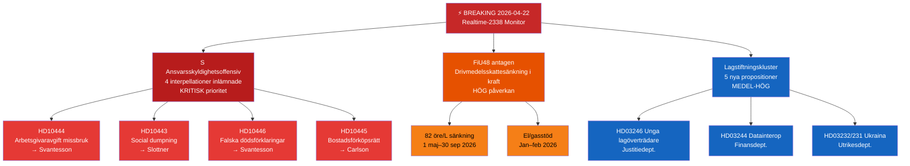

# Exekutiv sammanfattning — Riksdag Realtidsmonitor 2026-04-22 23:38
**Klassificering**: Offentlig | **Analytiker**: James Pether Sörling | **Cykel**: Realtime-2338
**Metodik**: ai-driven-analysis-guide.md v6.4 | **Admiralty-baslinje**: [A2]

---

## 🎯 BLUF

Riksdagen träder in i det sista lagstiftningsspurten inför valet med tre samtidiga breaking-nyhetsvektorer: (1) Socialdemokraterna har inlett ett koordinerat fyrfaldigt interpellationsoffensiv mot finansminister Elisabeth Svantesson (M) och koalitionspartners den 22 april 2026, med inriktning på svagheter inom arbetsmarknad, bostäder, socialt skydd och civil förvaltning inför valet i september 2026; (2) den extra tilläggsbudgeten med sänkt drivmedelsskatt antogs av Riksdagen den 21 april 2026, med oppositionen splittrad längs klimat-ekonomiska linjer; och (3) ett kluster av substantiella propositioner om energi, skogsbruk, rättsväsen och Ukraina-diplomati signalerar Kristersson-regeringens accelererande lagstiftningsagenda under den sista sessionen före upplösning.

S:s ansvarsskyldighetsoffensiv — tre separata interpellationer riktade mot finansminister Svantesson ensam — är kvällens politiska underrättelse av högsta prioritet. Detta mönster av flerkanalspress mot en enskild minister indikerar en koordinerad förvalssstrategi för att tvinga ministern till felsteg i offentliga svar.

---

## 🧭 3 Beslut som detta underlag stödjer

1. **Redaktionellt beslut**: Om S:s ansvarsskyldighetsoffensiv ska täckas som en enhetlig politisk berättelse (koordinerat angrepp på Svantesson) eller som separata interpellationer — den enhetliga inramningen är analytiskt starkare.
2. **Bevakarprioritet**: Om spårningen av arbetsgivaravgiftsmissbruksfallet (HD10444) ska eskaleras givet kopplingen till Aftonbladets rapportering — HÖG prioritet rekommenderas.
3. **Prognoshorisont**: Om den extra budgetens drivmedelsskattesänkning (HD01FiU48 antagen) kommer att generera mätbara oppositionella klimatnarrativvinster inför junibudgetdebatten — följ via medieramstningsstatistik de närmaste 7 dagarna.

---

## ⚡ 60-sekunders läsning

- **S:s trippelstrike mot Svantesson** [B2]: HD10444 (missbruk av arbetsgivaravgifter), HD10442 (ätstörningsdomstolsfall), HD10446 (falska dödsförklaringar) — tre vektorer simultant
- **HD10445 bostäder**: S riktar in sig på regeringens misslyckande med förköpsrätt för nyckelproperties i Stockholmsförorter (Sätra, Vårberg, Rågsved) — segregationspolitisk vektor [B2]
- **HD10443 social dumpning**: Kommunal socialbidragsdumpning — S riktar sig mot civilminister Slottner (KD) om migranter/utsatta populationer som överförs mellan kommuner [B2]
- **HD01FiU48 ANTAGEN**: Extra ändringsbudget — 82 öre/liter drivmedelsskattesänkning från 1 maj 2026; el/gasstöd för hushåll; 4,1 miljarder SEK i fiskal påverkan [A1]
- **Nya propositioner (14–16 apr)**: Unga lagöverträdare (HD03246), datainteroperabilitet (HD03244), aktivt skogsbruk (HD03242), Ukraina-skadeståndstribunal (HD03232/HD03231)
- **Vallinsen 2026**: Varje interpellation är riktad mot en namngiven minister — detta är debatspriming inför valrörelsen

---

## 📅 Topp framåtriktat trigger
**Bevaka 28 april–5 maj 2026**: Ministersvaren på de fyra interpellationerna kommer att debatteras i riksdagskammaren. Svantessons svar på HD10442 (ätstörningsdomstolsfall) och HD10444 (arbetsgivaravgifter) bär den högsta risken för medialt genomslag. Ett enda faktamässigt ifrågasatt svar kan bli veckans dominerande politiska historia inför junibudgetdebatten.

---

## 🔍 Konfidensmärkning
**Övergripande bedömningsförtroende**: HÖG [B2] — baserat på direkt MCP-hämtning av parlamentariska handlingar och korsreferens med dagens syskonanalysmappar (propositioner, motioner, utskottsbetänkanden, interpellationer).

---

## 📊 Karta över underrättelselandskapet

<!-- source-sha: 34bcedb9f943f85646d8e864b41374efd2461075 -->
