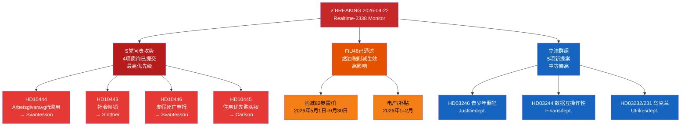

# 执行简报 — 瑞典议会（Riksdag）实时监测 2026-04-22 23:38
**分类**：公开 | **分析员**：James Pether Sörling | **周期**：Realtime-2338
**方法论**：ai-driven-analysis-guide.md v6.4 | **海军部基准**：[A2]

---

## 🎯 要点摘要（BLUF）

瑞典议会（Riksdag）以三个同步紧急新闻向量进入选举前的最后立法冲刺阶段：(1) 社会民主党于2026年4月22日发动了一场协调的四方面质询（interpellation）攻势，针对财政部长伊丽莎白·斯万特森（M）及联合执政伙伴，聚焦劳动力市场、住房、社会福利和民政管理方面的弱点，以备2026年9月选举；(2) 包含燃油税削减的特别补充预算于2026年4月21日获议会通过，反对党在气候-经济路线上存在分歧；以及(3) 一系列关于能源、林业、司法和乌克兰外交的实质性提案，标志着克里斯特松政府在解散前最后一次会议上立法议程的加速推进。

S党的问责攻势——三项仅针对财政部长斯万特森的独立质询——是今晚最高优先级的政治情报信号。这种对单一部长的多渠道议会施压模式表明，这是一种协调的选前策略，旨在迫使部长在公开回答中出现失误。

---

## 🧭 本简报支持的3个决策

1. **编辑决策**：S党的问责攻势是否应作为统一的政治故事（对斯万特森的协调攻击）还是单独的质询来报道——统一框架在分析上更为有力。
2. **监控优先级**：鉴于与《晚邮报》（Aftonbladet）报道的关联，是否应升级对雇主缴费滥用案（HD10444）的追踪——建议高优先级。
3. **预测视野**：特别预算中的燃油税削减（HD01FiU48已通过）是否会在六月预算辩论前为反对党带来可测量的气候叙事收益——通过未来7天的媒体框架指标进行追踪。

---

## ⚡ 60秒阅读

- **S党对斯万特森的三重打击** [B2]：HD10444（雇主缴费滥用）、HD10442（进食障碍法院案件）、HD10446（虚假死亡申报）——三个向量同时发动
- **HD10445 住房**：S党针对政府在斯德哥尔摩郊区（Sätra、Vårberg、Rågsved）关键房产优先购买权上的失败——种族隔离政策向量 [B2]
- **HD10443 社会倾销**：市政社会援助倾销——S党针对文职部长斯洛特纳尔（KD）就市政间转移的移民/弱势群体问题 [B2]
- **HD01FiU48 已通过**：特别修正预算——自2026年5月1日起每升削减82奥雷燃油税；家庭电/气补贴；财政影响41亿瑞典克朗 [A1]
- **新提案（4月14–16日）**：青少年罪犯（HD03246）、数据互操作性（HD03244）、积极林业（HD03242）、乌克兰损害赔偿法庭（HD03232/HD03231）
- **2026年选举视角**：每项质询均针对具名部长——这是选举活动的辩论预热

---

## 📅 最优先前向触发点
**关注2026年4月28日至5月5日**：四项质询的部长回应将在议会全体会议上进行辩论。斯万特森对HD10442（进食障碍法院案件）和HD10444（雇主缴费）的回答具有最高的媒体波动风险。单一一个事实上有争议的回答可能成为六月预算辩论前该周的主导政治故事。

---

## 🔍 置信度标签
**总体评估置信度**：高 [B2]——基于MCP直接检索议会文件，并与当天姊妹分析文件夹（提案、动议、委员会报告、质询）进行交叉核实。

---

## 📊 情报全景图

<!-- source-sha: 34bcedb9f943f85646d8e864b41374efd2461075 -->
