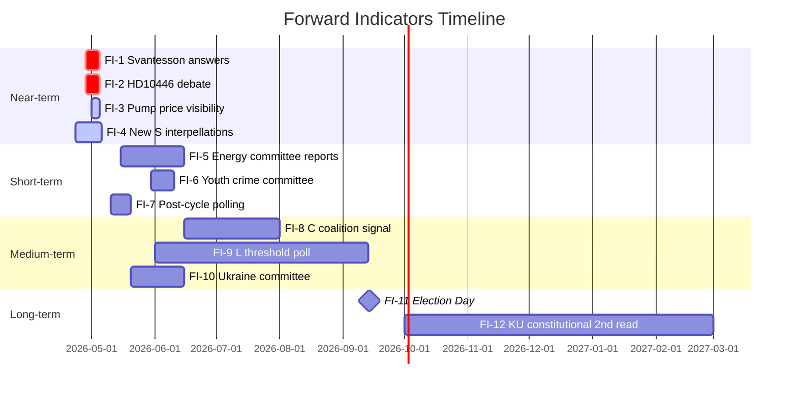

# Forward Indicators — Riksdag Realtime Monitor 2026-04-22
**Analyst**: James Pether Sörling | **Classification**: Public | **Cycle**: Realtime-2338

---

## Indicator Framework
≥10 dated indicators across 4 time horizons (Near, Short, Medium, Long)

---

## Horizon 1: Near-Term (0–14 days: 2026-04-22 to 2026-05-06)

### FI-1: Svantesson interpellation debate answers
**Watch date**: 2026-04-28 to 2026-05-05
**Indicator**: Did Svantesson provide factual, specific answers to HD10444 (employer contributions) and HD10442 (eating disorder court case)?
**Green signal**: Detailed factual answer with Finansinspektionen/Tillväxtverket data → narrative containment
**Red signal**: Vague or deflective answer → S picks up 2-4 points in next poll, KU petition likely
**Source**: riksdagen.se anföranden, SVT Nyheter coverage

### FI-2: HD10446 false death declaration debate
**Watch date**: 2026-04-28 to 2026-05-05
**Indicator**: Carlson (KD) provides government's account of Skatteverket/Socialstyrelsen coordination on false death records
**Green signal**: Documented remediation of process → issue closed
**Red signal**: No systemic fix documented → JO complaint risk [B2]
**Source**: riksdagen.se anföranden

### FI-3: HD01FiU48 pump price visibility
**Watch date**: 2026-05-02 to 2026-05-05
**Indicator**: Do major Swedish fuel retailers (Preem, Circle K, OKQ8) publish pump price reduction reflecting 82 öre tax cut?
**Green signal**: Visible pump price drop → government can claim HD01FiU48 impact
**Red signal**: No visible drop → opposition "fake relief" narrative activated
**Source**: Fuel retailer price data (public websites)

### FI-4: New S/V/MP interpellations after HD10444 cycle
**Watch date**: 2026-04-23 to 2026-05-06
**Indicator**: How many further accountability interpellations filed by S between now and May 6?
**Green signal (for coalition)**: 0–1 further interpellations → one-day tactical burst
**Red signal (for coalition)**: ≥3 further interpellations → sustained campaign confirmed
**Source**: riksdagen.se search_dokument(doktyp=ip, rm=2025/26)

---

## Horizon 2: Short-Term (2–6 weeks: 2026-05-06 to 2026-06-03)

### FI-5: Energy legislation committee reports (HD03240/239/238)
**Watch date**: 2026-05-15 to 2026-06-15
**Indicator**: Do NäringsU and MiljöU publish positive committee reports enabling Riksdag votes before summer recess?
**Green signal**: All three approved → coalition pre-election legacy narrative
**Red signal**: One or more deferred to autumn → "unfinished business" opposition attack
**Source**: riksdagen.se get_betankanden(organ=NU,MJU)

### FI-6: Youth offender reform (HD03246) committee report
**Watch date**: 2026-05-30 to 2026-06-10
**Indicator**: Does JuU publish committee report on unga lagöverträdare reform?
**Green signal**: Approved with broad support → bipartisan crime policy achievement
**Red signal**: S/V/MP dissents → crime policy dividing line in election campaign
**Source**: riksdagen.se get_betankanden(organ=JuU)

### FI-7: Polling movement post-interpellation cycle
**Watch date**: 2026-05-10 to 2026-05-20
**Indicator**: Do Novus/Ipsos/SIFO polls show S moving above 30% following interpellation cycle?
**Green signal (for S)**: S polling >30% → accountability campaign gaining electoral traction
**Green signal (for coalition)**: M+SD+KD+L hold ≥176 projected seats → Tidö continuation
**Source**: Published poll aggregates (Novus, Ipsos, SIFO)

---

## Horizon 3: Medium-Term (6 weeks–3 months: 2026-06-03 to 2026-09-01)

### FI-8: C (Centerpartiet) coalition signal
**Watch date**: 2026-06-15 to 2026-08-01
**Indicator**: Does C party leader (Muharrem Demirok) state a preference for post-election coalition direction?
**Green signal (for Tidö)**: C signals it will prioritise governing with M over S bloc
**Green signal (for S bloc)**: C signals openness to S-led government
**Source**: Press interviews, SVT/SR Almedalen declarations (Almedalen late June)

### FI-9: L (Liberalerna) threshold poll
**Watch date**: 2026-06-01 to 2026-09-13
**Indicator**: Does L consistently poll above 4% in ≥3 successive polls?
**Green signal**: L above 4% → Tidö coalition arithmetic stable
**Red signal**: L polling below 4% in ≥2 polls → threshold risk scenario activated
**Source**: Published poll aggregates

### FI-10: Ukraine tribunal legislation (HD03231/232) committee report
**Watch date**: 2026-05-20 to 2026-06-15
**Indicator**: Does UtU publish report approving Ukraine tribunal framework propositions?
**Green signal**: Approved → Sweden's Ukraine transitional justice role confirmed
**Source**: riksdagen.se get_betankanden(organ=UU)

---

## Horizon 4: Long-Term (3+ months: 2026-09-01 onward)

### FI-11: Election 2026 result — Riksdag composition
**Watch date**: 2026-09-13
**Indicator**: Which bloc achieves majority (175 seats)?
**Source**: Swedish Election Authority (Valmyndigheten)

### FI-12: HD01KU33/32 constitutional second reading
**Watch date**: 2026-10-01 to 2027-03-01
**Indicator**: Does the newly constituted Riksdag (post-election) advance KU33/32 to second reading and approval?
**Source**: riksdagen.se post-election session documents

---

## Forward Indicator Dashboard

